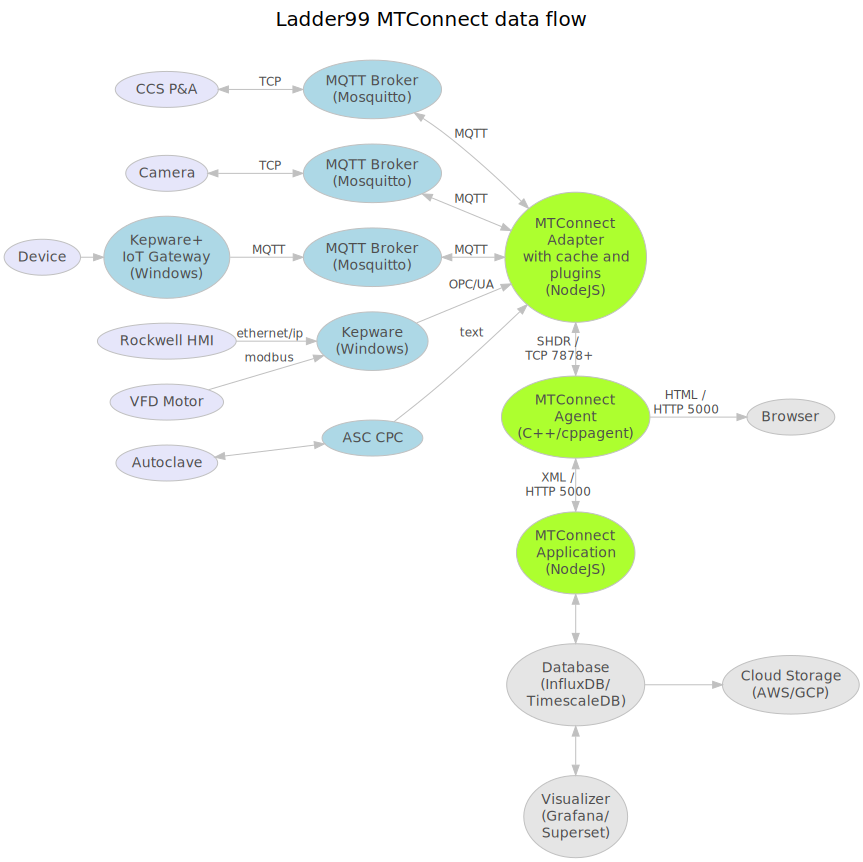

# Ladder99 MTConnect System

This project transfers data from factory devices to a database and end-user visualizations. 

MTConnect standardizes factory device data flow - it was designed by UC Berkeley, Georgia Institute of Technology, and Sun Microsystems in 2008. 

## Goals

- Connect factory devices to database and visualizations
- Use MTConnect Adapter, Agent, Application scheme
- Enforce one-way dataflow via a data diode
- Secure communication between devices via encrypted UDP transmission

## Architecture

### Data flow

MQTT is a simple publish/subscribe message protocol. Messages from factory devices go to an MQTT Broker (Mosquitto). PLC4X communicates with old machines via proprietary protocols and translates them to MQTT (correct?). 

Our MTConnect Adapter (a NodeJS program) subscribes and listens to those messages, translates them to SHDR (Simple Hierarchical Data Representation, eg "2021-02-28T02:40:00|key|value"), and sends them on to the MTConnect Agent (cppagent) via an optional one-way data diode (Java + RabbitMQ). 

An MTConnect Application then consumes the data as XML over HTTP, and feeds it to a database and visualizer. 

For more on the data diode, see the service [here](services/diode).

## Installation

Clone this repo

    git clone https://github.com/bburns/ladder99-mtconnect
    cd ladder99-mtconnect

Install Docker, Node, jq, and Python3 from their installers. 

Install [just](https://github.com/casey/just), which is a task runner, using `Justfile` for command scripts - if on Mac, 

    brew install just

Install all other dependencies with

    just install
    just install-dev   # includes sphinx for docs

You can see all the commands available with

    just

## Developing

The device models are defined in `models`, e.g. the ccs-pa model has model.yaml, inputs.yaml, outputs.yaml, and types.yaml. 

The device instances are defined in the `setups` folder, eg the `demo` setup has a list of instances in the devices subfolder there. Edit these as needed.

Then generate the `setups/demo/volumes/agent/devices.xml` and `setups/demo/docker/docker-compose.yaml` files (latter not implemented yet - hand-edit) -

    just compile

Then run docker-compose up and start the device simulations with -

    just run

You can watch the simulation send mqtt messages to the brokers through to the adapter and then onto the agent via shdr messages. 

To see the xml the agent generates visit

    localhost:5000/current

etc

To replay some more mqtt messages,

    just replay

(later use telegraf to shovel data from localhost:5000 to database and visualizer)

## Documentation

Build and deploy the docs with

    just docs

Then visit https://ladder99-mtconnect.web.app/

(could make a local server for development also)
