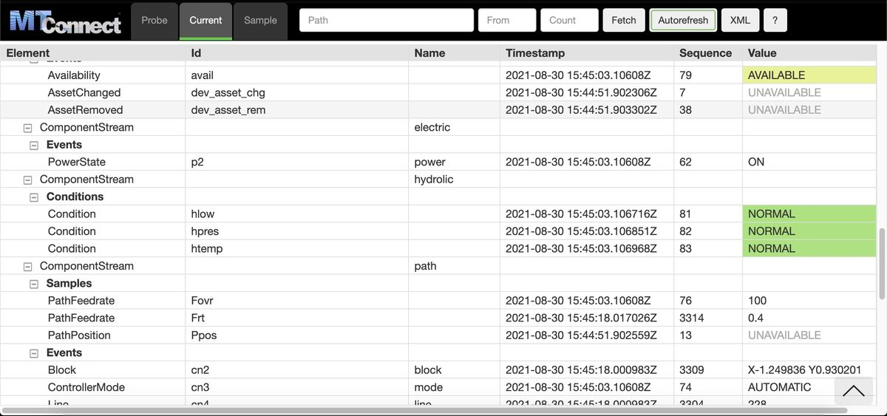

# Ladder99

[](./LICENSE)
[](https://github.com/Ladder99/ladder99/issues)
[]()
[](https://twitter.com/ladder99_com)

<!-- [](https://medium.com/@ladder99) -->
<!-- []() -->
<!-- [](https://github.com/prettier/prettier) -->
<!-- <a href="https://codecov.io/gh/Ladder99/neomem"></a> -->

Ladder99 is a free and open source software pipeline that transfers data from factory devices to a database and end-user visualizations using MTConnect, an open standard.

MTConnect standardizes factory device data flow and vocabulary - it was started by UC Berkeley, Georgia Institute of Technology, and Sun Microsystems in 2008, and continues under active development.

Ladder99 is developed by MRIIOT, your agile digital transformation partners.



## Quick Start

In a terminal (or use Git Bash for Windows),

```bash
shell/install
source ~/.bashrc
l99 start
```

Then goto http://localhost:5000 for MTConnect Agent and http://localhost for Grafana dashboard.

## Folders

- design - design notes, diagrams
- docs - website walkthrough and documentation
- services - source code for different sections of the pipeline - adapter, relay, etc.
- setups - configuration settings
- shell - shell scripts

Adapter plugins are defined in `services/adapter/src/drivers`.

## Links

For the Ladder99 documentation, see https://docs.ladder99.com.

For more on MTConnect, see https://www.mtconnect.org.

For more on MRIIOT and what we offer, see https://mriiot.com.

For architecture, design decisions, and milestones/versions/branches, see the [internal documentation](design).

## License

Open source Apache 2.0
