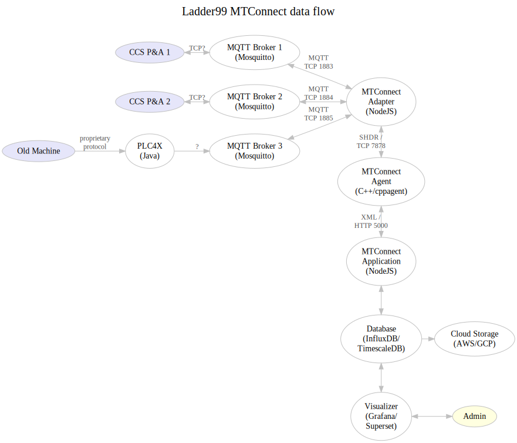

# Ladder99 MTConnect System

This project transfers data from factory devices to a database and end-user visualizations. 

MTConnect standardizes factory device data flow - it was designed by UC Berkeley, Georgia Institute of Technology, and Sun Microsystems in 2008. 

## Goals

- Connect factory devices to database and visualizations
- Use MTConnect Adapter, Agent, Application scheme
- Enforce one-way dataflow via a data diode
- Secure communication between devices via encrypted UDP transmission

## Architecture

### Data flow

Messages from factory devices go to an MQTT Broker (Aedes, a NodeJS program). PLC4X communicates with old machines via proprietary protocols and translates them to MQTT (correct?).MQTT is a simple publish/subscribe message protocol.

Our MTConnect Adapter (a NodeJS program) subscribes and listens to those messages, translates them to SHDR (Simple Hierarchical Data Representation, eg "2021-02-28T02:40:00|key|value"), and sends them on to a one-way diode (Java + RabbitMQ). 

The diode receiver then sends them on to an MTConnect Agent (C++/cppagent), and an MTConnect Application consumes the data as XML over HTTP, and feeds it to a database and visualizer. 

### Data diode

The data diode uses RabbitMQ (a message queue that uses AMQP - Advanced Message Queuing Protocol) and Java applications to transfer data unidirectionally and securely via a UDP connection.

[2016 paper](https://arxiv.org/abs/1602.07467) and [original source code](https://github.com/marcelmaatkamp/rabbitmq-applications/tree/master/application/datadiode)

## Usage

Run the system - start plc4x, mqtt broker, mtconnect adapter, mtconnect agent, data diode, mtconnect application, database, visualizer -

    docker-compose up

Run the device simulator (sends test messages to mqtt broker) -

    npm run device

In the adapter terminal you should get output like this -

    MTConnect Adapter
    Subscribes to MQTT topics, transforms to SHDR, sends to diode.
    ------------------------------------------------------------------
    Connecting to MQTT broker on { host: 'localhost', port: 1883 } ...
    Creating UDP socket...
    Hit ctrl-c to stop adapter.
    Connected to MQTT broker on { host: 'localhost', port: 1883 }
    Subscribing to MQTT topics...
    Subscribing to topic update-mtconnect-test...
    Listening for MQTT messages...
    Received MQTT message on topic update-mtconnect-test: {"connection":"onlin...
    Transforming MQTT message to SHDR...
    2021-01-05T01:21:46.196Z|connection|AVAILABLE
    2021-01-05T01:21:46.196Z|state|ACTIVE
    2021-01-05T01:21:46.196Z|program|pgm0
    2021-01-05T01:21:46.196Z|step|step1
    Sending SHDR to diode over UDP at { host: 'localhost', port: 4999 } ...

The diode terminal should show the message being received and transmitted to the agent.
