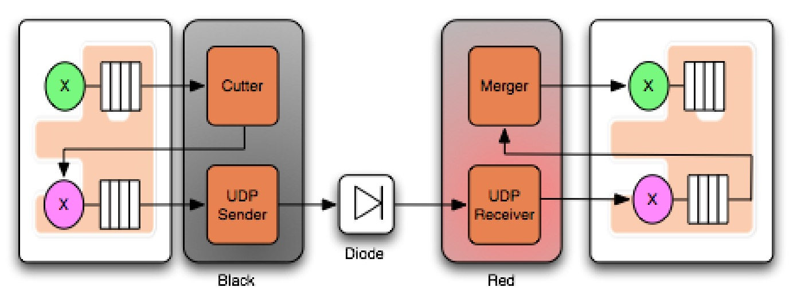
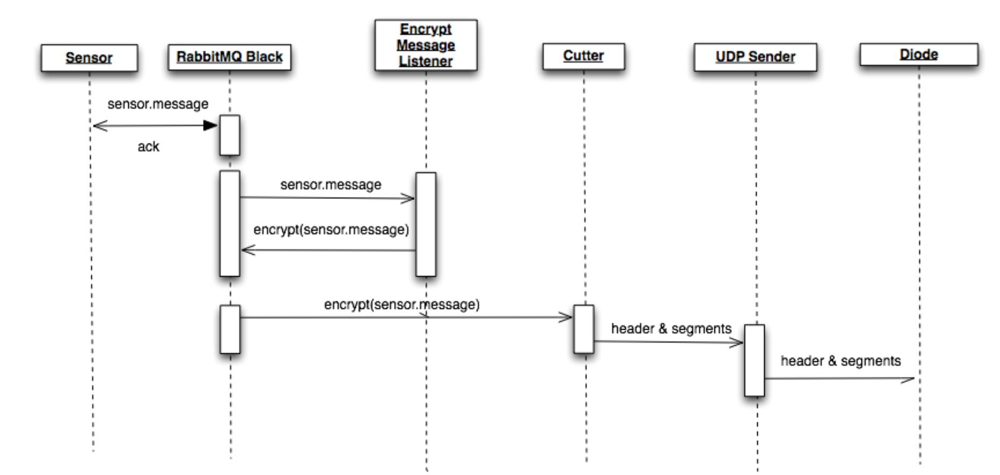

# Ladder99 MTConnect System

This project transfers data from factory devices to a database and end-user visualizations. 

MTConnect standardizes factory device data flow - it was designed by UC Berkeley, Georgia Institute of Technology, and Sun Microsystems in 2008. 

## Goals

- Connect factory devices to database and visualizations
- Use MTConnect Adapter, Agent, Application scheme
- Enforce one-way dataflow via a data diode
- Secure communication between devices via encrypted UDP transmission

## Architecture

### Data flow

Messages from factory devices go to an MQTT Broker (Aedes, a NodeJS program). PLC4X communicates with old machines via proprietary protocols and translates them to MQTT (correct?). MQTT is a simple publish/subscribe message protocol.

Our MTConnect Adapter (a NodeJS program) subscribes and listens to those messages, translates them to SHDR (Simple Hierarchical Data Representation, eg "2021-02-28T02:40:00|key|value"), and sends them on to a one-way diode (Java + RabbitMQ). 

The diode receiver then sends them on to an MTConnect Agent (C++/cppagent), and an MTConnect Application consumes the data as XML over HTTP, and feeds it to a database and visualizer. 

### Data diode

The data diode uses RabbitMQ and a Java application to transfer data via a one-way UDP connection. 

RabbitMQ uses a protocol called AMQP (Advanced Message Queuing Protocol), which is similar to MQTT, but allows different topologies:

UDP has limited packet size (standard is 1500 bytes), so data must be chopped up by a cutter and reassembled on the other side:

Data can also be encrypted before being cut up:

The complete pipeline - the X's are exchanges (input ports) - the green X is an unencrypted exchange:

[2016 paper](https://arxiv.org/abs/1602.07467) and [original source code](https://github.com/marcelmaatkamp/rabbitmq-applications/tree/master/application/datadiode)

## Usage

Run the system with

    docker-compose up
    
this will start plc4x, the mqtt broker, adapter, agent, diode, application, database, and visualizer - and send some test messages from a simulated device - 

In the terminal you should get output like this -

    $ docker-compose up --remove-orphans
    Removing orphan container "diode"
    Creating broker ... done
    Creating adapter ... done
    Creating device  ... done
    Attaching to broker, adapter, device
    broker     | 2021-03-03T07:04:53: mosquitto version 2.0.7 starting
    adapter    |
    adapter    | > ladder99-adapter@0.1.0 start
    adapter    | > node src/index.js
    adapter    |
    device     |
    device     | > ladder99-device@0.1.0 start
    device     | > node src/index.js
    device     |
    device     | Device
    device     | Simulates a device sending MQTT messages.
    device     | ------------------------------------------------------------
    adapter    | MTConnect Adapter
    device     | Connecting to MQTT broker on { host: 'broker', port: 1883 }
    adapter    | Subscribes to MQTT topics, transforms to SHDR, sends to diode.
    adapter    | ----------------------------------------------------------------
    adapter    | Connecting to MQTT broker on { host: 'broker', port: 1883 } ...
    adapter    | Hit ctrl-c to stop adapter.
    device     | Publishing messages...
    device     | Topic l99/ccs/evt/status: {"connection":"online","state":400,"prog...
    device     | Topic l99/ccs/evt/read: [{"address":"%Q0.1","keys":["OUT2","outp...
    device     | Topic l99/ccs/evt/read: {"address":"%Q0.7","keys":["OUT8","outpu...
    device     | Closing MQTT connection...
    broker     | 2021-03-03T07:04:53: Config loaded from /mosquitto/config/mosquitto.conf.
    broker     | 2021-03-03T07:04:53: Opening ipv4 listen socket on port 1883.
    broker     | 2021-03-03T07:04:53: mosquitto version 2.0.7 running
    broker     | 2021-03-03T07:04:56: New connection from 172.29.0.4:47774 on port 1883.
    broker     | 2021-03-03T07:04:56: New client connected from 172.29.0.4:47774 as mqttjs_4193fb70 (p2, c1, k60).
    broker     | 2021-03-03T07:04:56: No will message specified.
    broker     | 2021-03-03T07:04:56: Sending CONNACK to mqttjs_4193fb70 (0, 0)
    broker     | 2021-03-03T07:04:56: Received PUBLISH from mqttjs_4193fb70 (d0, q0, r0, m0, 'l99/ccs/evt/status', ... (177 bytes))
    broker     | 2021-03-03T07:04:56: Received PUBLISH from mqttjs_4193fb70 (d0, q0, r0, m0, 'l99/ccs/evt/read', ... (115 bytes))
    broker     | 2021-03-03T07:04:56: Received PUBLISH from mqttjs_4193fb70 (d0, q0, r0, m0, 'l99/ccs/evt/read', ... (56 bytes))
    broker     | 2021-03-03T07:04:56: Received DISCONNECT from mqttjs_4193fb70
    broker     | 2021-03-03T07:04:56: Client mqttjs_4193fb70 disconnected.
    broker     | 2021-03-03T07:04:56: New connection from 172.29.0.3:40256 on port 1883.
    adapter    | Connected to MQTT broker on { host: 'broker', port: 1883 } mqtt://broker:1883
    adapter    | Subscribing to MQTT topics...
    adapter    | Subscribing to topic l99/ccs/evt/status...
    adapter    | Subscribing to topic l99/ccs/evt/read...
    adapter    | Listening for MQTT messages...
    device     | npm notice
    device     | npm notice New minor version of npm available! 7.5.3 -> 7.6.0
    device     | npm notice Changelog: <https://github.com/npm/cli/releases/tag/v7.6.0>
    device     | npm notice Run `npm install -g npm@7.6.0` to update!
    device     | npm notice
    device exited with code 0
    ^C
    Gracefully stopping... (press Ctrl+C again to force)
    Stopping adapter ... done
    Stopping broker  ... done

## Running the diode

Edit your `/etc/hosts` with `sudo nano /etc/hosts`, and add the line:

    127.0.0.1 rabbitred rabbitblack nodered

Bring up all the services -

    cd src/diode/application/datadiode/contrib/docker
    docker-compose up

Visit the RabbitMQ management consoles here (user guest, pw guest) - http://rabbitblack/#/exchanges and http://rabbitred/#/exchanges.

Publish and receive some data -

    cd src/diode/application/datadiode/contrib/nodejs
    npm install  # just need to do once
    node src/send.js

You can see the message go by in the RabbitMQ console - http://rabbitblack/#/queues/%2F/hello. 

It's not yet setup to pass through the diode though.

Node-red

    http://localhost:1880

LDAP

    https://rabbitblack/#/
    https://rabbitred/#/

Run black and red testers

    brew install gradle
    cd src/diode/application/datadiode/black
    gradle run

but we need gradle 2.8, not 7.0

Well, let's make our own testers

tcp to 5673 rabbitblack
udp over 4321
tcp out on 5674 rabbitred

    $ cd src/diode
    $ docker build -t diode .

    Sending build context to Docker daemon  729.5MB
    Step 1/4 : FROM bivas/gradle:8-onbuild
    # Executing 5 build triggers
    ---> Using cache
    ---> Using cache
    ---> Using cache
    ---> Using cache
    ---> Using cache
    ---> e673a2bc5c7d
    Step 2/4 : WORKDIR /home/app
    ---> Using cache
    ---> bf4e856c0246
    Step 3/4 : COPY . .
    ---> 406589beb9ea
    Step 4/4 : RUN ./gradlew
    ---> Running in 1796ba9cd902
    Downloading https://services.gradle.org/distributions/gradle-2.8-bin.zip
    .............................................................................................................................................................................................................

    BUILD SUCCESSFUL
    Total time: 43.475 secs
    Removing intermediate container 1796ba9cd902
    ---> 8791a6794a69
    Successfully built 8791a6794a69
    Successfully tagged diode:latest

---

    $ docker run diode ./gradlew tasks

    Starting a new Gradle Daemon for this build (subsequent builds will be faster).
    :tasks

    ------------------------------------------------------------
    All tasks runnable from root project
    ------------------------------------------------------------

    Application tasks
    -----------------
    bootRun - Run the project with support for auto-detecting main class and reloading static resources
    installApp - Installs the project as a JVM application along with libs and OS specific scripts.
    run - Runs this project as a JVM application

    Build tasks
    -----------
    assemble - Assembles the outputs of this project.
    bootRepackage - Repackage existing JAR and WAR archives so that they can be executed from the command line using 'java -jar'
    build - Assembles and tests this project.
    buildDependents - Assembles and tests this project and all projects that depend on it.
    buildNeeded - Assembles and tests this project and all projects it depends on.
    classes - Assembles main classes.
    clean - Deletes the build directory.
    jar - Assembles a jar archive containing the main classes.
    testClasses - Assembles test classes.

    Build Setup tasks
    -----------------
    init - Initializes a new Gradle build. [incubating]

    Distribution tasks
    ------------------
    assembleDist - Assembles the main distributions
    distTar - Bundles the project as a distribution.
    distZip - Bundles the project as a distribution.
    installDist - Installs the project as a distribution as-is.

    Docker tasks
    ------------
    distDocker - Packs the project's JVM application as a Docker image.

    Documentation tasks
    -------------------
    javadoc - Generates Javadoc API documentation for the main source code.

    Help tasks
    ----------
    components - Displays the components produced by root project 'app'. [incubating]
    dependencies - Displays all dependencies declared in root project 'app'.
    dependencyInsight - Displays the insight into a specific dependency in root project 'app'.
    help - Displays a help message.
    model - Displays the configuration model of root project 'app'. [incubating]
    projects - Displays the sub-projects of root project 'app'.
    properties - Displays the properties of root project 'app'.
    tasks - Displays the tasks runnable from root project 'app' (some of the displayed tasks may belong to subprojects).

    IDE tasks
    ---------
    cleanEclipse - Cleans all Eclipse files.
    cleanIdea - Cleans IDEA project files (IML, IPR)
    eclipse - Generates all Eclipse files.
    idea - Generates IDEA project files (IML, IPR, IWS)

    Verification tasks
    ------------------
    check - Runs all checks.
    test - Runs the unit tests.

    Other tasks
    -----------
    cleanIdeaWorkspace
    dependencyManagement
    runClient
    runFastRabbitServer
    runRabbitServer
    runServer
    wrapper

    Rules
    -----
    Pattern: clean<TaskName>: Cleans the output files of a task.
    Pattern: build<ConfigurationName>: Assembles the artifacts of a configuration.
    Pattern: upload<ConfigurationName>: Assembles and uploads the artifacts belonging to a configuration.

    To see all tasks and more detail, run gradlew tasks --all

    To see more detail about a task, run gradlew help --task <task>

    BUILD SUCCESSFUL

    Total time: 10.782 secs

----

    $ docker run diode /bin/bash -c "cd application/datadiode/black && gradle run"
    Starting a new Gradle Daemon for this build (subsequent builds will be faster).
    ...
    [errored at "<<<<<<" in java file]

