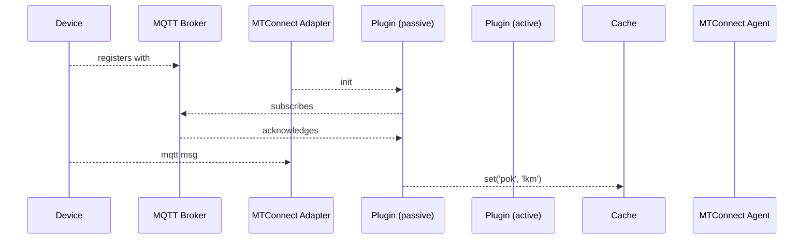

```mermaid
sequenceDiagram

participant device as Device
participant broker as MQTT Broker
participant adapter as MTConnect Adapter
participant plugin1 as Plugin (passive)
participant plugin2 as Plugin (active)
participant cache as Cache
participant agent as MTConnect Agent

device -->> broker: registers with
adapter -->> plugin1: init
plugin1 -->> broker: subscribes
broker -->> plugin1: acknowledges
device -->> adapter: mqtt msg
plugin1 -->> cache: set('pok', 'lkm')

```

<!-- loop Healthcheck
    John->>John: Fight against hypochondria
end

Note right of John: Rational thoughts! -->

