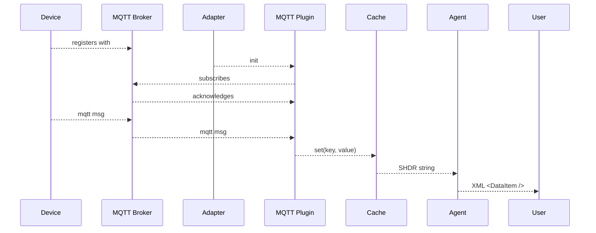
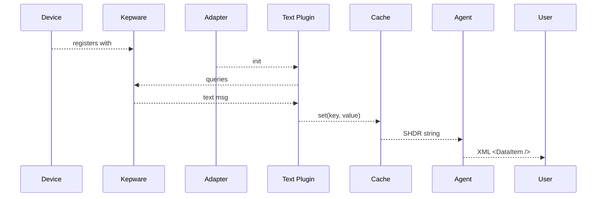

MQTT Plugin (passive)

```mermaid
sequenceDiagram

participant device as Device
participant broker as MQTT Broker
participant adapter as Adapter
participant plugin as MQTT Plugin
participant cache as Cache
participant agent as Agent
participant user as User

device -->> broker: registers with
adapter -->> plugin: init
plugin -->> broker: subscribes
broker -->> plugin: acknowledges
device -->> broker: mqtt msg
broker -->> plugin: mqtt msg
plugin -->> cache: set(key, value)
cache -->> agent: SHDR string
agent -->> user: XML <DataItem />

```

Text Plugin (active)

```mermaid
sequenceDiagram

participant device as Device
participant kepware as Kepware
participant adapter as Adapter
participant plugin as Text Plugin
participant cache as Cache
participant agent as Agent
participant user as User

device -->> kepware: registers with
adapter -->> plugin: init
plugin -->> kepware: queries
kepware -->> plugin: text msg
plugin -->> cache: set(key, value)
cache -->> agent: SHDR string
agent -->> user: XML <DataItem />

```

