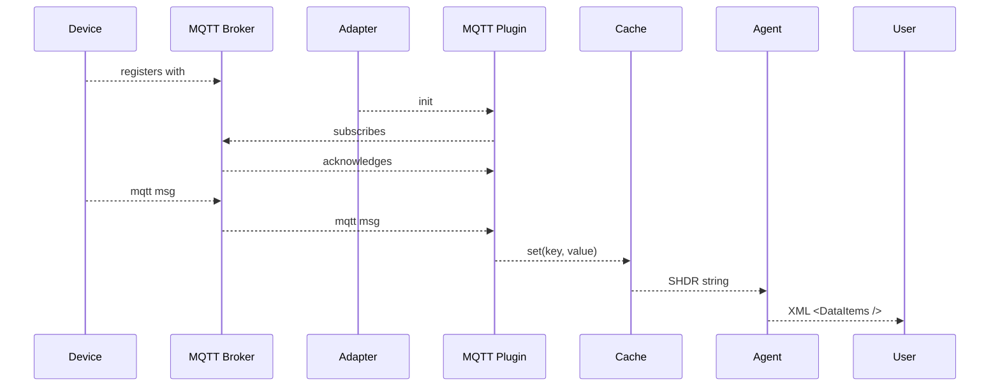
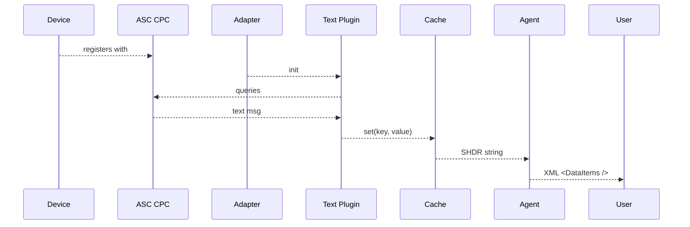
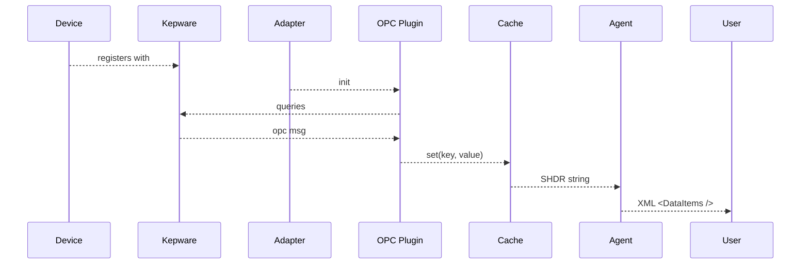

See https://mermaid-js.github.io/mermaid/#/sequenceDiagram

MQTT Plugin (passive)

```mermaid
sequenceDiagram

participant device as Device
participant broker as MQTT Broker
participant adapter as Adapter
participant plugin as MQTT Plugin
participant cache as Cache
participant agent as Agent
participant user as User

device -->> broker: registers with
adapter -->> plugin: init
plugin -->> broker: subscribes
broker -->> plugin: acknowledges
device -->> broker: mqtt msg
broker -->> plugin: mqtt msg
plugin -->> cache: set(key, value)
cache -->> agent: SHDR string
agent -->> user: XML <DataItems />

```

ASC CPC Text Plugin (active)

```mermaid
sequenceDiagram

participant device as Device
participant cpc as ASC CPC
participant adapter as Adapter
participant plugin as Text Plugin
participant cache as Cache
participant agent as Agent
participant user as User

device -->> cpc: registers with
adapter -->> plugin: init
plugin -->> cpc: queries
cpc -->> plugin: text msg
plugin -->> cache: set(key, value)
cache -->> agent: SHDR string
agent -->> user: XML <DataItems />

```

Kepware OPC Plugin (active)

```mermaid
sequenceDiagram

participant device as Device
participant kepware as Kepware
participant adapter as Adapter
participant plugin as OPC Plugin
participant cache as Cache
participant agent as Agent
participant user as User

device -->> kepware: registers with
adapter -->> plugin: init
plugin -->> kepware: queries
kepware -->> plugin: opc msg
plugin -->> cache: set(key, value)
cache -->> agent: SHDR string
agent -->> user: XML <DataItems />

```

