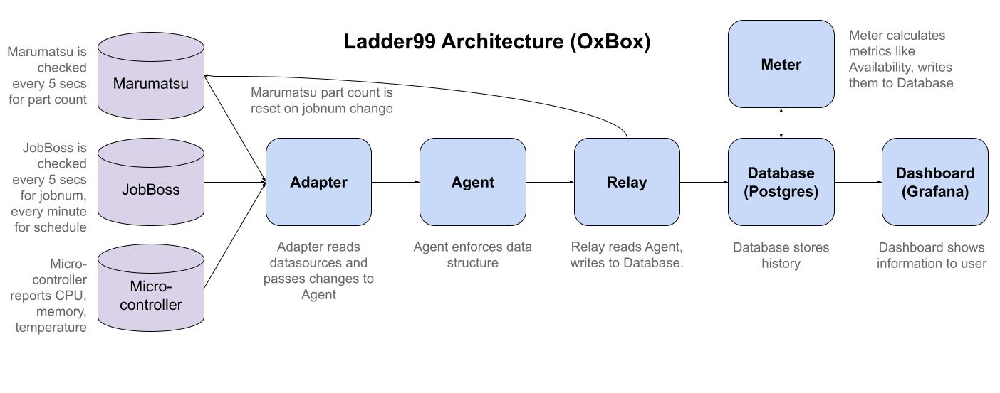
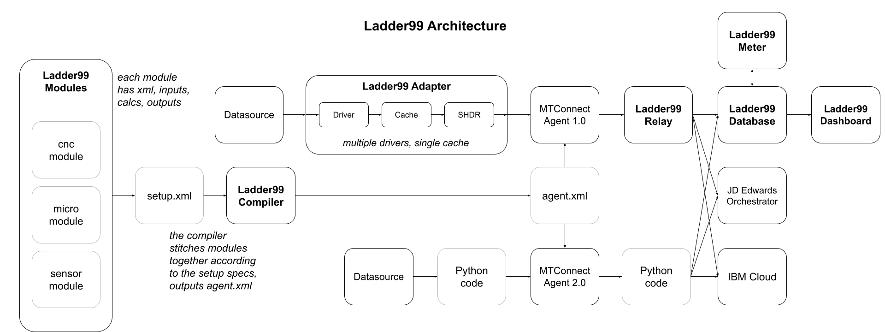

# Architecture

## Example architecture for a client

## Future direction

We will be building a compiler that takes xml module definitions and assembles them into a complete devices.xml file for the agent to consume. 

