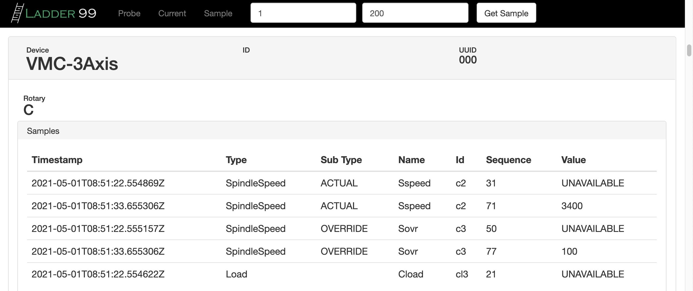

****************
Ladder99
****************

Ladder99 is a free and open source application that transfers data from factory devices to a database and end-user visualizations using MTConnect, an open standard.

.. toctree::
   :maxdepth: 2
   :caption: Table of Contents

   pages/welcome
   pages/installation
   .. pages/adapter
   pages/agent
   .. pages/application
   .. pages/database
   .. pages/visualizer
   pages/about

   .. pages/getting-started
   .. pages/setting-up-devices
   .. pages/developing-adapters
   .. pages/contributing

