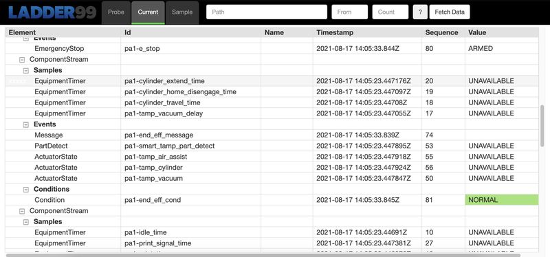

****************
Ladder99
****************

Ladder99 is a free and open source application that transfers data from factory devices to a database and end-user visualizations using MTConnect, an open standard.

.. toctree::
   :maxdepth: 2
   :caption: Table of Contents

   pages/welcome
   pages/architecture
   pages/installation
   .. pages/pipeline
   pages/adapter
   .. pages/develop-adapter
   .. pages/agent
   .. pages/relay
   .. pages/database
   .. pages/dashboard
   .. pages/develop-agent
   pages/about

   .. pages/getting-started
   .. pages/setting-up-devices
   .. pages/developing-adapters
   .. pages/contributing

