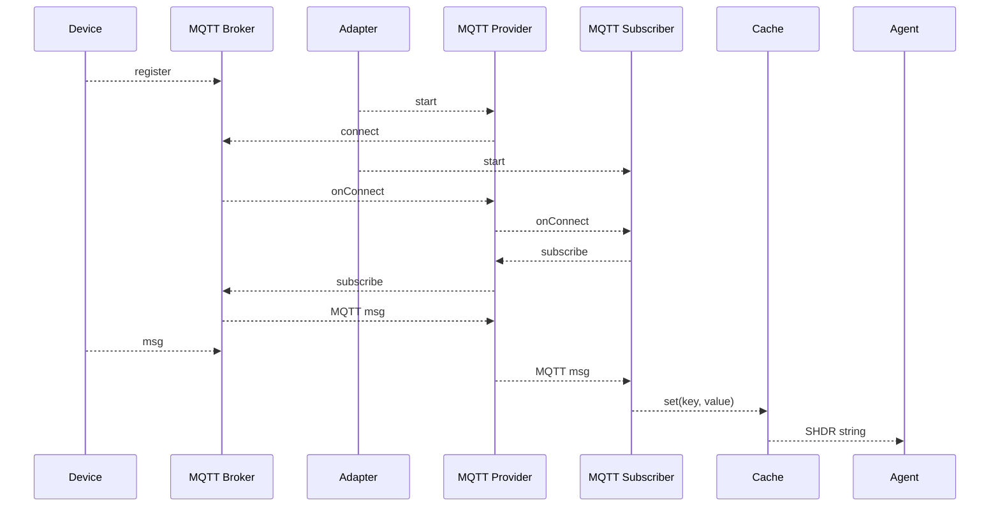
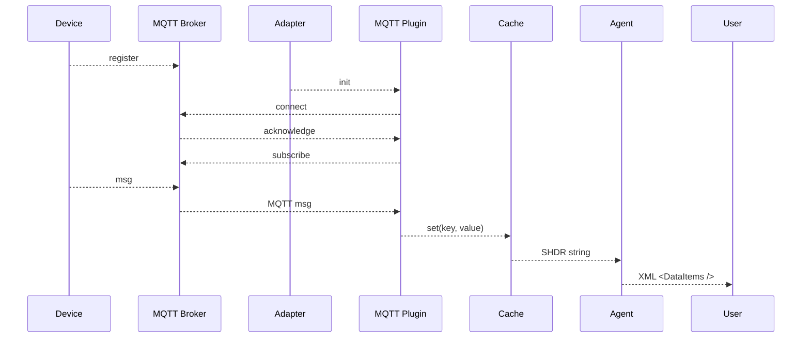
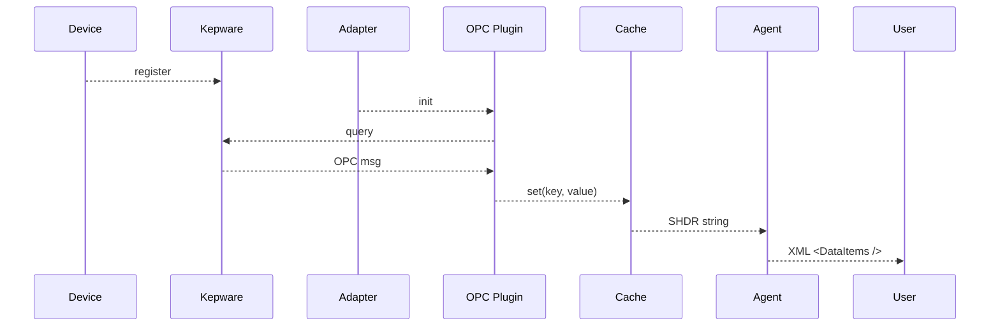
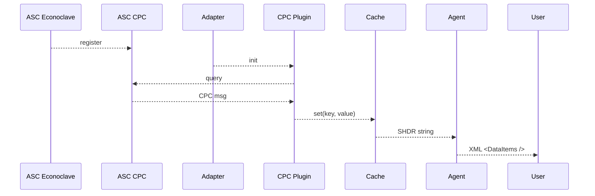

# Sequence diagrams 

Lifecycles of Adapter plugins

## MQTT Provider and Subscriber

## MQTT Plugin

## Kepware OPC Plugin

## ASC CPC Plugin

See https://mermaid-js.github.io/mermaid/#/sequenceDiagram

