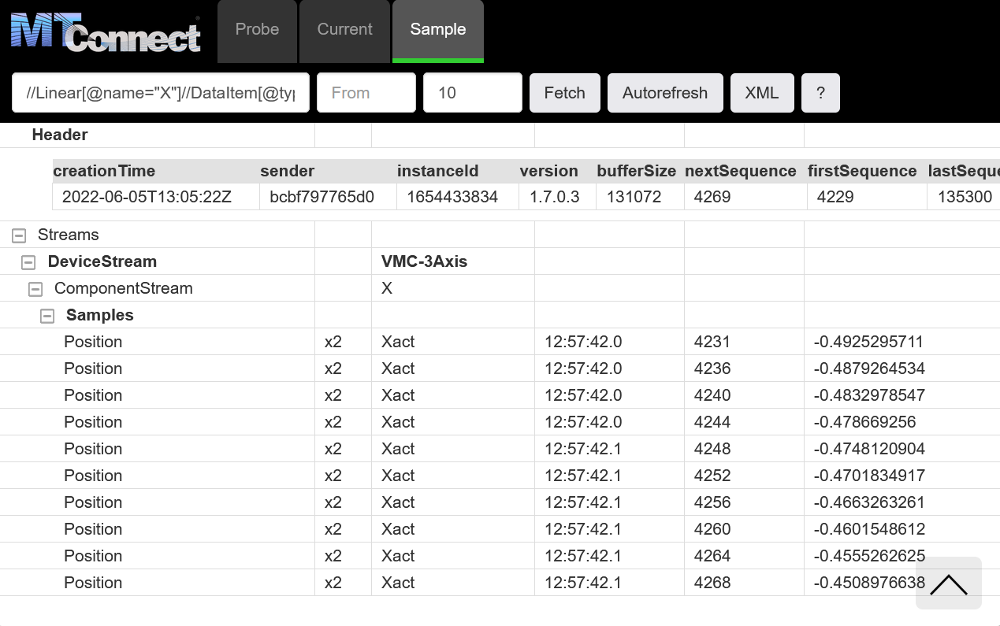
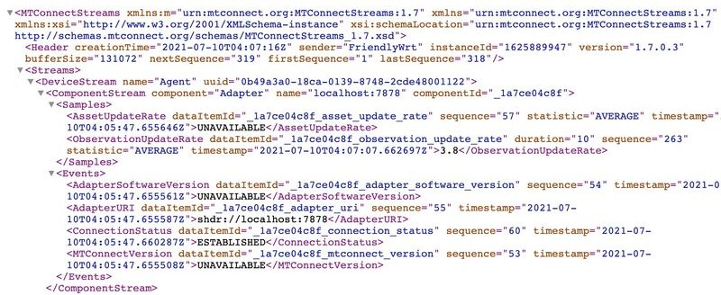

# Agent

The **MTConnect Agent** receives data from one or more device Adapters and writes the data to an XML tree. This XML can be consumed by other applications, or displayed in a browser as an HTML webpage.


## Run Image

The Agent comes with a recording of a CNC machine for playback. 

This command will download an image of the Agent from Docker Hub (a central repository for Docker services) and run the simulation -

```
docker run -it --rm --init --name agent -p5000:5000 ladder99/agent
```

## View Output

View the output in your browser at http://localhost:5000 -


The Agent starts in the **Probe** tab, which shows the data items available - first for the Agent itself, then the CNC machine. 

Click on the **Current** tab to see the current data values, then click on the Autorefresh button to have the view refreshed every 2 seconds. 

The **Sample** tab shows a series of recent data values. The Agent comes with a buffer to store data values, and you can query it with XPath expressions. 

For example, to see the last 10 values for the x-axis position, visit http://localhost:5000/sample?path=//Linear[@name=%22X%22]//DataItem[@type=%22POSITION%22%20and%20@subType=%22ACTUAL%22]&count=10



Click the question mark to see more help. 

<!-- ## MTConnect Agent

While you're waiting, take a look at http://mtconnect.mazakcorp.com - this shows some live Mazak Agents you can connect to.

Try http://mtconnect.mazakcorp.com:5701/ - this shows the list of dataitems available from the Agent, in XML format. For example, the a motor temperature looks like this -

```xml
<DataItem category="SAMPLE" compositionId="Cmotor" id="Stemp" nativeUnits="CELSIUS" type="TEMPERATURE" units="CELSIUS"></DataItem>
```

Now try http://mtconnect.mazakcorp.com:5701/current - this shows the current values for the dataitems - e.g. here the temperature is 23 Celsius -

```xml
<Temperature dataItemId="Stemp" timestamp="2022-08-31T20:28:32.484493Z" compositionId="Cmotor" sequence="2664042">23</Temperature>
```
 -->

## XML Output

Click **XML** to see the underlying XML data -




## Exit Agent

When you're done, hit Ctrl+C in the terminal window.


<!-- ## Custom Setup

To run with your own custom setup, point the Agent to a folder containing your agent.cfg configuration file, e.g.

    docker run -it --init --rm -p 5000:5000 \
        -v $(pwd)/setups/test/print-apply/volumes/agent:/data/agent \
        --workdir /data/agent \
        ladder99/agent:latest agent debug 
        
-->


<!-- ## XML Output

To see the original XML output, you can omit or comment out the files sections of the agent.cfg file -

 -->


<!-- ## HTML Styles

The HTML output is defined by the XSL and CSS in the [pipeline/agent/styles folder](https://github.com/Ladder99/ladder99/tree/main/pipeline/agent/styles), which transforms the default XML output. -->


## Source Code

The MTConnect Agent is an open source C++ application. To learn more about it, see https://github.com/mtconnect/cppagent.

