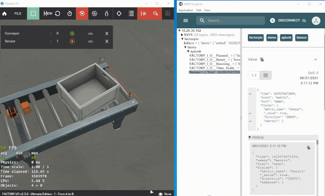

<!-- 
---
title: factoryio-driver
description: 
published: true
date: 2021-08-22T06:48:18.657Z
tags: 
editor: markdown
dateCreated: 2021-08-21T20:19:51.547Z
---
 -->

# FactoryIO Driver

## Overview

Fully configurable Factory I/O driver built on top of [base-driver](https://github.com/Ladder99/base-driver), and [Factory I/O SDK](https://docs.factoryio.com/sdk/) libraries.  

## Source

[Github Repository](https://github.com/Ladder99/factoryio-driver)

# Output

## Splunk Metric

Handler `l99.driver.factoryio.handlers.SplunkMetric, factoryio` outputs data in Splunk metric format to an MQTT broker.

<!--  -->


# Configuration

## Local

```yaml
type: l99.driver.factoryio.FactoryioLocalMachine, factoryio
strategy: l99.driver.factoryio.collectors.BasicLocal01, factoryio
```

Driver accesses Factory I/O memory mapped file and must be run locally.

## Remote

```yaml
type: l99.driver.factoryio.FactoryioRemoteMachine, factoryio
strategy: l99.driver.factoryio.collectors.BasicRemote01, factoryio
```

Driver accesses Factory I/O Web API and can be run remotely.