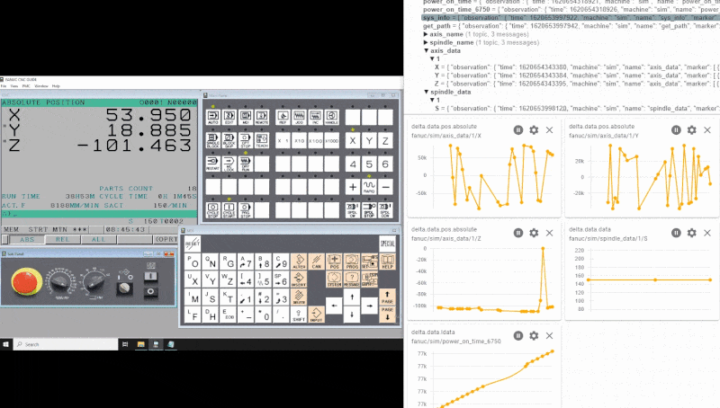
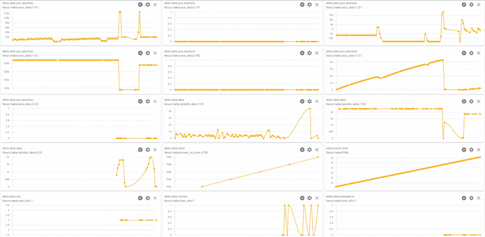

# Fanuc

> WARNING:
> Review [Fanuc Vulnerability Information](https://www.fanuc.co.jp/en/product/vulnerability/index.html) before proceeding.

## Overview

Built on top of Fanuc Focas native libraries, [`Fanuc Driver`](https://github.com/Ladder99/fanuc-driver) transforms controller data to various protocols and formats.  Supported outputs include MQTT JSON, MQTT SparkplugB, InfluxDb Line Protocol, and MTConnect SHDR. Concepts in the [`base-driver`](https://github.com/Ladder99/base-driver) repository can be reused to create transofrmation logic to other transports and formats.

Below illustrates [Fanuc NC Guide](https://www.fanucamerica.com/products/cnc/software/cnc-guide-simulation-software) output visualized with [MQTT Explorer](http://mqtt-explorer.com/).



Below illustrates [Fanuc 0i-TF](https://www.fanucamerica.com/products/cnc/cnc-systems/series-0if) production output.



## Videos

[Setup - v0.1](https://www.youtube.com/watch?v=_sZ0qCVkTkM)

[Setup / Changes - v0.2](https://www.youtube.com/watch?v=yhe_apuiJVY)

[InfluxDb Output](https://www.youtube.com/watch?v=gqfBj0ImMrw)

[MTConnect Output](https://www.youtube.com/watch?v=j1gXHXA2RW0)

[SparkplugB Output](https://www.youtube.com/watch?v=yw0TMXsLHro)

## Focas Library Matrix

Below table outlines controller, operating system and architecture compatibility for the included native Focas libraries.

| Name | OS | Width | Description |
|---|---|---|---|
| FWLIB32.DLL | Windows | 32 | CNC/PMC Data window control library |
| FWLIBE1.DLL | Windows | 32 | Processing library for TCP/IP |
| FWLIB30i.DLL | Windows | 32 | Processing library for 30i/31i/32i/35i, PMi-A |
| FWLIB150.DLL | Windows | 32 | Processing library for 150-B |
| FWLIB15i.DLL | Windows | 32 | Processing library for 150i |
| FWLIB160.DLL | Windows | 32 | Processing library for 160/180/210 |
| FWLIB16W.DLL | Windows | 32 | Processing library for 160i/180i-W |
| FWLIB0i.DLL  | Windows | 32 | Processing library for 0i-A |
| FWLIB0iB.DLL | Windows | 32 | Processing library for 0i-B |
| FWLIB0iD.DLL | Windows | 32 | Processing library for 0i-D |
| FWLIBPM.DLL  | Windows | 32 | Processing library for Power Mate-D/H |
| FWLIBPMi.DLL | Windows | 32 | Processing library for Power Mate i-D/H |
| FWLIBNCG.DLL | Windows | 32 | Processing library for FS31i/32i/35i NCGuidePro |
| FWLIB0DN.DLL | Windows | 32 | Processing library for FS0i-D NCGuidePro |
| libfwlib32-linux-x86.so.1.0.0 | Linux | 32 | Processing library for Linux |
| libfwlib32-linux-x86.so.1.0.5 | Linux | 32 | Processing library for Linux |
| libfwlib32-linux-armv7.so.1.0.5 | Linux | 32 | Processing library for Linux |
| libfwlib32-linux-x64.so.1.0.5 | Linux | 64 | Processing library for Linux |
| FWLIB64.DLL    | Windows | 64 | CNC/PMC Data window control library |
| FWLIBE64.DLL   | Windows | 64 | Processing library for TCP/IP |
| FWLIB30i64.DLL | Windows | 64 | Processing library for 30i/31i/32i/35i, PMi-A |
| FWLIB0iD64.DLL | Windows | 64 | Processing library for 0i-D |
| FWLIBNCG64.DLL | Windows | 64 | Processing library for FS31i/32i/35i NCGuidePro |
| FWLIB0DN64.DLL | Windows | 64 | Processing library for FS0i-D NCGuidePro |


## Linux Installation

> WARNING:
> Instructions need to be upgraded to .NET6

Instructions documented here are for non-Docker builds.

### ARMv7 Linux

[Install .NET SDK](https://sukesh.me/2020/07/07/how-to-install-net-core-on-raspberry-pi/)

```bash
export DOTNET_ROOT=$HOME/dotnet
export PATH=$PATH:$HOME/dotnet

cd ~

git clone --recurse-submodules -j8 \
	https://github.com/Ladder99/fanuc-driver.git

cd fanuc-driver/fanuc

dotnet restore "fanuc.csproj"

dotnet build "fanuc.csproj" \
	-c Release \
	/nowarn:CS0618 \
	/nowarn:CS8632 \
	/nowarn:CS1998 \
	/nowarn:CS8032 \
	-p:DefineConstants=ARMV7

dotnet publish "fanuc.csproj" \
	-c Release \
	/nowarn:CS0618 \
	/nowarn:CS8632 \
	/nowarn:CS1998 \
	/nowarn:CS8032 \
	-p:DefineConstants=ARMV7

./bin/Release/netcoreapp3.1/fanuc \
	--nlog ../examples/fanuc-driver/nlog-example-nlog.config \
  --config ../examples/fanuc-driver/config-example.yml
```

### x86 Linux

[Install .NET SDK](https://dotnet.microsoft.com/en-us/download/dotnet/3.1)

```bash
export DOTNET_ROOT=$HOME/dotnet
export PATH=$PATH:$HOME/dotnet

# You may want to disable the .NET telemetry
export DOTNET_CLI_TELEMETRY_OPTOUT='true'

# Choose a folder for `fanuc-driver` (it should be either empty or non-existent, but the parent folder needs to exist)
fanuc_driver_folder="$HOME/fanuc-driver"

# Clone the sources
git clone --recurse-submodules -j8 https://github.com/Ladder99/fanuc-driver.git "$fanuc_driver_folder"

dotnet publish "$fanuc_driver_folder/fanuc/fanuc.csproj" --self-contained true --runtime linux-x64 /nowarn:CS0618 /nowarn:CS8632 /nowarn:CS1998 -p:DefineConstants=LINUX64

# Configure `config.yml` and `nlog.config`
# Example files: "$fanuc_driver_folder/fanuc/config.yml" and "$fanuc_driver_folder/fanuc/nlog.config"

# Start an MQTT broker (outside `fanuc-driver`)

# Start `fanuc-driver`
"$fanuc_driver_folder/fanuc/bin/Debug/netcoreapp3.1/linux-x64/publish/fanuc" --nlog "$fanuc_driver_folder/fanuc/nlog.config" --config "$fanuc_driver_folder/fanuc/config.yml"
```


## Docker Installation

### Install Docker and docker-compose

```bash
cd ~

curl -fsSL https://get.docker.com -o get-docker.sh
sudo sh ./get-docker.sh

sudo groupadd docker

sudo usermod -aG docker $USER
newgrp docker
sudo systemctl enable docker
sudo systemctl start docker
docker run hello-world

sudo curl -L "https://github.com/docker/compose/releases/download/v2.3.3/docker-compose-$(uname -s)-$(uname -m)" -o /usr/local/bin/docker-compose
sudo chmod +x /usr/local/bin/docker-compose
docker-compose --version
```

### Select Latest Image

[Docker Hub Images](https://hub.docker.com/r/ladder99/fanuc-driver/tags)

Export the latest image tag to `FOCAS_TGT` environment variable.    
Docker-compose will use this variable to pull the correct image.

For x86 Linux architecture use:

```bash
export FOCAS_TGT=linux64-886a5a3
```

For ARM Linux architecture use:

```bash
export FOCAS_TGT=arm-886a5a3
```

### Clone Repository

```bash
mkdir ~/fanuc
cd ~/fanuc

git clone --recurse-submodules -j8 \
	https://github.com/Ladder99/fanuc-driver.git
```

If you are working with the develop branch then you'll want to check that branch out.

```bash
cd fanuc-driver
git checkout develop
cd base-driver
git checkout develop
```

### Prepare Volumes

Below commands copy the basic configuration files for Fanuc Driver, Mosquitto, and MTConnect Agent.

```bash
cd ~/fanuc/fanuc-driver/examples

mkdir -p ../../volumes/fanuc-driver
cp fanuc-driver/nlog-example-linux.config ../../volumes/fanuc-driver/nlog.config
cp fanuc-driver/config-example.yml ../../volumes/fanuc-driver/config.yml

mkdir -p ../../volumes/mosquitto/config
mkdir -p ../../volumes/mosquitto/data
mkdir -p ../../volumes/mosquitto/log
cp mosquitto.conf ../../volumes/mosquitto/config/mosquitto.conf

mkdir -p ../../volumes/agent
cp mtconnect/agent.cfg ../../volumes/agent/agent.cfg
cp mtconnect/devices_example.xml ../../volumes/agent/devices.xml
```

### Start Profile

Available profiles:  

| Image | Profiles | Description |
| --- | --- | --- |
| [Portainer](https://hub.docker.com/r/portainer/portainer-ce) | `all`, `admin` | Visual Docker management. |
| [Dozzle](https://hub.docker.com/r/amir20/dozzle/) | `all`, `admin` | Docker log concentrator. |
| [Influx](https://hub.docker.com/_/influxdb) | `all`, `influx` | Time series database. |
| [Agent](https://hub.docker.com/r/ladder99/agent) | `all`, `mtc` | MTConnect Agent. |
| [Mosquitto](https://hub.docker.com/_/eclipse-mosquitto) | `all`, `mqtt` | MQTT broker. |
| [Fanuc Driver](https://hub.docker.com/r/ladder99/fanuc-driver) | `all`, `influx`, `mqtt`, `spb`, `mtc`, `fanuc` | Fanuc Focas adapter. |

If you are using the Fanuc Driver in combination with Ladder99 MTConnect Historian then stand up the `fanuc` profile.  
If you want to output data to InfluxDb, MQTT, or as SparkplugB then select the appropriate profile, in addition to `admin`.

```bash
cd ~/fanuc/fanuc-driver/examples

profile=fanuc

docker-compose --project-name fanuc --file compose.yml --profile $profile --verbose pull
docker-compose --project-name fanuc --file compose.yml --profile $profile --verbose create
docker-compose --project-name fanuc --file compose.yml --profile $profile --verbose start
```

### Building an Image

1. Clean Environment

```bash
docker container stop fanuc_driver
docker container stop agent
docker container rm fanuc_driver
docker container rm agent
docker container prune
```

```bash
docker rmi $(docker images --format '{{.Repository}}:{{.Tag}}' | grep 'ladder99/fanuc-driver')
docker rmi $(docker images --format '{{.Repository}}:{{.Tag}}' | grep 'ladder99/agent')
docker image prune
```

```bash
sudo rm -rf ~/fanuc
```

2. [Clone Repository](#clone-repository)


3. Prepare Build

For x86 Linux architecture use:

```bash
cd ~/fanuc/fanuc-driver

# set vars for build
os=LINUX64
image=ladder99/fanuc-driver
commit=$(git rev-parse --short HEAD)
tag=linux64-$commit
```

For ARM Linux architecture use:

```bash
cd ~/fanuc/fanuc-driver

# set vars for build
os=ARM
image=ladder99/fanuc-driver
commit=$(git rev-parse --short HEAD)
tag=arm-$commit
```

4. Build Image

```bash
# build driver container
docker build \
	-f Dockerfile.$os \
  --tag=$image:$tag .

# the architecture you are on (linux64,arm)
# set the driver image tag
#export FOCAS_TGT=$( docker images ladder99/fanuc-driver | tail -n +2 | awk 'NR==1{print $1":"$2}' )
export FOCAS_TGT=$tag
```

5. Push Image

```bash
docker login

docker push ladder99/fanuc-driver:$FOCAS_TGT
```

6. [Prepare Volumes](#prepare-volumes) 

7. [Start Profile](#start-profile)

