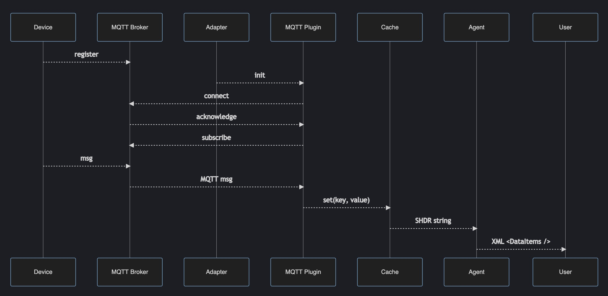

# Developing Adapters

## Diagram

This diagram shows the sequence of operations for data going from a device through the adapter and plugin to the agent -

## Defining Models

Device models are defined in subfolders of the `models` folder, and typically contain:

- model.yaml - defines the structure of the xml that is included in devices.xml, which is fed to the mtconnect agent
- cache-inputs.yaml - defines how to parse mqtt messages using the mqtt-json plugin, which writes values to a key-value cache
- cache-outputs.yaml - defines the shdr strings that are calculated from the cache and sent on to the agent
- types.yaml - (optional) used by cache-outputs.yaml

For example, the Chicago Coding Systems (CCS) Print and Apply model is defined in `models/ccs-pa` - you can see the definitions there.

To develop a new model, you could make a copy of the `ccs/pa` folder and make changes to those files.

    cp -r models/ccs/pa models/my/model
    ...

## Defining Devices

The devices (model instances) are defined in the `setups` folder, eg the `ccs-pa` setup has a list of instances in the `setup.yaml` file there.

To start your own setup, start by making a copy of the `setups/ccs-pa` folder and name it something appropriate -

    cp -r setups/ccs-pa setups/my-setup

Make changes to the setup as needed.

Then generate the devices.xml and docker files (former partially implemented, latter not implemented yet - hand-edit) - e.g.

    sh/compile my-setup

## Testing a setup

You can test a setup by running the pipeline in Docker -

    sh/start my-setup

or an individual service (e.g. play) with

    sh/start my-setup [servicename]

You can stop all services with

    sh/stop my-setup all

or an individual service with

    docker kill [servicename]

Next we'll see about contributing to the Ladder99 project.
