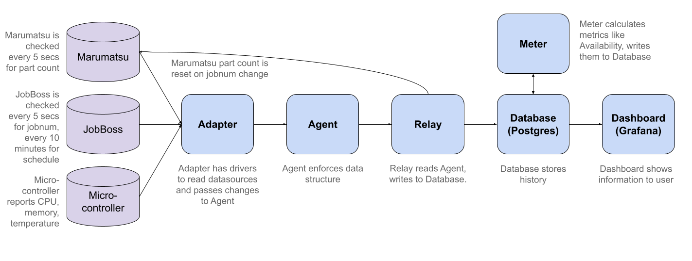

# How Does It Work?

Data flows from **Devices** through the **Adapter**, **Agent**, and **Relay** to the **Database**, **Meter**, **Dashboard**, and other applications.

The **Adapter** polls or subscribes to messages from **Devices**, and translates the data to a simple text format, which it sends on to the **Agent**.

<!-- The **Adapter** polls or subscribes to messages from **Devices**, and translates the data to SHDR (Simple Hierarchical Data Representation), a simple text format, eg "2021-02-28T02:40:00|count|32", which it sends on to the **Agent**. -->

The **Agent** fits that data into an XML tree representing the device structures. This XML can be viewed in the browser directly, or transformed into HTML.

The **Relay** then consumes the XML and feeds it to the **Database**. 

The **Meter** polls the Database for changes and writes updated statistics.

And finally, the **Dashboard** polls the Database and displays current and historical values in a browser.
