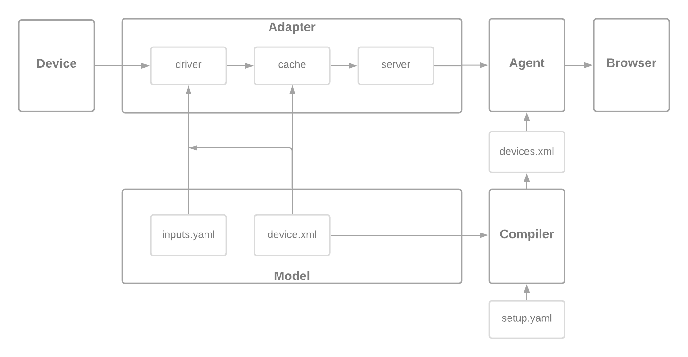

# Adapter

## About

The Adapter reads data from a device and translates it into SHDR, a simple key-value text representation, then sends it on to the Agent.

## Running

You can run some sample data with

```bash
cd ladder99
git clone https://github.com/Ladder99/setup-development setups/development
l99 use development/ccs-pa
l99 start adapter agent mosquitto play
```

then visit http://localhost:5000/current.

<!-- ## Diagram

 -->

## How it works

<!-- ### Compiler

The compiler gathers the device.xml templates from the different models specified in a setup.yaml file. It removes Inputs, source attributes, substitutes $deviceId, etc. - then combines the resulting xml data into one devices.xml file. -->

### Adapter

The Adapter reads the setup.yaml, iterates over the device configs, each of which includes one or more sources. Each source can use a different driver to read data from a device.

### Driver

A Driver reads data from a device, by either subscribing to it, polling it, or communicating with it in some way - then adds that data to a key-value cache. 

<!-- The data to read and where to put it in the cache comes from the device.xml template.  -->

<!-- For MQTT and TCP dialogs a supplemental inputs.yaml file can specify topics to subscribe to and how to chop up the messages. -->

### Cache

The Cache is a key-value store in the Adapter that can execute code when a value changes. This can write data to another cache location, or write SHDR data to the server. When a cache value is written to, it will recursively call the functions until all are complete, or some limit is reached.

### Server

Each Adapter has a TCP server which talks to the Agent. It sends SHDR data which the Agent splits up and applies to the model defined by the agent.xml file.

<!-- ### Agent

The Agent receives the SHDR data and applies it to the agent.xml model, then publishes that data in XML format when requested by HTTP. -->
