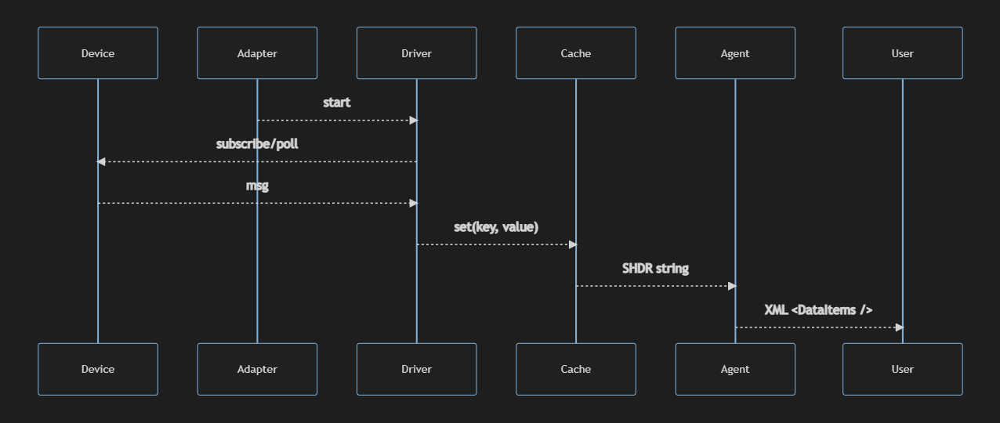

# Adapter

## About

The Adapter reads data from a device and translates it into SHDR, a simple key-value text representation, then sends it on to the Agent.

## How it works

### Adapter

The Adapter reads the setup.yaml, iterates over the device configs, each of which includes one or more sources. Each source can use a different driver to read data from a device.

### Driver

A Driver reads data from a device, by either subscribing to it, polling it, or communicating with it in some way - then adds that data to a key-value cache. 

### Cache

The Cache is a key-value store in the Adapter that sends SHDR data to the Agent when the value changes. 

### Server

Each Adapter has a TCP server which talks to the Agent. It sends SHDR data which the Agent splits up and applies to the model defined by the agent.xml file.

### MQTT

For MQTT, an MqttProvider can subscribe to an external MQTT Broker, then an MqttSubscriber can subscribe to certain messages from it. 

## Diagram

This diagram shows the sequence of operations for data going from a device through the adapter and driver to the agent -

## Defining Schemas

Device schemas are defined in the `schemas` folder, and typically contain:

<!-- - model.yaml - defines the structure of the xml that is included in devices.xml, which is fed to the mtconnect agent -->
- inputs.yaml - defines how to parse mqtt messages using the mqtt-json plugin, which writes values to a key-value cache
- outputs.yaml - defines the shdr strings that are calculated from the cache and sent on to the agent
- types.yaml - (optional) used by inputs and outputs.yaml

