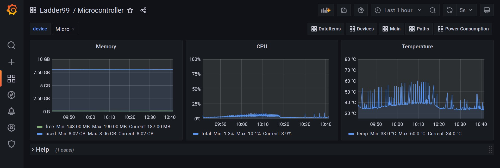

# Running Ladder99

Ladder99 comes with an example setup that displays data from a **LIVE** Mazak CNC machine. 


## Run Pipeline

Run the example setup with

```bash
cd ladder99
./l99 start example  # or just 'l99 start example' on Windows
```

The first time you run this it will download and build all the different services. 

This WILL take several minutes, so grab a coffee!


## View Services

Ladder99 is made up of a set of services. When the `start example` command is finished, you'll see output like the following -

```
Recreating pgadmin   ... done
Recreating portainer ... done
Recreating grafana   ... done
Recreating postgres  ... done
Recreating agent     ... done
Recreating relay     ... done
Recreating adapter   ... done
```

First let's make sure all the services are running okay - 

```bash
$ ./l99 list  # or just 'l99 list' on Windows
NAMES       STATUS                         PORTS
adapter     Up 34 seconds
agent       Up 32 seconds                  0.0.0.0:5000->5000/tcp
dozzle      Up 5 hours                     0.0.0.0:8080->8080/tcp
grafana     Up 42 seconds                  0.0.0.0:80->3000/tcp
pgadmin     Up 44 seconds               0.0.0.0:5050->5050/tcp
portainer   Up 43 seconds                  8000/tcp, 9443/tcp, 0.0.0.0:9000->9000/tcp
postgres    Up 42 seconds                  0.0.0.0:5432->5432/tcp
relay       Up 44 seconds
```

Everything looks good! 

If you see any services are marked as 'stopped' or 'restarting', see the [Troubleshooting](troubleshooting.md) section


## View Dashboard

Now you can visit the Grafana dashboard at http://localhost/d/main. 

The username/password for the example setup is admin/grafana. 

The dashboard will show the live status of a Mazak CNC machine. 


Try clicking on the different pages linked at the top - 'DataItems', 'Devices', 'Main', 'Microcontroller'.

For example, the 'Microcontroller' page will show your computer's memory, CPU usage, and temperature (if your processor supports it) over time. 




## Stop Pipeline

When you're done, you can stop all the Ladder99 services with

```bash
./l99 stop all  # or just 'l99 stop all' on Windows
```
