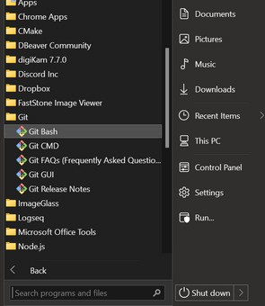

# Installation

## Install Git

**Git** gives us access to the source code for Ladder99, and also provides a console on Windows that acts more like a Linux console, **Git Bash**. 

You can install it from https://git-scm.com/downloads.


## Open Terminal

Open a terminal window - if on Windows, run **Git Bash** to get a more Linux-like environment -




## Install Docker

**Docker** lets us run the different parts of the pipeline in a consistent way on different platforms.

First check if it's on your system -

```bash
docker version
```

If not there, install it - https://docs.docker.com/get-docker/.


## Install Ladder99

Now go to a good working directory and install the Ladder99 pipeline source code by cloning the code from GitHub and running the install script -

```bash
cd ~
git clone https://github.com/Ladder99/ladder99
cd ladder99
shell/install/cli
```

This should show output like so -

```plain
Adding PATH extension and L99 variables to ~/.bashrc...
Using 'example' for Ladder99 setup, as found in the 'setups' folder.
Done.
Please run the file by typing in 'source ~/.bashrc', or logout and log back in.
Then try 'l99'.
```


## Finish the Installation

Now load the Ladder99 environment variables into your shell,

```bash
source ~/.bashrc
```

and that's it - the next page shows how to run Ladder99. 

