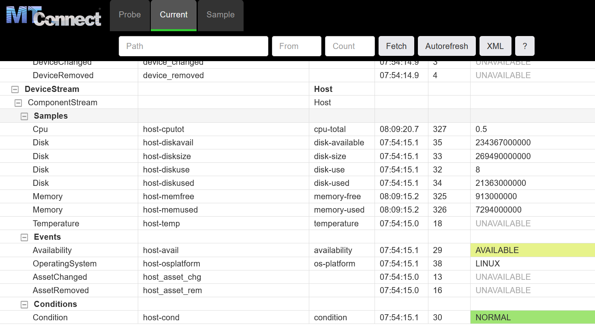

# Viewing the Agent

The **MTConnect Agent** shows some of the data used by Ladder99. 

In the example setup, this includes the host operating system statistics. 

You can view it in your browser at http://localhost:5000/current -

For more on the Agent, see [here](../reference/agent.md) - otherwise, continue on to the dashboard.
