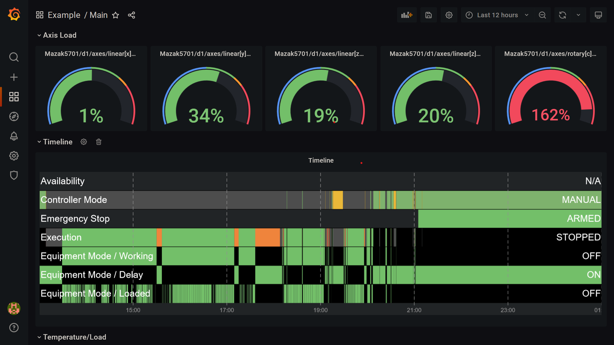

# Viewing the Dashboard

Now you can visit the Grafana dashboard at http://localhost/d/main. 

## Login

Login with username 'admin', password 'grafana'. 

Note: normally the initial password for the admin account is 'admin', but for the Example setup we've pre-set the password for you.

## Main Page

The dashboard will show the LIVE status of a Mazak CNC machine, as provided by Mazak (note: the machine may be OFF at certain times of the day) -

Try clicking on the different pages linked at the top - 'DataItems', 'Devices', 'Main', 'Host'.

## Host Page

For example, the 'Host' page will show your computer's memory, CPU usage, and temperature (if your processor supports it) over time. 

