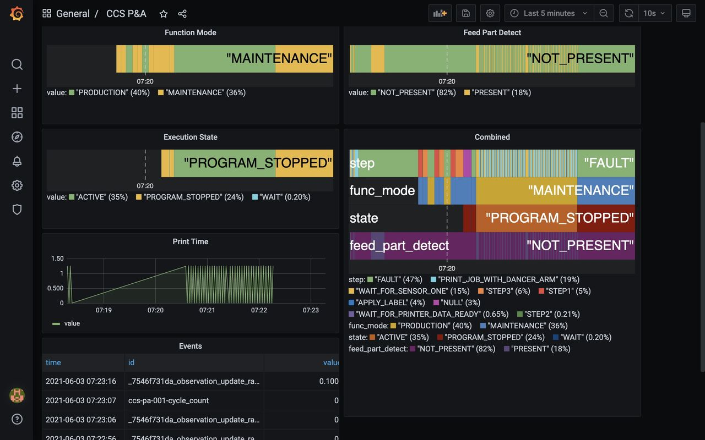

# What is Ladder99?

**Ladder99** is a free and open-source software pipeline that transforms data from your devices to a standard vocabulary, which can then feed into a database and dashboard, or any MTConnect-compatible application.

You can think of it as a historian for MTConnect devices.

It comes with a database and user-customizable dashboard -

