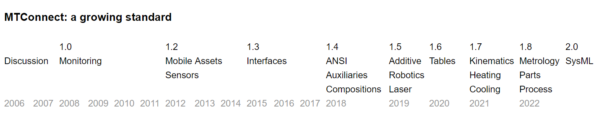

# What is MTConnect?

**MTConnect** standardizes factory device data vocabulary - it was started by UC Berkeley, Georgia Institute of Technology, and Sun Microsystems in 2008, and continues under active development. 

> "MTConnect will be more important in the 21st century for manufacturing than CNC was for manufacturing in the 20th century." - John Byrd

## MTConnect Agent

MTConnect provides a reference Agent, which accepts data from devices and transforms it to standard format. This data is then available to other applications, and to the user through a web interface -

## Data Representation

The underlying data representation is primarily XML, though as of MTConnect 2.0 is expanding to other formats, including JSON and MQTT. 

