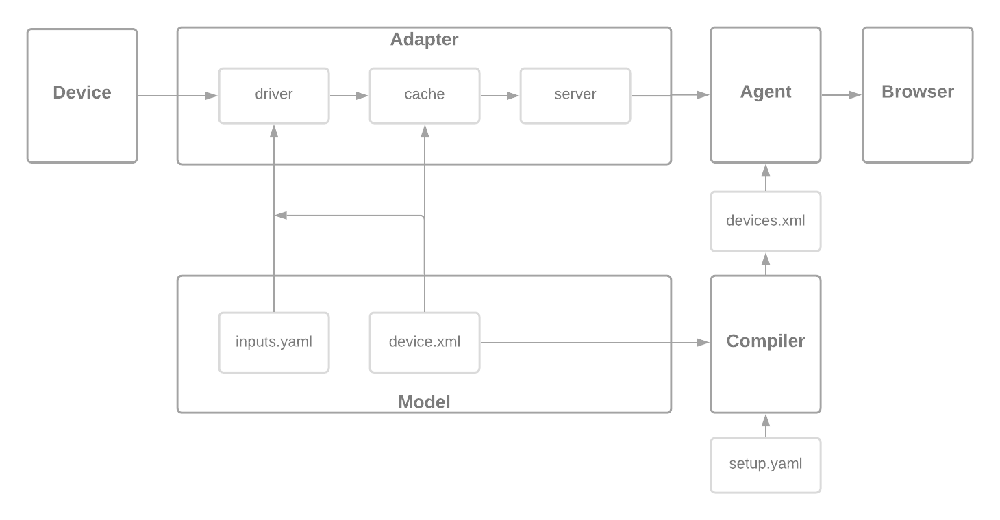

# Adapter

## About

The Adapter reads data from a device and translates it into SHDR, a simple key-value text representation, then sends it on to the Agent.

## Running

You can run some sample data with

    ./l99 start development/ccs-pa adapter agent mosquitto play

then visit http://localhost:5000/current.

## Diagram

## How it works

### Compiler

The compiler gathers the device.xml templates from the different models specified in a setup.yaml file. It removes Inputs, source attributes, substitutes $deviceId, etc. - then combines the resulting xml data into one devices.xml file.

### Adapter

The adapter reads the setup.yaml, iterates over the device configs, each of which includes one or more sources. Each source can use a different driver to read data from a device.

### Driver

A driver reads data from a device, by either subscribing to it, polling it, or talking with it - then adds that data to the cache. The data to read and where to put it in the cache comes from the device.xml template. For MQTT and TCP dialogs a supplemental inputs.yaml file could specify topics to subscribe to and how to chop up that data, or that info could be put into the device.xml template.

### Cache

The cache is a key-value store that can execute code when a value changes. This can write data to another cache location, or write SHDR data to the server. When a cache value is written to, it will recursively call the functions until all are complete, or some limit is reached.

### Server

Each adapter has a TCP server which talks to the agent. It sends SHDR data which the agent splits up and applies to the model defined by the compiled devices.xml file.

### Agent

The agent receives SHDR data and applies it to the devices.xml model, then publishes that data in xml format when requested by HTTP.
