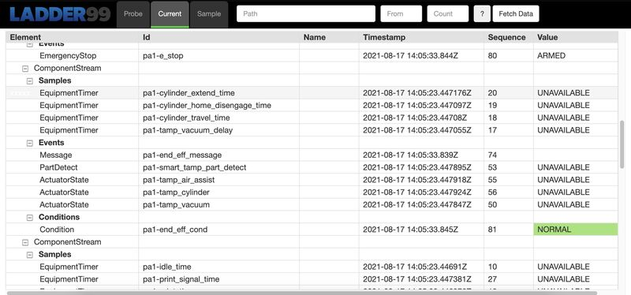
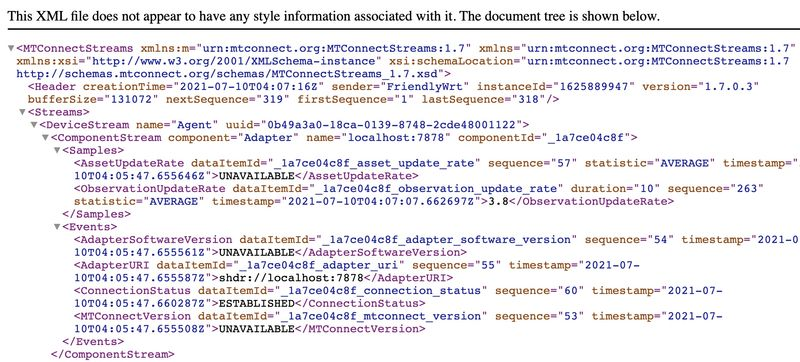

# Agent

Ladder99 Agent is a Docker image of the MTConnect Agent, which receives data from one or more device Adapters, fits the key-value data into an XML tree, and serves output as XML or HTML.

## Default Setup

To start the Agent with the default simulation of a 3-axis VMC CNC machine -

    docker run --name agent -it --init --rm -p 5000:5000 \
        --pull always ladder99/agent:latest

then view the output in your browser at http://localhost:5000 or http://raspberrypi.local:5000 or similar.

## Custom Setup

To run with your own custom setup, point the Agent to a folder containing your agent.cfg configuration file, e.g.

    docker run --name agent -it --init --rm -p 5000:5000 \
        -v $(pwd)/setups/ccs-pa/volumes/agent:/data/agent \
        --workdir /data/agent \
        --pull always ladder99/agent:latest agent debug

## XML Output

To see the original XML output, you can omit or comment out the files sections of the agent.cfg file -

## HTML Styles

The HTML output is defined by the XSL and CSS in the [services/agent/styles folder](https://github.com/Ladder99/ladder99/tree/main/services/agent/styles), which transforms the default XML output. We use an adapted/extended version of the styles found here - https://github.com/TrakHound/MTConnect-Agent-Stylesheet.

## Source

The MTConnect Agent is an open source C++ application - see https://github.com/mtconnect/cppagent.
