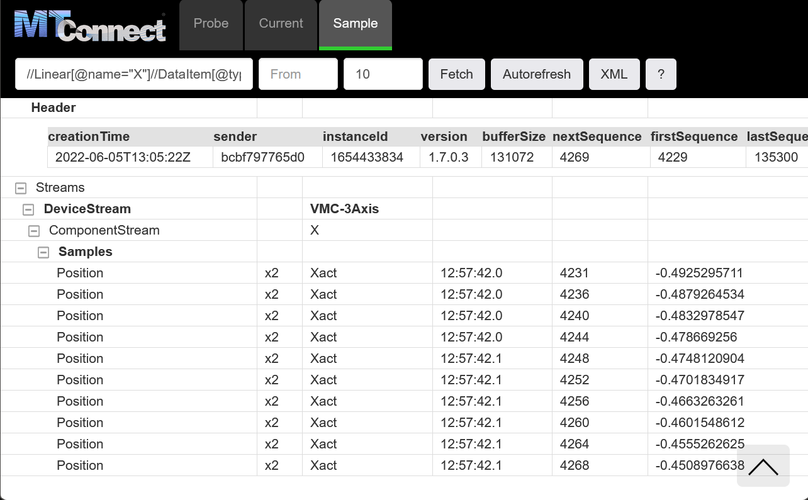

# Getting Started

## Install Docker

Ladder99 uses Docker to run services on different platforms.

First, open a Terminal or Command Prompt window (on Windows, use Git Bash), and check if it's on your system -

```
docker version
```

If not there, install it - https://docs.docker.com/get-docker/.

## Run MTConnect Agent

Now let's run the MTConnect Agent. This command will download an image of the Agent from Docker Hub and run it, which by default plays back a recording of a CNC machine in a loop -

```
docker run -it --rm --init --name agent -p5000:5000 ladder99/agent
```

then view the output in your browser at http://localhost:5000  -


The Agent starts in the **Probe** tab, which shows the data items available for the Agent itself, then the CNC machine. 

Click on the **Current** tab to see the current data values, then click on the Autorefresh button to have the view refreshed every 2 seconds. 

The Agent comes with a buffer to store data values, and you can query it with XPath expressions. 

For example, to see the last 10 values for the x-axis position, visit http://localhost:5000/sample?path=//Linear[@name=%22X%22]//DataItem[@type=%22POSITION%22%20and%20@subType=%22ACTUAL%22]&count=10



Click the question mark to see more help. 

When you're done, hit Ctrl+C in the terminal window.
