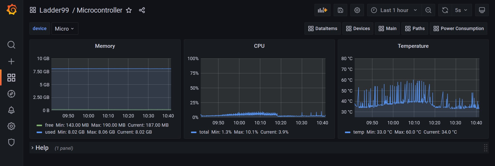

# Installation

## Install Docker Compose

Ladder99 uses **Docker Compose** to run the different services - check if you have it with

```
docker-compose version
```

Install or upgrade it at https://docs.docker.com/compose/install/.

## Install Ladder99

Next, install the Ladder99 pipeline by cloning the code from GitHub. If you don't have **git**, you can install it from https://git-scm.com/downloads -

```
git clone https://github.com/Ladder99/ladder99
cd ladder99
```

The current branch is 'historian' - check it out with -

```
git checkout historian
```

## Run Ladder99

To test the pipeline, open a terminal window (if on Windows, use Git Bash), and run it with 

```
./l99 start example
```

The first time you run this it will download and build the different services. This WILL take several minutes, so grab a coffee!

The first time you run `./l99 start` for a setup it will ask you to edit a .env file, mainly to set the database password. This is optional - the password will default to 'postgres'.

```
$ ./l99 start example
No .env file found - copying from default...
PLEASE EDIT setups/example/.env, e.g. nano setups/example/.env
```

Now run `./l99 start example` again. 

Once it's done, you can view the dashboard at http://localhost/d/main. The first time you visit Grafana, it will ask you for the username and password - this is just 'admin' and 'admin'. Then you will need to enter a new password. Grafana will then show the live status of a remote Mazak CNC machine. 

<!-- Click on the 'microcontroller' link at the top-right of the page to see your computer's memory, CPU usage, and temperature (if your processor supports it) over time.  -->

<!--  -->

To stop all the services, say

```
./l99 stop all
```
