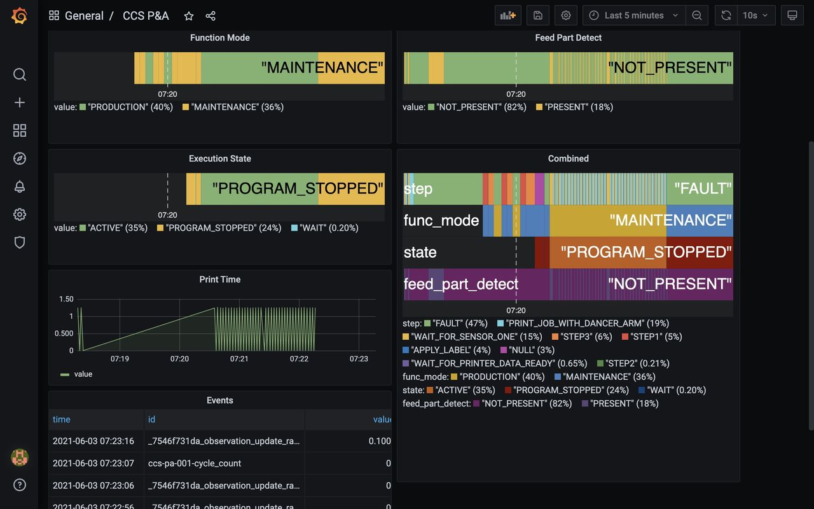

# Welcome

**Ladder99** is a free and open-source software pipeline that transforms data from your devices to a standard vocabulary, which can then feed into a database and dashboard, or any MTConnect-compatible application.

^ A dashboard showing the status of a Mazak CNC machine

 

^ The MTConnect Agent showing the current properties of a device

 

**MTConnect** standardizes factory device data flow and vocabulary - it was started by UC Berkeley, Georgia Institute of Technology, and Sun Microsystems in 2008, and continues under active development. 
