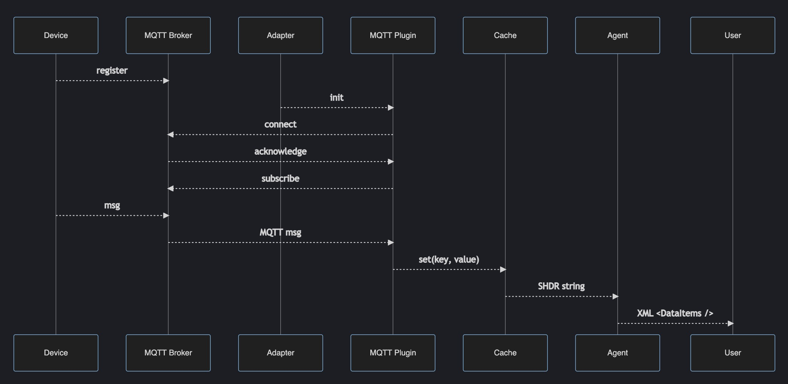

***********************
Developing Adapters
***********************

Diagram
======================

This diagram shows the sequence of operations for data going from a device through the adapter and plugin to the agent - 

Defining Models
======================

Device models are defined in subfolders of the ``models`` folder, and typically contain:

- model.yaml - defines the structure of the xml that is included in devices.xml, which is fed to the mtconnect agent
- inputs.yaml - defines how to parse mqtt messages using the mqtt-json plugin, which writes values to a key-value cache
- outputs.yaml - defines the shdr strings that are calculated from the cache and sent on to the agent
- types.yaml - (optional) used by outputs.yaml

For example, the Chicago Coding Systems (CCS) Print and Apply model is defined in `models/ccs-pa <https://github.com/Ladder99/ladder99/tree/main/models/ccs-pa>`_ - you can see the definitions there.

To develop a new model, you could make a copy of the ``ccs-pa`` folder and make changes to those files.

   .. code:: console

      cp -r models/ccs-pa models/my-model

Defining Devices
=========================

The devices (model instances) are defined in the ``setups`` folder, eg the ``ccs-pa`` setup has a list of instances in the ``devices.yaml`` file there.

To start your own setup, start by making a copy of the ``setups/ccs-pa`` folder and name it something appropriate - 

   .. code:: console

      cp -r setups/ccs-pa setups/my-setup

Make changes to the setup as needed.

Then generate the devices.xml and docker files (former partially implemented, latter not implemented yet - hand-edit) - e.g.

   .. code:: console

      shell/setup/compile ccs-pa

Testing a setup
=========================================

You can test a setup by copying the relevant data into Docker volumes, then running different parts of the setup with Docker-compose.

Copy the data files into named volumes (use your setup name in place of "ccs-pa" ) -

   .. code:: console

      shell/adapter/copy ccs-pa
      shell/agent/copy ccs-pa

Then start all the services with (where base, sims, db, app correspond to docker-compose yamls in ``setups/ccs-pa/docker``) -

   .. code:: console

      shell/setups/start ccs-pa base sims db app

You can stop services with

   .. code:: console

      shell/setups/stop ccs-pa sims
