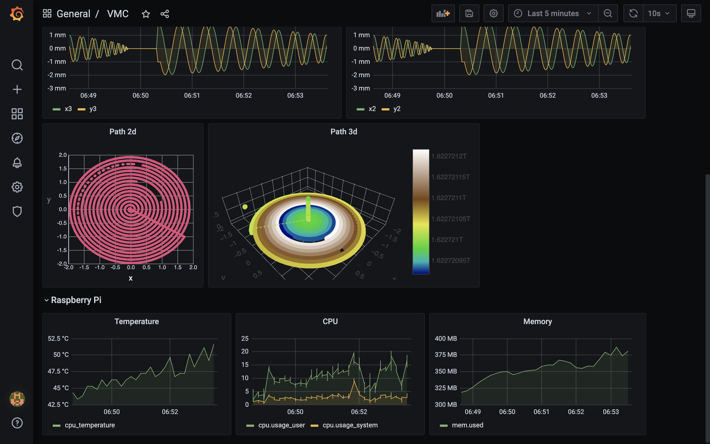

# Getting Started

## Running the Pipeline

The MTConnect Agent comes with a simulator for a VMC CNC device - let's get that running along with the rest of the pipeline.

First, make a copy of the default settings file and edit the passwords as needed -

    cp setups/.env-default setups/.env
    nano setups/.env

On your edge device, in the ladder99 folder (note the d in startd, for detach / run in the background), start all the vmc services in Docker - this may take a few minutes the first time it's run. Note: db, viz, and app are profiles indicating which services to start.

    shell/docker vmc startd db viz app

## Viewing the Agent

Now you should be able to view the MTConnect Agent output on your browser at e.g. http://raspberrypi.local:5000.

Click 'Probe' to see the structure of the data items, 'Current' to see the latest values, and 'Sample' with 'from' and 'count' values to see a range of data items.

## Viewing the Dashboard

You can also view a dashboard in your browser at e.g. http://raspberrypi.local:3003. The default username/password is admin/admin - you'll be asked to change the password.

<!-- or did we specify the pw in the .env file? -->

You can select a range on the graphs to zoom in, or select a time range.

## Stopping the Pipeline

To stop the pipeline services,

    shell/docker vmc stop db viz app

Next we'll take a look at setting up some devices.
