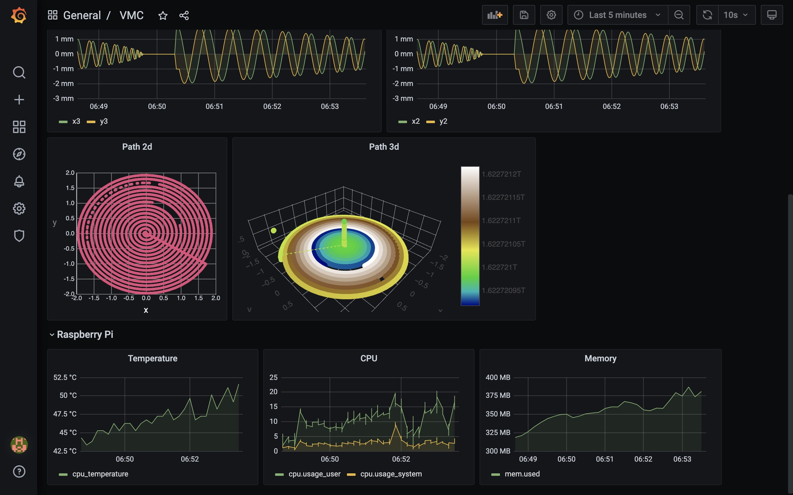

*******************
Getting Started
*******************

Running the Pipeline
=====================

The MTConnect Agent comes with a simulator for a VMC CNC device - let's get that running along with the rest of the pipeline. 

First, make a copy of the default settings file and edit the passwords as needed -

   .. code:: console

      cp setups/vmc/.env-default setups/vmc/.env
      nano setups/vmc/.env

On your edge device, in the ladder99 folder (note the d in startd, for detach / run in the background) - this will take a few minutes the first time it's run -

   .. code:: console

      shell/setups/docker startd vmc

Viewing the Agent
=====================

Now you should be able to view the MTConnect Agent output on your browser at e.g. http://raspberrypi.local:5000.

.. image:: _images/agent.jpg

Click 'Probe' to see the structure of the data items, 'Current' to see the latest values, and 'Sample' with 'from' and 'count' values to see a range of data items.

Viewing the Dashboard
=====================

You can also view a dashboard in your browser at e.g. http://raspberrypi.local:3003. The default username/password is admin/admin - you'll be asked to change the password. 

.. or did we specify the pw in the .env file?

You can select a range on the graphs to zoom in, or select a time range.

Stopping the Pipeline
=====================

To stop the agent and pipeline, 

   .. code:: console

      shell/setups/docker stop vmc

Next we'll take a look at setting up some devices.
