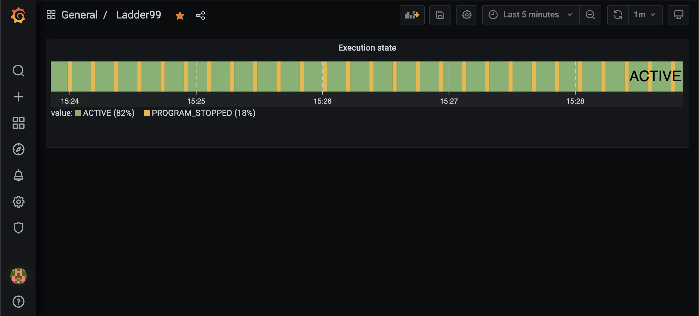

*******************
Getting Started
*******************

Running the Agent
=====================

Let's run the MTConnect Agent, which comes with a simulator for a CNC device.

On your edge device, in the ladder99 folder -

   .. code:: console

      shell/agent/test

Now you should be able to view the MTConnect Agent output on your browser at e.g. http://raspberrypi.local:5000.

.. image:: _images/agent.jpg

Viewing the dashboard
=========================

Start the database in another console on the edge device -

   .. code:: console

      shell/setups/start default db

Initialize the database - 

   .. code:: console

      shell/db/run setups/default/migrations/000-init.sql
      shell/db/run setups/default/migrations/001-tables.sql

Now start the application, which feeds data from the agent to the database and visualizer -

   .. code:: console

      shell/setups/start default app

Now you should be able to view a dashboard in your browser at http://raspberrypi.local:3003.

Next we'll take a look at setting up some devices.
