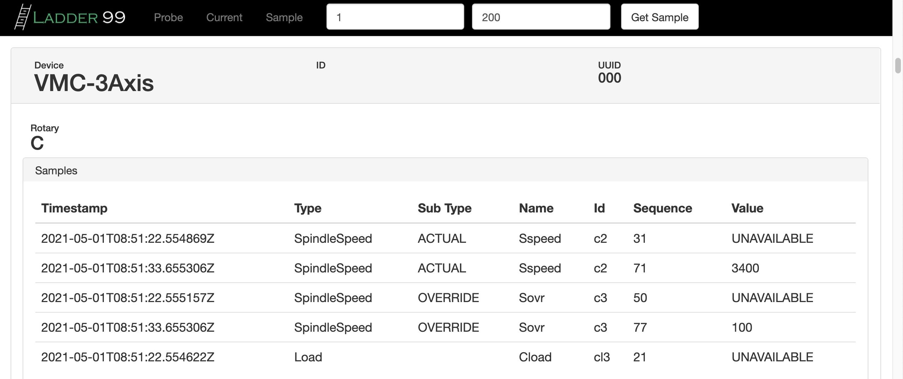

****************
Ladder99
****************

Ladder99 is a free and open source application that transfers data from factory devices to a database and end-user visualizations using MTConnect, an open standard.

.. toctree::
   :maxdepth: 2
   :caption: Table of Contents

   about
   introduction
   installation
   getting-started
   setup-devices
   developing-adapters
