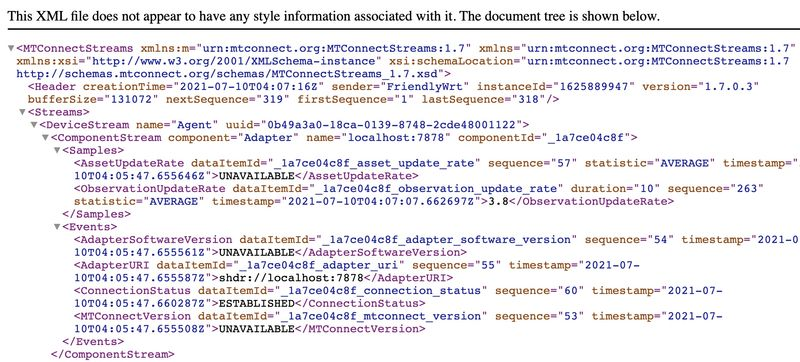
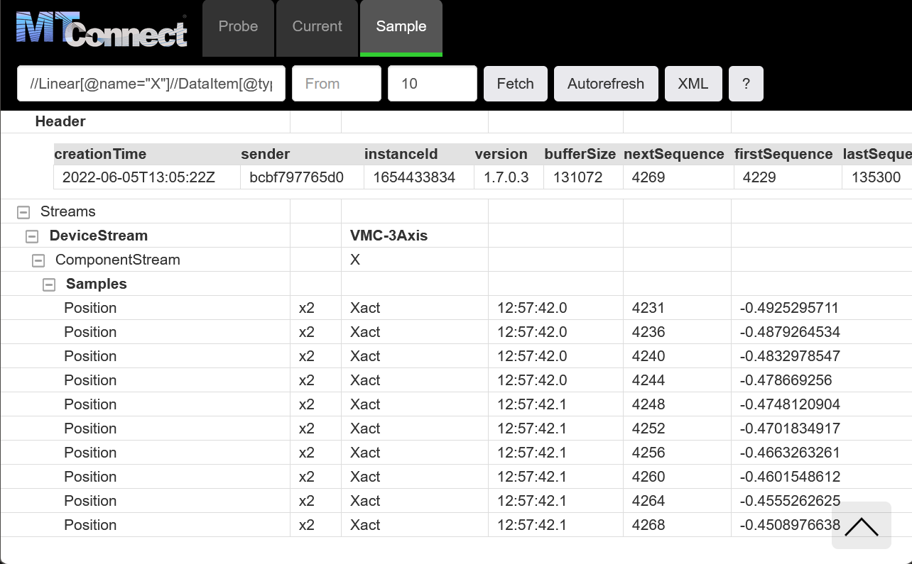

# Running Agent

Now let's run the MTConnect Agent, which comes with a recording of a CNC machine for playback. 


## Run Image

This command will download an image of the Agent from Docker Hub (a central repository for Docker services) and run the simulation -

```
docker run -it --rm --init --name agent -p5000:5000 ladder99/agent
```


## View Output

View the output in your browser at http://localhost:5000 -


The Agent starts in the **Probe** tab, which shows the data items available for the Agent itself, then the CNC machine. 

Click on the **Current** tab to see the current data values, then click on the Autorefresh button to have the view refreshed every 2 seconds. 

Click the question mark to see more help. 


## XML Output




## Query Agent

The Agent comes with a buffer to store data values, and you can query it with XPath expressions. 

For example, to see the last 10 values for the x-axis position, visit http://localhost:5000/sample?path=//Linear[@name=%22X%22]//DataItem[@type=%22POSITION%22%20and%20@subType=%22ACTUAL%22]&count=10




## Exit Agent

When you're done, hit Ctrl+C in the terminal window.
