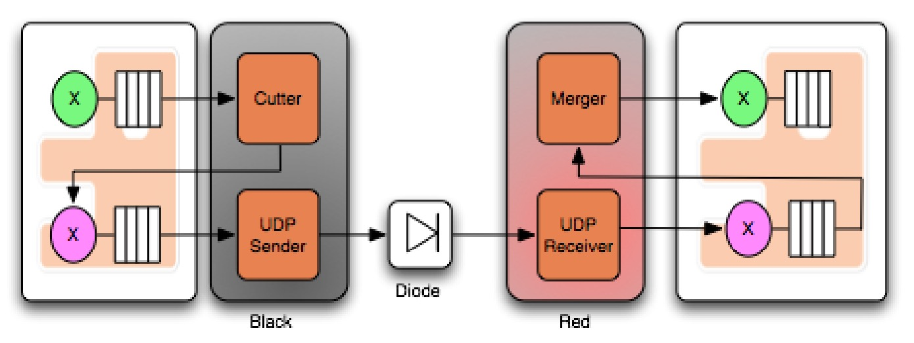
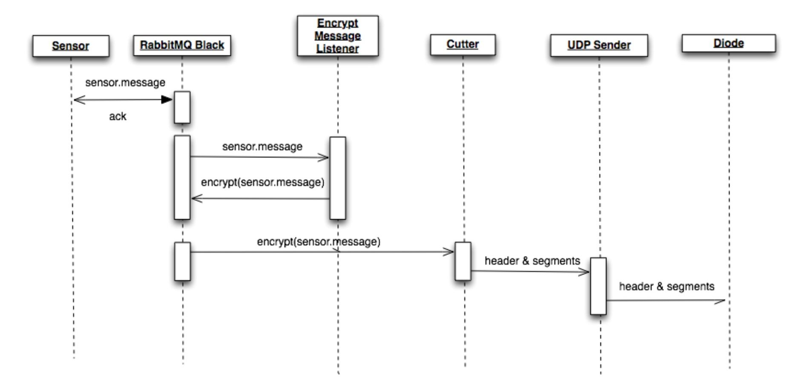

# Data diode

The data diode is based on a project by Marcel Maatkamp - it uses RabbitMQ and a Java application to transfer data via a one-way UDP connection. The original paper from 2016 "Unidirectional Secure Information Transfer via RabbitMQ" is [here](https://arxiv.org/abs/1602.07467) and GitHub repo is [here](https://github.com/marcelmaatkamp/rabbitmq-applications/tree/master/application/datadiode).

RabbitMQ uses a protocol called AMQP (Advanced Message Queuing Protocol), which is similar to MQTT, but allows different topologies:

UDP has limited packet size (standard is 1500 bytes), so data must be chopped up by a cutter and reassembled on the other side:

Data can also be encrypted before being cut up:

The complete pipeline - the X's are exchanges (input ports) - the green X is an unencrypted exchange:

## Installing

Uninstall/remove any Java/JDK you have locally, then install OpenJDK 8 - this is a free alternative to Oracle's JDK. 

    brew cask install adoptopenjdk8

(from https://apple.stackexchange.com/questions/334384/how-can-i-install-java-openjdk-8-on-high-sierra-or-newer-macos)

Then add this to your ~/.zshrc file and restart the terminal -

    export JAVA_HOME=$(/usr/libexec/java_home)

Install JCE for security (otherwise it will try to do automatically for JDK 15) - [Java-8 JCE](http://www.oracle.com/technetwork/java/javase/downloads/jce8-download-2133166.html). Unzip the JCE and place the jars in $JAVA_HOME/jre/lib/security - 

    cd ~/Desktop/UnlimitedJCEPolicyJDK8 && \
    sudo cp *.jar $JAVA_HOME/jre/lib/security

Install Gradle 2.8 - this is a Java builder. Unzip it and put the folder somewhere and add the path to your ~/.zshrc like so and restart the terminal - 

    export PATH="~/gradle-2.8/bin:$PATH"

Then edit your `/etc/hosts` with `sudo nano /etc/hosts`, and add the line:

    127.0.0.1 rabbitred rabbitblack nodered

(can all this be done in a docker-compose setup?)

(eventually upgrade these to latest Java and Gradle)

## Starting the RabbitMQ queues

Bring up the RabbitMQ queues via docker-compose - 

    just rabbits

Visit the RabbitMQ management consoles here (user guest, pw guest) -

- http://rabbitblack/#/exchanges 
- http://rabbitred/#/exchanges

In another terminal, publish and receive some data - this runs the nodejs program [here](code/application/datadiode/contrib/nodejs/src/send.js) to publish a string to the 'hello' exchange -

    just send

You can see the message go by in the RabbitMQ console - http://rabbitblack/#/queues/%2F/hello. 

The diode is not fully setup yet though - the Java programs will listen to the rabbit messages and transform them. 

## Starting the Diode Receiver and Sender

Run the black (receiver) and red (sender) Java applications - these listen to the RabbitMQ queues and manipulate the data - 

    just black

and in another terminal

    just red

(but both get stuck at 97%)

## Sending data across Diode

As directed in the paper's appendix, goto node-red and setup a timestamp feeding to an mqtt output. Set the url to rabbitblack:1883 and leave the topic blank - 

- http://nodered

This should send a timestamp across the diode. (but doesn't)

## LDAP

(what's this for?)

- https://rabbitblack/#/ 
- https://rabbitred/#/

## Original Readme

The original readme for the data diode is [here](code/application/datadiode), slightly updated. 
