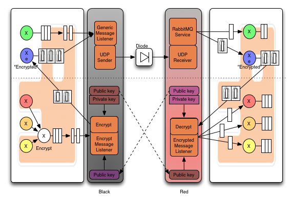
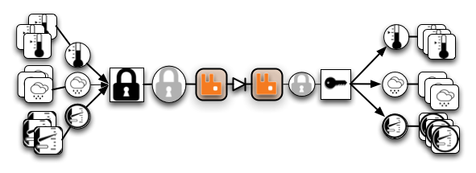
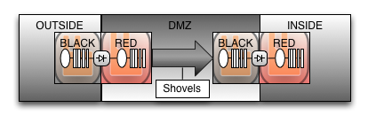
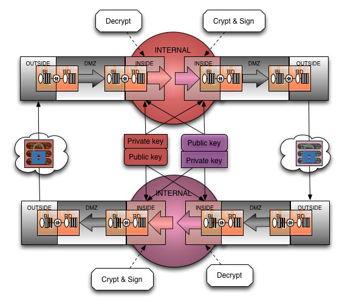
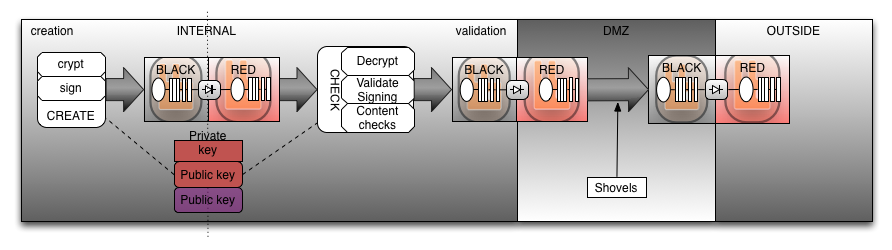
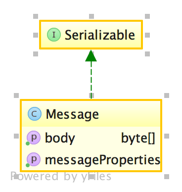
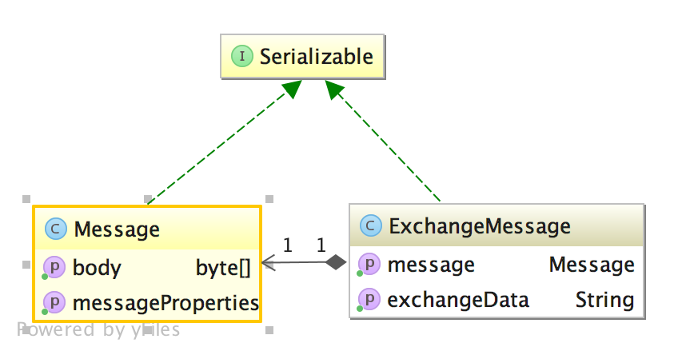
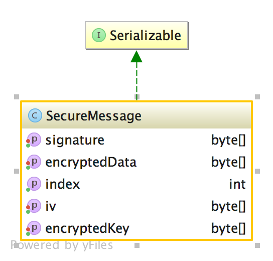

# RabbitMQ mirrored over a data diode


Reference Implementation of RabbitMQ mirrored over a data diode. 

Nowhere near production-ready but in this state it will successfully transport messages from outside to inside and has a reference encryption mechanism in place how to send messages encrypted with AES wrapped in RSA.

Settings for encryption like key size can be found in [application.properties](https://github.com/marcelmaatkamp/docker-spring-datadiode-black/blob/master/src/main/resources/application.properties)

application/datadiode/black/src/resources/application.properties

```
asymmetrical algorithm = RSA
asymmetrical.cipher = RSA/NONE/PKCS1Padding
asymmetrical.keysize = 2048

symmetrical.algorithm = AES
symmetrical.cipher = AES/CBC/PKCS7Padding
symmetrical.keysize = 256
```

# Pre

To enable strong encryption (AES-256) see 

* [Java-6 JCE](http://www.oracle.com/technetwork/java/javase/downloads/jce-6-download-429243.html)
* [Java-7 JCE](http://www.oracle.com/technetwork/java/javase/downloads/jce-7-download-432124.html)
* [Java-8 JCE](http://www.oracle.com/technetwork/java/javase/downloads/jce8-download-2133166.html)
 
Install unzip the JCE and place the jars in $JAVA_HOME/jre/lib/security:

    cp *.jar $JAVA_HOME/jre/lib/security

<!-- 
Install both outside (black) and inside (red) packages

    git clone https://github.com/marcelmaatkamp/rabbitmq-applications 
-->


# Start

First start both test rabbitmqs on a host called 'rabbitmq': 
<!-- 
    cd application/datadiode/contrib/docker
    docker-compose up
 -->

    just rabbit

This will start the following setup:



Validate by visiting the following pages:

<!-- 
* [rabbitmq on black side](http://rabbitmq:15673)
* [rabbitmq on red side](http://rabbitmq:15674) 
* -->
* [rabbitmq on black side](http://rabbitblack/#/exchanges)
* [rabbitmq on red side](http://rabbitred/#/exchanges)

with username/pw guest/guest


<!-- 
Start outside 

    cd docker-spring-datadiode-black
    gradle run

Start inside:

    cd docker-spring-datadiode-red
    gradle run 
-->

Start outside/black:

    just black

start inside/red in another terminal

    just red


Console output on the outside (black):

```
o.d.b.listener.EncryptMessageListener    : [bWFyY2Vs]: {"secureMessage":{"index":1,"signature":["b5RphGhiTUXZD+STtNvDzWubm0Xj97BrY0XIR5wcd7Bq1914ZGl6zUH70+bbFnv9TuJsfWJSOUXs\noL4goRDZI0B0ORzHv+QtmCN4nZIlsVyWqvz5Mvbz0lPvoeODMZ2zfdicnjOCrhdaGw3iQUQvrVQU\nggxkY3yj9L0k20i5CELmVtonNyKzgORS6UzlooUnnZkaRyiHMnbGCu\/g8g5QAEMlop0XkpgMSqFu\n6fhPtoizmCzF3yfJp2jApL58\/t8RSwvYxuHhIITVpngaODAAO\/OJTALYrAWCV\/H8KSRp4tlItG4F\n94kz0rPvJKo+fmjCv508KEP4XXwLtc3Nj8yGDA=="],"encryptedKey":["bJTIKbw\/+wH6s\/ady83yekuvs4iyQgSW\/jh89Nskogx3abdVbUNnBV2DaNNEkGPtFzd4Ao8KnNsL\nHry3JI3LO4aU8Fiy2zgtu3al05Mr3Zbvxrg5N92qd1CWI4FkKPglTw8psJA\/y4zTwu00CmHtF8a9\n9JGB4E4PasdpNX8eMdVkGmy8Y5HbzCkD+CokptokiEnMPCK3nP6it8zcv3JRn\/x7MLn1k6IUdHKE\n0SL\/KXZ\/mdCG3IHned+lBH3zb3k5dTSrJL0C4i3chOsRftXlDF1Q4I0mYRQ9QRZfm67Q3o86B8+\/\nnDRYAM9k4irv6r\/jC5pNKOhOPe8h0xYtommhPA=="],"encryptedData":["5rycbZqjsf8BCZmxTtj4XEaRK6XcX5DRFiVnTFuKQGXdLuomJXwpLrSh7SSqLLx8eu4pBtUDsCiL\nuxW0EI3jEIxmPQbeBALvZbvzjbGukt1H8HgxlZtg7bVXUhn7WkEEdqpySqR5buoY3ah\/c7g8JqDc\nTjBSh5CgbBfypDNxD+S4MVcH67fsGD5QtnLZuHUKPsOhaLN4rOdInQHtNcA7IRVFkvY6uHKy5ns9\n6CHaJV0KulrSNmO55iqzIjQcXAS7d18+X53RPe6zwPerukZyWY3ybRIJ\/kylZpXzlBzOi+HS5hGT\nftOCT1Ig031B0p3vR2wGr6Uzo3NijdIGFCYmZbwk\/EsjXoW\/lSKdOd6TJuTzRURqA5aayjjtyOe+\nnNvZ8\/668K17hsLdSxylL05TKruwXr0YQXhMmBRTfEwj5ZSf6pGJvSfOx6hofztsXMl2e0ndMpEu\n06KVCJf6yrAs4bPEAZstczxC\/IaMZ9am4fCizxQw8g1v3Js3stGNz5PGXbmpoXeSKqfigGb1d\/Er\nyFzLaSpcuqPY6nUFSfoFKT2NjjiwGQmULbjtcvzL06uGAr78fHtvn3aV5Pif8DQxQf+bj7uO\/QS4\nfNuK3a+VNxM0Qk1P28z\/+Em61DBjoDI1EcelQr7BizbJXl3HUrLBSYy+U+wXkuYw911RyDH+NHSD\npOU2zRpuiyeyTcGXPhRapAyQiuUeB4Tj03+sPGijn8KCJUhCBdoJ1\/LDkC7mqKiqyLiKbQOB8RtT\nwyDSE\/ZduTAjgzsACUKbWhojVOrgmXEkE3\/O6PA0XqWhS8u+mEruT1TH\/MSF+eNzGy4RNOKH6JpQ\n2f9aw3+CVBX7k\/9UuxhgtekfLbbpU4S9vZyWHLCETEO616R8kZ4kv7N3DfyT4kgoHp\/Uv3njDc04\ngmI4d6VPnuk9RQEQiwQUJs9DqKIt3YaGCEpD9\/8OiePQRDWgZbJkhQQ3di\/insOEGEwEe0SvRo1I\nRtEKACL6qRtZS2qnorXlzdF5yAVGXqVPNFpOXBY02zttV8l3pkpX+yeAMSNrspx4gVj4p9x8705h\na+2IP4HqBSrL4ORCCPJFmCoHIa9l5CreQO31XU0QjU0SKFZe6YYkVyM+ymqFfA9xhLyhRHrT2+Ej\ndBkuWaeaZyv5Ij1vCBSW1N\/tHQRYzpdaHFsDCg6rJLlpJ9hQziqWC\/+SBYNboEGnuzolzLaXy0Wn\no8z1yhCO6kN1bVa6rnj7YuBXQGJWB8FBjRYfP3xDq9hwCtctzvFqVnGJRo9\/3wdKkVQA+BNNoEFC\nbC0OmYubsy270bt3nu4R69B3B0HTvuKTrZHAYWsLb3dAu5xi0v1xwJ5heihvEgOO273O2DA+WOA+\nv62vNZ3k6DEgOKLKE+vr8Sff1QKYZNOwxUJVBxYWGHrbQFH6hNrLjr2cb2rKj\/U5oLIFfUIMY2Ix\nGsvIOESPuogCGLMghXyXhiDJWti5mTGHHayJDNq2lBhe\/26wsj155633LH0icsWeyJflvVcTw\/H+\ndPFE+CJzAVzw5lE688qs8U1DwFWQA0w4M8ewZGgNyltg6EVKEga1E9M1eI0t01MUhmGxKVZNJSxo\n3wubR7UdtCnM5n5aQKu+PlPirIDuRly0DXpZ1Lri+VvQRAWZI7bnBv3CrlPxznZO8Xr7JYORW\/qP\nCY3asN2n9OXWY5e1ZLqBsTWBS29U1nheecLDXWL6h7XKJUOy2pYynXU5CfLhEpFiCmRpLca\/TOEj\n8G6uPhayYf8ZUOf0\/DfWqv\/ciWV0moQep0\/91mI8chAeSDQ5Vv9Epm5PathVApArwftyBgQvZf8L\njX2Jk\/skGEJ+NJuwzUvK6Lj5AiInHk7lVFaQ83SIQDRj+iiDaxlxKhQtE2yFu5GGVQ0GtJtff9c7\nqVxHPPHVPhuVKXmGojo7ncDL61kdOrx2P9aVmp5mrfgxL9b3vgJI5zMO+hkslcFe5Filuqk72VBL\njLcsB8J+o3SFow\/rhdZq6\/VeIHY7\/hbjANYA+K4nI4Qx2aWYFfRXzIJDzBEQq7jjdzKgkPfL0G24\n1fmF7rm\/WLd4em\/pCUtSio6xU7RGDwv+kIpbcbZrBf8aqMGcy23cKe2OEQQvJgSzbbzvBAAsbIUs\nvdQkolX9Btl9UYewPOPuA0+JZvq060IoKB6twTQU5DWlMdLNOOChNi3K13W3c4snDF8lGr4l1Isq\nfhtAdcV+DskmLbryPIjbi9E8mnCis1PUNccRZvF3z9NnUKdqJRzw8mvqCVDvpWgLLkR3kUp\/MYWe\nL6vgu+qZCrda7o18Y5VqTwYsSAz6yO8tFk6QcqBg0Dh+7\/dVsis\/o5VEKVL\/FSRwZVmWHZClfYH5\nrNhHYxy85BLp67cPLsynP6ak35+uHsKCD\/ZnQK6OdMUUUu7c+dSbFm4UmxScdfpUPBGyCWvdeKMo\n\/miaicnOXoh5i\/dCJKqXSSSWLyrzEKZs5jNap+uRw+YvqHC+SPvTUD0OChiE520EGgGTKRTL9PTj\nDdKtAf6b+Brff8\/sTYw5YbJ9SZUX8x5S5TByb5XLGNNu6g5h4g7Rw0A51dHYW\/dfoG4mFRuqIGd3\nX0ik7IUv\/UaAQb\/XCNSQ4jiMur269lCREklM2yd2n165JTlZvwnISIZlA4FiyQIBwx7\/JhODmfIX\n1sJjDD2o9OKaYrJ2j10Ss0YKKJLLedLoqb6oSk8olRDpYjonawrCJvED7dNc6c6oGrpmDXUIPCPD\npUyHvFSz671Mzl82ky6nxWSTS\/lTT6U9wk3LIlwzOk1dvaV+Ln3MZktQbNDBOt3CWo+vySXPvGD1\n1LFp\/1w\/i3aUKCFE4Z2OyuOSqiQ4w92zJna3SCpqFNQ76eLX3DDHGrdrQVsmoJJdCC7oonuseZmi\n0ASLClhrKszwjIt1GK8Dc3Yp6I7mDV8r5S8S02V2RMokLIXDtANoFDG\/COI1AKyk3E3a0DjR2HF6\n\/uwxdUN7E6sD63k9WOhcKZNUd8KcSsZr7K42l7wqT0rbwjUdLg0V0QI1E2IUp7kyLixMMtBTBdj2\ntzL4FDHwFTQGJqKAf7feP18YhEeVBgEiuiyOTpNfEsPf6A4WcMtg3s\/rDocaT+O41eeTQWy5Nyov\nmkv7DeGBXFzV4CSWeR7J0\/XzZKdB3Xf3GqBaCbOyjSs+GNIl+KjpLkITCe9Bibs="],"iv":["vA5OQzzRKsTewMo1Ma0SmA=="]}}: {"org.datadiode.model.message.ExchangeMessage":{"message":{"messageProperties":{"headers":[""],"contentType":"application/x-java-serialized-object","contentLength":0,"contentLengthSet":false,"deliveryMode":"PERSISTENT","priority":0,"redelivered":false,"receivedExchange":"sensor","receivedRoutingKey":"bWFyY2Vs","deliveryTag":1,"deliveryTagSet":true,"messageCount":0,"consumerTag":"amq.ctag-pwWjY2tzUjdS01cdVEnQQw","consumerQueue":"encrypt"},"body":["rO0ABXNyAENvcmcuZGF0YWRpb2RlLm1vZGVsLmV2ZW50LnNlbnNvci50ZW1wZXJhdHVyZS5UZW1w\nZXJhdHVyZVNlbnNvckV2ZW50vqbEUzgjq5cCAAFEAAt0ZW1wZXJhdHVyZXhyACxvcmcuZGF0YWRp\nb2RlLm1vZGVsLmV2ZW50LnNlbnNvci5TZW5zb3JFdmVudAmQNj9AL5ShAgABTAAGc2Vuc29ydAAp\nTG9yZy9kYXRhZGlvZGUvbW9kZWwvZXZlbnQvc2Vuc29yL1NlbnNvcjt4cgAfb3JnLmRhdGFkaW9k\nZS5tb2RlbC5ldmVudC5FdmVudNLl636osM15AgADSQAFaW5kZXhMAARkYXRldAAQTGphdmEvdXRp\nbC9EYXRlO0wABHV1aWR0ABBMamF2YS91dGlsL1VVSUQ7eHAAAAABc3IADmphdmEudXRpbC5EYXRl\naGqBAUtZdBkDAAB4cHcIAAABUMijD9J4c3IADmphdmEudXRpbC5VVUlEvJkD95hthS8CAAJKAAxs\nZWFzdFNpZ0JpdHNKAAttb3N0U2lnQml0c3hwpkAZpTilJvLObegL2JVCfnNyAD5vcmcuZGF0YWRp\nb2RlLm1vZGVsLmV2ZW50LnNlbnNvci50ZW1wZXJhdHVyZS5UZW1wZXJhdHVyZVNlbnNvcnjZPEmG\nuRW0AgAAeHIAJ29yZy5kYXRhZGlvZGUubW9kZWwuZXZlbnQuc2Vuc29yLlNlbnNvcjHcbb41TAJ6\nAgAESQACaWRMAAtnZW9Mb2NhdGlvbnQAJ0xvcmcvZGF0YWRpb2RlL21vZGVsL2V2ZW50L0dlb0xv\nY2F0aW9uO0wACHRhcmdldGlkdAASTGphdmEvbGFuZy9TdHJpbmc7TAAEdHlwZXEAfgAOeHAAAAAB\nc3IAJW9yZy5kYXRhZGlvZGUubW9kZWwuZXZlbnQuR2VvTG9jYXRpb26jX4d5RdqQaAIAAkQACGxh\ndGl0dWRlRAAJbG9uZ2l0dWRleHBASjCJQ+EAYEATmQRwqAjIdAAIYldGeVkyVnN0AAt0ZW1wZXJh\ndHVyZUA1dmRNFdwU"]},"exchangeData":"{\"org.springframework.amqp.core.FanoutExchange\":{\"shouldDeclare\":true,\"declaringAdmins\":[{\"@class\":\"list\"}],\"name\":\"sensor\",\"durable\":true,\"autoDelete\":false,\"arguments\":[{\"@class\":\"linked-hash-map\"}]}}"}}: message: {"org.datadiode.model.event.sensor.temperature.TemperatureSensorEvent":{"index":1,"date":"2015-11-02 14:39:01.74 UTC","uuid":"ce6de80b-d895-427e-a640-19a538a526f2","sensor":{"@class":"org.datadiode.model.event.sensor.temperature.TemperatureSensor","type":"temperature","id":1,"geoLocation":{"longitude":4.899431,"latitude":52.379189},"targetid":"bWFyY2Vs"},"temperature":21.4624679735535}}
o.d.b.listener.EncryptMessageListener    : [bWFyY2Vs]: {"secureMessage":{"index":2,"signature":["PUuf41io7mN1HrApMoWhRoEqlJyC+q9xK\/CfSzm9paeGMnv2A3B7MhSBH5z+wy82eQ4PDol8kPyq\n0fysqzeB2cNTE7CB+uCMz0PP\/QCdJKillNbcKOPtsYzuyLoHOplZ5XY9F1jkEaV1rh0vvxAWqfvo\ngyYpNB+g7lqiJqmhDCWwxFYsCB8zwmMMnjfU7j775DeBGZlNeGC0TXEiWSbMV4pTQjg\/9afWPMcY\nZv8Djj8lEUTS+LlfBGPChRC14QxyRPJcRQ2rsiQo9PToRwDfl0IWWUwOafjJUvuGdo3NyRnuqxEg\n3E\/SUQkvCMkV8xJRo\/JUXDAN+HWz8v6ObqSgSw=="],"encryptedKey":["kAW8LbE9OGKpEIgS0OzWuzu1woECo9H907r4KcN2iijymhUH0Gj+qo54e53No46rEsjwxK2tpjgL\nQRZVhSVs+GP+8e01p+tgt898i\/soAbzyo4TIFCthFvN5m9Cin9wGL7bku8vjFnud27Kj0qo52n+U\nVYqehWyfsuk5KwtdqiWprBjMjxDTyiaXNGZOCFf61aCQy37D7ZAyVCTd+aUSprgV846wotHrTgf4\ntDrsWQZP71YMspsqXZN7Kj6PTpzwnE+wtSG\/L1bcfOS1xA6T3GKjzW+LKkvPnio6\/Gvg7J3nGJ2V\nlOHWCz+M799y8EuGbTp+nBeGhKGhwM1Fd1pcCQ=="],"encryptedData":["9Bj9\/BiMg07c9cbo7UYxWECleVD4Iz+CNRfiBEI9BXxYtKyLHjhAswgmOirJqZAHPDyOBVLS7lFJ\nuuEebp4+\/h1V0wEgHHEMm\/28GRi2J30wFEDJjTnYvNEF\/Qt8RKi2A2odkP3s8iJchIqIIyIu9Zcj\ncpFNRSO3x7x2FMJ5w2sbkn2PKmUx6hj9R+vWlg7qbuUFTQUFowZM3R7ldkwdTeppDgJz1xvpq7DL\nPeLZgi1uUfaNhjYvy9Z4pPzPDw9O2l6y4Ul6359rARHpOdFto4fUsN3Fz7CgneKGjP6yz\/cNjs3V\nXXLdC\/HOIaCqg7RBRMBt19MCTTN4NnVQSA17xNQzOqtKm8hriGvlgFwIjfPjeMrXCmcL2sKjuyhT\nnQfFd7hWkdmr\/DBg91Guv5d3eFOf+wTHYezY\/geAG0oro63wNxKP8N6hYTyE7+Xve\/8vJXAGaQAF\nWZy9lebCrOHN6F\/Zi\/yGvcfPjb3xdh0UJZ0XyELU3edTiM0yqoEc9sCibzJ4saamoV4uYnIYnV83\nRymEsj9VUvK80dd8gxkxa0qr0O0oe9IXBAKyaV+S5n7h3jOgrvUCKP397J7qCjbpCde5ZRpzl3IH\nnI\/1oMNmauW8VpUWV2avV1OfMAGck\/0yOK\/5Dp3\/La62zFLVglFW\/snVKOVJb\/v48n8RWryKupCU\nIYxZOsi2YJx+yWKsAFvlHGF7zDY9dXqIGk\/xu8oRBnuSaMdnBChER57WElrYQgvL5w9odmJBM\/0x\nVteQr9J8ZyGp050BlsgbtAEhb3agq5thewbqNh66kzyB026lFn44s8wBSzFHDC4Ce7ydOAASCHVb\nnh5QZhe8eLnl2XhaD4lohNV7ckBCWacXKuHk6g3wx0JmEfsnsdfRHLF8KLMiGK\/gjDOCsTHjT8IP\nV3wBwL8+5reV5i\/Lr6NUNEHaQQgReMAiF8agfIhB3czdEuOgVqJOQeh4LiPCuQSItKu\/ZFWzmTKY\nmoclrv7i40KkuWXOz5PU4ynME2pIwvalxDc6h7fBjeq\/TIYLOmWTSjDld5CPQsewpQ+RoHzY2Djt\nedT0\/ajkQNU672vURDBLGjL7l73sbHVIyxYmZl6sEWdb+NJypsOZBNTv4FtDW06kKzaS6R781tBb\nhKIc8DAFbWPWYrGqi6liOAOezEqWzxqqTOU+pSEFVSJuaSddP3H7B9gDjZ7zLBlATwvz78RcYRRk\nMNnr02j7a6t5qjbWEYckRWK4OZ5KBYzZBK6JsjRpQUCTUhVa2xX2l3xYhO5yuidFHdN68J3TeJV4\nrlkVd0cOzNx\/TQtQ3D0dT28LcJg1Dypf8E\/1uvzxgvqOZ+ndIFnOyPGD3\/sBf8hivNjas5VRXKTW\nNepQy8amncD8ZxTQNs5kr\/zHejisNDQcIEqGR+fwk7TCYy1yegL2+bPyLhBcOKWxw30AJbsxniFB\nP+\/\/P9SlECAVRsEZcr3EFrrY+jFGlTLpm0fv8Y\/07p3WrHIvJ5sPELMi+sUEkct+Diu8AqnNJzYG\nPnjzIMJNNejj6oHWNGyff7ie3a3GSUlCyzF13fc5TZ7vldNfzstM7KCbHWnpw\/6Tj9DS2\/4gjjnD\nZfdpnUxeuCV2+wdikNnHRnYe4kcI\/P3CRP1Jrmg5IpL+r39E5Is94eSzwo+TvjIX9ieRfG\/XEP4X\nTWJTPlPiOpZk8MiJu04LHUv5qn24Lgt2U2KUCsMX6Y23uorZKAXxXaewHwfmA12H9XOxG\/smN7dt\n\/9WpUKiBM5S1RXhjw44T\/98uzdIewCM42gCACV0rYlFgmXDxu\/5Pm74t+0NATCuqjiWy3zitWXsk\n7+BwcBCzz8XpWHpLnQc7QB69luDwQG8rCWBURemAp7P7ZeednvPlaaa2RDdzHeSNjTEAuivXQAMU\ngdpy1cN5Q7YEAEnXX8fTKLSZRkNca1QYzz\/3jlFIGoGK\/\/VKD\/+tuYAvXmH25x4qlwPUK567GN3g\ntPaAqpXu4k\/sMuyXlkge6CczeVzpjAxeoQXXIBkfxcJp46z43rL8JoIU0oNYjjW6BN8X69hFQcjo\nV2VnqXFcElDTPsZe5W4P4Blh7QA+1HLqzLqJtWXRIdELO\/DPFys5JWg1gT\/8LuGYHNrhEQJ4XeLv\nn1y0bLY12\/PcPQlvldcco3bMJn9JqJV1BCVA+gS\/ounlPPwQZpMVDjGZZ0ggDmhw0NiSuSAjsdYm\n518sWXQAIliKhWgzEd+sw1yoStcIyJ8RcIZ8wBg9ickpowjqmyiFwxmHjg4r14So6jbhX+FBm7ez\ntuAdxzyUfEsqapIVFJDsV7sYFYmLM8TaT+KwOWPSI7MIGtgtKACyPmpIW4eFD8haAEn2SORcIyDn\nnrT4WR2BMcfLOKY8NwPFNIJQMM161mCHQ0D9j6TKYzyICkdaUMaQUioBwK4bh5Emi2767qe6TBsr\neOnRPpcanRC2YTE6Qrt51LV+cFI976f74Y7ZKMt7\/mPoBtQ\/jR9jOG6BFb9RfYx0MgHpCbl84rhK\nEwyGAM\/sIYdyxU9MZGyWW0\/FPRTqyvM3HnoRFg4Dv5U0n16l\/uAjYsb8Ktzjj1YYdDa5Vn6m6VHw\nPGhCS+jU1jmTr7i90XETVsIa9uhBApcvCOqryJm++\/TRSo\/UUO5si+NePpOKaisG7VzzHmK+VlYg\nS4Wu\/a2ircqytCKu1rwzmiIXbDSQl2wygUWbzStNt1clvsYcBnIouPQ5caCNSwTbg2+jkoFwS77w\nN95Om0FAFWruXckQygfDMiqeZ7rA2GIAOuWUrtNAt11qkMWQBsnCszPjo3PKD5VRloT8fHfBprhA\nUK1HuA7f3gZgLX6ggPhqe5b2AMk+VLFn\/sywXvdwHHs1KTQY2JmFWnsgQnS88WGk2gDyAfnRs4y8\nTx5oPUExs5wcSa10NgE4TkS23eji7VDd6b4owCoRn7sSu3AW0hZ6FNLF30kOm0wUT4AP9gttplNE\npOXYPuHr2HjGvPJZSC07cw2SdMAfFf6rFJ30ZkPW\/bQZZ8UGbzHb2S7vcyBS4bC8Lp6dlM+04hGW\n+9ps9BUKxxyIiYwQluAGycNj2+6OQ5l61I7Q77zVwy+a2tWVCbf8YLGsXRz5HK3j1ARbpB\/S1DVX\nxWjKD0WysgSK61C2JhLfTIXtliEu31AbkbHKDkzV6Xsd8zfw6o2YrVfWNfRqyIA="],"iv":["7pttOMCBdEz76stz8Bxudg=="]}}: {"org.datadiode.model.message.ExchangeMessage":{"message":{"messageProperties":{"headers":[""],"contentType":"application/x-java-serialized-object","contentLength":0,"contentLengthSet":false,"deliveryMode":"PERSISTENT","priority":0,"redelivered":false,"receivedExchange":"sensor","receivedRoutingKey":"bWFyY2Vs","deliveryTag":2,"deliveryTagSet":true,"messageCount":0,"consumerTag":"amq.ctag-pwWjY2tzUjdS01cdVEnQQw","consumerQueue":"encrypt"},"body":["rO0ABXNyAENvcmcuZGF0YWRpb2RlLm1vZGVsLmV2ZW50LnNlbnNvci50ZW1wZXJhdHVyZS5UZW1w\nZXJhdHVyZVNlbnNvckV2ZW50vqbEUzgjq5cCAAFEAAt0ZW1wZXJhdHVyZXhyACxvcmcuZGF0YWRp\nb2RlLm1vZGVsLmV2ZW50LnNlbnNvci5TZW5zb3JFdmVudAmQNj9AL5ShAgABTAAGc2Vuc29ydAAp\nTG9yZy9kYXRhZGlvZGUvbW9kZWwvZXZlbnQvc2Vuc29yL1NlbnNvcjt4cgAfb3JnLmRhdGFkaW9k\nZS5tb2RlbC5ldmVudC5FdmVudNLl636osM15AgADSQAFaW5kZXhMAARkYXRldAAQTGphdmEvdXRp\nbC9EYXRlO0wABHV1aWR0ABBMamF2YS91dGlsL1VVSUQ7eHAAAAACc3IADmphdmEudXRpbC5EYXRl\naGqBAUtZdBkDAAB4cHcIAAABUMijEtR4c3IADmphdmEudXRpbC5VVUlEvJkD95hthS8CAAJKAAxs\nZWFzdFNpZ0JpdHNKAAttb3N0U2lnQml0c3hwgGvklOVk7okDMt4XzsFMPXNyAD5vcmcuZGF0YWRp\nb2RlLm1vZGVsLmV2ZW50LnNlbnNvci50ZW1wZXJhdHVyZS5UZW1wZXJhdHVyZVNlbnNvcnjZPEmG\nuRW0AgAAeHIAJ29yZy5kYXRhZGlvZGUubW9kZWwuZXZlbnQuc2Vuc29yLlNlbnNvcjHcbb41TAJ6\nAgAESQACaWRMAAtnZW9Mb2NhdGlvbnQAJ0xvcmcvZGF0YWRpb2RlL21vZGVsL2V2ZW50L0dlb0xv\nY2F0aW9uO0wACHRhcmdldGlkdAASTGphdmEvbGFuZy9TdHJpbmc7TAAEdHlwZXEAfgAOeHAAAAAB\nc3IAJW9yZy5kYXRhZGlvZGUubW9kZWwuZXZlbnQuR2VvTG9jYXRpb26jX4d5RdqQaAIAAkQACGxh\ndGl0dWRlRAAJbG9uZ2l0dWRleHBASjCJQ+EAYEATmQRwqAjIdAAIYldGeVkyVnN0AAt0ZW1wZXJh\ndHVyZUA6EzLM8qIG"]},"exchangeData":"{\"org.springframework.amqp.core.FanoutExchange\":{\"shouldDeclare\":true,\"declaringAdmins\":[{\"@class\":\"list\"}],\"name\":\"sensor\",\"durable\":true,\"autoDelete\":false,\"arguments\":[{\"@class\":\"linked-hash-map\"}]}}"}}: message: {"org.datadiode.model.event.sensor.temperature.TemperatureSensorEvent":{"index":2,"date":"2015-11-02 14:39:01.844 UTC","uuid":"0332de17-cec1-4c3d-806b-e494e564ee89","sensor":{"@class":"org.datadiode.model.event.sensor.temperature.TemperatureSensor","type":"temperature","id":1,"geoLocation":{"longitude":4.899431,"latitude":52.379189},"targetid":"bWFyY2Vs"},"temperature":26.074993905293034}}
o.d.b.listener.EncryptMessageListener    : [bWFyY2Vs]: {"secureMessage":{"index":3,"signature":["CYUoITo73OCkLzzyCd26O2I9a7WiXwnCgCEOkOQ6EAl2nUKOrvlgKzhJb9+WF8oJP3f3PKyscSJ0\nR1ho2IDsaoy6UASgVgK\/Vu9ALil2hHBfHlTRUUOjvX\/TbJi9qT5df+0iR4GlzN0oclW3xdjo3SYF\nKHMYTd9BBcyMzDG+seDIDgyAMZnBfZW1mfu7JIf487BZXHROQn1Zn1a\/wuCkHUEr70jNZYd0Ps0b\n9g5gY6\/8jco4u4xJQXfqqFYFBNkHnSvQgLSG0EJe+h5te\/mMFFTi40i5TpunbXCAEfsVJLUP8e9A\n5tqJhbjh7EQeI1BKSeaTgEIwrpYCv6hPymKDsg=="],"encryptedKey":["ksOzFTtO1jbsUqKS2Hcjq1mC6yI0PH9PBTuOSEs3rKuoIeEX2saWAoPx8xHWdU\/HM+mWcJ9pkDdm\np8eQTp0EoQs5TNvLcarAiPCf16jj\/7Tm2ahHw0OXiJbSxAeoawIHAlWtvBSF6rZyPvLC6NF1Ej66\nLbtm4AOPF1zMINe1qAOv0iX6AtVWPeH8hyQ5+Kij2h1PIc0fV+BqQviKGIG+eZgP+jbvAwiEYuEv\n78dD7kHswi+MeZgaHgrLZlv7vyHmeT0hcVP46KDSimk2CBTE9+6r\/1sTHzve4GYHWNXMfwHs6FUJ\nSiB9DQgbYcKWfq9qt3IwMGRIx+A2sPx+JLGJSg=="],"encryptedData":["jhSTeHkmo+NnKiYwRPJnX+LI4fP\/KDm3LEsqllqUaGFS8vn58bF+VrZ6K1C3t2MlMiBXHW5dm7tM\n9X9Y+Za8S9s0Sce8EySsmEhFcCKI3Z\/dfZvp40XhzlXYPR\/Jb\/mIzHrZmMnxfCpbTYAqPUwonqnH\njRtGDT\/bwJ3Csms0N6UerEgaTL8hCbfpN3CPoP0NFh+m9XDZWniRMKFx\/sPMXj5hLeXH2cSNNISO\nj6ajZ7KpPVabuVjKTR7FXUIkGz1J8vQX5POjFxnE2ef\/pdTbRJ2ZVonsmnxMVYgD2zrcl80xvgBH\nuYdpb26PmDLHUOgoreigrX4K4S+nmRE8Y9xjHC1dJvELR\/z\/YsYj\/z5\/JkdVHU1ZRDjINaj5jHS3\n0c4dHyZKFMaeM3lsGwBlQlmr9zgJHi2WCXqTlnVTqjiY2DFQY1uRO9Zl2VUNfwX26tQ2jyi\/whlb\nkjBCjovWb6fcRtr6eM5u9MNALgriaNWKdzC6fDb9ahuq\/Tfz9Cp6VKJBCUNM9Ox91NRNrCMXrXaS\nlKCOhwottrnB41qm5cJt\/2gbhpXPZwDJNTngoisMRV2wXnb6hTt1kaUbd1mMX7gQn6bvVvReNYxb\n2efqf+52jSAl8QWTgZegABPEO+58LwHqgD\/baFlmaqgsfjhlFLOXAeWs9yDQifbclffJHXpqYjF3\nGEZ8c9fPYqVzRi5\/mgTL6O+9sL\/XSdty600Qz3Wj7ssAKfCuw2DPPB5WU3Yckvnm5TicgefbJRTi\nT60CJ\/ongsPZx0ZD38ck1vi7O1EXQtz0WuluVr8YBFSTuKXJbgIxsmajay184OZ6tIhv8iqo6tba\nbfRH4nri6oBeR5BVrHkdqyjxTL0ebjwFiVpGtf3flJhICX\/ETdu+YMqtbhKWcrdXFZeMssvsN\/0u\nAmEk\/e1+SuGwdcXC6OP4QzZyAZmswHTsHvg2WYOt1RrIyrKPlIFnAYRC7dQoepIrlot1VyGdGPIa\nSONozJWYSgKpAeELVkFdXT3nJyFMsupkwUUZVGbym5v24kXirMG3Nlwl995x8VkXJnNYqlWnxCts\ntH9uuMH2W\/0kgp4nJf5Na+Li\/w5zlRoNGFEfM9faD6zOMgO1g\/M0EJlh8+N8EAs1+HROoHuCeO4O\ntbSwgWfLbxzVsri8ChpfIEYasvyNxCVLR7PUq61QX\/Ybz1m\/XdMc3iZEFeo8FfSblsTzQrPu\/ElK\naAeSDU5\/TIEBxCPIT0ycgPn1JUUW7QMLQMfQzqgWdTwVE7KZDiSS4i5nmLbSSBpSNCTNSrcf4XD5\nV6Tg03Xkaag4SGAPjTdYRNuAgWTKS6cHmufhZMjAV4SY42WpQOr1uF0z\/fAlXO0+qoRFjk9lDHVq\nxU9OwwGF9xoAU249GkdLotRaJFwlRSgjj6Xnq77yP5kaIzoxLX+zeQWYQgoknGJcspuZA7Aaitbj\njtotTFYOYtbW8ajirDoCDTDxe0RPASZWEzwSYvonnYKtawDBBh8fuMOo1EGRhOVHn45XR7uID7m8\n2OkQ+rOz5jN44M83FMlnY4wrnV7lSVNl6QEr4Ypxo2nr7CuusKsVtaf4gGduxApEHkysZhxPhqaX\nAn2uZooTLkrjMy3AM1qxEQgu2cEH7qfExzCfUNL6XxuxEAl0Lmu9bPVT9lanah30NyYKyZncOm88\nCVRdLe8lPZYcsaSm7LGGEu84Vz0q7NLYdiJ3HLAFgV51IC2pgRZPVIEmVGm74u8wyCth0j+0BPYu\n6jcqjpabSblVsyttCx\/UU7GFJEQkLTjeLA+J2YWdi8RdbnfL9ZUjQ5eITCa\/OJe36t744REIIr8N\nVNLcNExpT4GaKCfI5xsnP9Kz5fRH0\/XiyTcpOW8NV1WCCFBGGnzIRUqRckELAY9hhea7uZj7T3m5\n1Z9GrPe83aTp9YLi2WoYhVIjza7zK9xPQoWjLdxig8oBmngFSOJ9FWZLfr3U8xcrxTiFrBKIDRon\nEAmpE9CMsZeqMP8RCR6LPShzwsciK2eviOp7K5gVNvEMRBrkKBrue6UcVbzHdPNT2dfcDtcOOB1S\nU335A84n4mxf2XsPcj3F2GJm+zRSKdXeo0R\/geIxgX\/JlDQVvUwm\/eq71yjXUHLP92SWIE34QNwT\ne4K2m7a6dsvzlzmfycOlDXyuRAMKf+qoutvGI0iLhkO6ZCJ48UonmaoMsLZJKej7q17IRBmAulcR\n87tZxSO6GmSfBfGWEdvho6bHNb8J91JUo+mw8DU5tbMXJCRctKiJ0VfN\/DH5QDZjwx1nHCJvjd+M\n7SRSpTSOY2q\/P9\/DQtEd14J++vdjWoIZ6Vl5+5CR+LZ7xMNF2eUEUtaJbJxjm\/6Ik1FpxgmQjaUO\nS5r5Ggdpaq7lfsx+4DLUuO8GXBx9E3NhgKzAebF4ghy1QlDhw\/q5McyJCPPjUJZP2DkOS4EvzWLo\n1oJbJ1BKZNh500W8cfzUsjkgGlYrU+3ysLSgGa79SQ7ypIEhoqVbgwu89uO+UO1Ct7QGHw5svJK7\n6nktvowusMEt15wU85QIvCiAxRwM8Ap+UG\/2hHYxHoP76zWWEF\/Y8ul4RNN91pkS2EroeMVj7JGI\n8UHGDqz8rnDT2JwXkdvqbMPmh\/ojc7DY81ddg1DC8O+itsDJp2XakI0AcTNKowCXR\/mwBfNckP2V\nPMdzjjVyVRYedmJozCx82GJQLljvqn\/vbdAzrwiiTpKiYhp8eXVFHX7SpYzre\/5EbgREKNW99Erb\nX1zxMHQqDi4QrUppKGyx8lYYplcqx54wj9N12H8Dvn5q725YEGIAgzy+g6bIVrSmrYFjOfivXSur\nm1mg1hXQKkInkPxVSlDVOQPGr5KC0C77pB0JPNxtdHlJ\/EIzl2LXwO088i5ufsxRAQxWt4+MzTm\/\nTiokTqD5hza69uSSfpaaiv+\/t9C+c8j9Db4zOuikaW4HazVKChP+mhQkL7Nc5s1Uzw5FB3eQHoKk\nF\/zN8x8Ka1CA5fQB958D329pu3x3YJWEgHCmIaVc2tTi5kZ5e1TnJQD7zTlJvsz6ObHXEUYhZ+7E\nT0kWpSJoMyConU8Zh\/sFgolIbtELKTMezKkGHmgZ30QRQBc6zSjUHNGBtyYj0Ko4xryXTKTP5byI\nDJC2PdjTN\/fAaZZXuctKWB7EbV4CDs9VXXdIb7duYTP2UgVvZ3e9HYLjZlwNXR8="],"iv":["SqMhXEUHWBgbBsey7fY4kg=="]}}: {"org.datadiode.model.message.ExchangeMessage":{"message":{"messageProperties":{"headers":[""],"contentType":"application/x-java-serialized-object","contentLength":0,"contentLengthSet":false,"deliveryMode":"PERSISTENT","priority":0,"redelivered":false,"receivedExchange":"sensor","receivedRoutingKey":"bWFyY2Vs","deliveryTag":3,"deliveryTagSet":true,"messageCount":0,"consumerTag":"amq.ctag-pwWjY2tzUjdS01cdVEnQQw","consumerQueue":"encrypt"},"body":["rO0ABXNyAENvcmcuZGF0YWRpb2RlLm1vZGVsLmV2ZW50LnNlbnNvci50ZW1wZXJhdHVyZS5UZW1w\nZXJhdHVyZVNlbnNvckV2ZW50vqbEUzgjq5cCAAFEAAt0ZW1wZXJhdHVyZXhyACxvcmcuZGF0YWRp\nb2RlLm1vZGVsLmV2ZW50LnNlbnNvci5TZW5zb3JFdmVudAmQNj9AL5ShAgABTAAGc2Vuc29ydAAp\nTG9yZy9kYXRhZGlvZGUvbW9kZWwvZXZlbnQvc2Vuc29yL1NlbnNvcjt4cgAfb3JnLmRhdGFkaW9k\nZS5tb2RlbC5ldmVudC5FdmVudNLl636osM15AgADSQAFaW5kZXhMAARkYXRldAAQTGphdmEvdXRp\nbC9EYXRlO0wABHV1aWR0ABBMamF2YS91dGlsL1VVSUQ7eHAAAAADc3IADmphdmEudXRpbC5EYXRl\naGqBAUtZdBkDAAB4cHcIAAABUMijFil4c3IADmphdmEudXRpbC5VVUlEvJkD95hthS8CAAJKAAxs\nZWFzdFNpZ0JpdHNKAAttb3N0U2lnQml0c3hwtvXGei3+4pTinpQ6VvNHZ3NyAD5vcmcuZGF0YWRp\nb2RlLm1vZGVsLmV2ZW50LnNlbnNvci50ZW1wZXJhdHVyZS5UZW1wZXJhdHVyZVNlbnNvcnjZPEmG\nuRW0AgAAeHIAJ29yZy5kYXRhZGlvZGUubW9kZWwuZXZlbnQuc2Vuc29yLlNlbnNvcjHcbb41TAJ6\nAgAESQACaWRMAAtnZW9Mb2NhdGlvbnQAJ0xvcmcvZGF0YWRpb2RlL21vZGVsL2V2ZW50L0dlb0xv\nY2F0aW9uO0wACHRhcmdldGlkdAASTGphdmEvbGFuZy9TdHJpbmc7TAAEdHlwZXEAfgAOeHAAAAAB\nc3IAJW9yZy5kYXRhZGlvZGUubW9kZWwuZXZlbnQuR2VvTG9jYXRpb26jX4d5RdqQaAIAAkQACGxh\ndGl0dWRlRAAJbG9uZ2l0dWRleHBASjCJQ+EAYEATmQRwqAjIdAAIYldGeVkyVnN0AAt0ZW1wZXJh\ndHVyZUA6fF3IXUOP"]},"exchangeData":"{\"org.springframework.amqp.core.FanoutExchange\":{\"shouldDeclare\":true,\"declaringAdmins\":[{\"@class\":\"list\"}],\"name\":\"sensor\",\"durable\":true,\"autoDelete\":false,\"arguments\":[{\"@class\":\"linked-hash-map\"}]}}"}}: message: {"org.datadiode.model.event.sensor.temperature.TemperatureSensorEvent":{"index":3,"date":"2015-11-02 14:39:02.697 UTC","uuid":"e29e943a-56f3-4767-b6f5-c67a2dfee294","sensor":{"@class":"org.datadiode.model.event.sensor.temperature.TemperatureSensor","type":"temperature","id":1,"geoLocation":{"longitude":4.899431,"latitude":52.379189},"targetid":"bWFyY2Vs"},"temperature":26.48580601002646}}
```

Console output on the inside (red):
```
o.d.r.listener.EncryptedMessageListener  : [bWFyY2Vs]: {"secureMessage":{"index":1,"signature":["b5RphGhiTUXZD+STtNvDzWubm0Xj97BrY0XIR5wcd7Bq1914ZGl6zUH70+bbFnv9TuJsfWJSOUXs\noL4goRDZI0B0ORzHv+QtmCN4nZIlsVyWqvz5Mvbz0lPvoeODMZ2zfdicnjOCrhdaGw3iQUQvrVQU\nggxkY3yj9L0k20i5CELmVtonNyKzgORS6UzlooUnnZkaRyiHMnbGCu\/g8g5QAEMlop0XkpgMSqFu\n6fhPtoizmCzF3yfJp2jApL58\/t8RSwvYxuHhIITVpngaODAAO\/OJTALYrAWCV\/H8KSRp4tlItG4F\n94kz0rPvJKo+fmjCv508KEP4XXwLtc3Nj8yGDA=="],"encryptedKey":["bJTIKbw\/+wH6s\/ady83yekuvs4iyQgSW\/jh89Nskogx3abdVbUNnBV2DaNNEkGPtFzd4Ao8KnNsL\nHry3JI3LO4aU8Fiy2zgtu3al05Mr3Zbvxrg5N92qd1CWI4FkKPglTw8psJA\/y4zTwu00CmHtF8a9\n9JGB4E4PasdpNX8eMdVkGmy8Y5HbzCkD+CokptokiEnMPCK3nP6it8zcv3JRn\/x7MLn1k6IUdHKE\n0SL\/KXZ\/mdCG3IHned+lBH3zb3k5dTSrJL0C4i3chOsRftXlDF1Q4I0mYRQ9QRZfm67Q3o86B8+\/\nnDRYAM9k4irv6r\/jC5pNKOhOPe8h0xYtommhPA=="],"encryptedData":["5rycbZqjsf8BCZmxTtj4XEaRK6XcX5DRFiVnTFuKQGXdLuomJXwpLrSh7SSqLLx8eu4pBtUDsCiL\nuxW0EI3jEIxmPQbeBALvZbvzjbGukt1H8HgxlZtg7bVXUhn7WkEEdqpySqR5buoY3ah\/c7g8JqDc\nTjBSh5CgbBfypDNxD+S4MVcH67fsGD5QtnLZuHUKPsOhaLN4rOdInQHtNcA7IRVFkvY6uHKy5ns9\n6CHaJV0KulrSNmO55iqzIjQcXAS7d18+X53RPe6zwPerukZyWY3ybRIJ\/kylZpXzlBzOi+HS5hGT\nftOCT1Ig031B0p3vR2wGr6Uzo3NijdIGFCYmZbwk\/EsjXoW\/lSKdOd6TJuTzRURqA5aayjjtyOe+\nnNvZ8\/668K17hsLdSxylL05TKruwXr0YQXhMmBRTfEwj5ZSf6pGJvSfOx6hofztsXMl2e0ndMpEu\n06KVCJf6yrAs4bPEAZstczxC\/IaMZ9am4fCizxQw8g1v3Js3stGNz5PGXbmpoXeSKqfigGb1d\/Er\nyFzLaSpcuqPY6nUFSfoFKT2NjjiwGQmULbjtcvzL06uGAr78fHtvn3aV5Pif8DQxQf+bj7uO\/QS4\nfNuK3a+VNxM0Qk1P28z\/+Em61DBjoDI1EcelQr7BizbJXl3HUrLBSYy+U+wXkuYw911RyDH+NHSD\npOU2zRpuiyeyTcGXPhRapAyQiuUeB4Tj03+sPGijn8KCJUhCBdoJ1\/LDkC7mqKiqyLiKbQOB8RtT\nwyDSE\/ZduTAjgzsACUKbWhojVOrgmXEkE3\/O6PA0XqWhS8u+mEruT1TH\/MSF+eNzGy4RNOKH6JpQ\n2f9aw3+CVBX7k\/9UuxhgtekfLbbpU4S9vZyWHLCETEO616R8kZ4kv7N3DfyT4kgoHp\/Uv3njDc04\ngmI4d6VPnuk9RQEQiwQUJs9DqKIt3YaGCEpD9\/8OiePQRDWgZbJkhQQ3di\/insOEGEwEe0SvRo1I\nRtEKACL6qRtZS2qnorXlzdF5yAVGXqVPNFpOXBY02zttV8l3pkpX+yeAMSNrspx4gVj4p9x8705h\na+2IP4HqBSrL4ORCCPJFmCoHIa9l5CreQO31XU0QjU0SKFZe6YYkVyM+ymqFfA9xhLyhRHrT2+Ej\ndBkuWaeaZyv5Ij1vCBSW1N\/tHQRYzpdaHFsDCg6rJLlpJ9hQziqWC\/+SBYNboEGnuzolzLaXy0Wn\no8z1yhCO6kN1bVa6rnj7YuBXQGJWB8FBjRYfP3xDq9hwCtctzvFqVnGJRo9\/3wdKkVQA+BNNoEFC\nbC0OmYubsy270bt3nu4R69B3B0HTvuKTrZHAYWsLb3dAu5xi0v1xwJ5heihvEgOO273O2DA+WOA+\nv62vNZ3k6DEgOKLKE+vr8Sff1QKYZNOwxUJVBxYWGHrbQFH6hNrLjr2cb2rKj\/U5oLIFfUIMY2Ix\nGsvIOESPuogCGLMghXyXhiDJWti5mTGHHayJDNq2lBhe\/26wsj155633LH0icsWeyJflvVcTw\/H+\ndPFE+CJzAVzw5lE688qs8U1DwFWQA0w4M8ewZGgNyltg6EVKEga1E9M1eI0t01MUhmGxKVZNJSxo\n3wubR7UdtCnM5n5aQKu+PlPirIDuRly0DXpZ1Lri+VvQRAWZI7bnBv3CrlPxznZO8Xr7JYORW\/qP\nCY3asN2n9OXWY5e1ZLqBsTWBS29U1nheecLDXWL6h7XKJUOy2pYynXU5CfLhEpFiCmRpLca\/TOEj\n8G6uPhayYf8ZUOf0\/DfWqv\/ciWV0moQep0\/91mI8chAeSDQ5Vv9Epm5PathVApArwftyBgQvZf8L\njX2Jk\/skGEJ+NJuwzUvK6Lj5AiInHk7lVFaQ83SIQDRj+iiDaxlxKhQtE2yFu5GGVQ0GtJtff9c7\nqVxHPPHVPhuVKXmGojo7ncDL61kdOrx2P9aVmp5mrfgxL9b3vgJI5zMO+hkslcFe5Filuqk72VBL\njLcsB8J+o3SFow\/rhdZq6\/VeIHY7\/hbjANYA+K4nI4Qx2aWYFfRXzIJDzBEQq7jjdzKgkPfL0G24\n1fmF7rm\/WLd4em\/pCUtSio6xU7RGDwv+kIpbcbZrBf8aqMGcy23cKe2OEQQvJgSzbbzvBAAsbIUs\nvdQkolX9Btl9UYewPOPuA0+JZvq060IoKB6twTQU5DWlMdLNOOChNi3K13W3c4snDF8lGr4l1Isq\nfhtAdcV+DskmLbryPIjbi9E8mnCis1PUNccRZvF3z9NnUKdqJRzw8mvqCVDvpWgLLkR3kUp\/MYWe\nL6vgu+qZCrda7o18Y5VqTwYsSAz6yO8tFk6QcqBg0Dh+7\/dVsis\/o5VEKVL\/FSRwZVmWHZClfYH5\nrNhHYxy85BLp67cPLsynP6ak35+uHsKCD\/ZnQK6OdMUUUu7c+dSbFm4UmxScdfpUPBGyCWvdeKMo\n\/miaicnOXoh5i\/dCJKqXSSSWLyrzEKZs5jNap+uRw+YvqHC+SPvTUD0OChiE520EGgGTKRTL9PTj\nDdKtAf6b+Brff8\/sTYw5YbJ9SZUX8x5S5TByb5XLGNNu6g5h4g7Rw0A51dHYW\/dfoG4mFRuqIGd3\nX0ik7IUv\/UaAQb\/XCNSQ4jiMur269lCREklM2yd2n165JTlZvwnISIZlA4FiyQIBwx7\/JhODmfIX\n1sJjDD2o9OKaYrJ2j10Ss0YKKJLLedLoqb6oSk8olRDpYjonawrCJvED7dNc6c6oGrpmDXUIPCPD\npUyHvFSz671Mzl82ky6nxWSTS\/lTT6U9wk3LIlwzOk1dvaV+Ln3MZktQbNDBOt3CWo+vySXPvGD1\n1LFp\/1w\/i3aUKCFE4Z2OyuOSqiQ4w92zJna3SCpqFNQ76eLX3DDHGrdrQVsmoJJdCC7oonuseZmi\n0ASLClhrKszwjIt1GK8Dc3Yp6I7mDV8r5S8S02V2RMokLIXDtANoFDG\/COI1AKyk3E3a0DjR2HF6\n\/uwxdUN7E6sD63k9WOhcKZNUd8KcSsZr7K42l7wqT0rbwjUdLg0V0QI1E2IUp7kyLixMMtBTBdj2\ntzL4FDHwFTQGJqKAf7feP18YhEeVBgEiuiyOTpNfEsPf6A4WcMtg3s\/rDocaT+O41eeTQWy5Nyov\nmkv7DeGBXFzV4CSWeR7J0\/XzZKdB3Xf3GqBaCbOyjSs+GNIl+KjpLkITCe9Bibs="],"iv":["vA5OQzzRKsTewMo1Ma0SmA=="]}}: {"org.datadiode.model.message.ExchangeMessage":{"message":{"messageProperties":{"headers":[""],"contentType":"application/x-java-serialized-object","contentLength":0,"contentLengthSet":false,"deliveryMode":"PERSISTENT","priority":0,"redelivered":false,"receivedExchange":"sensor","receivedRoutingKey":"bWFyY2Vs","deliveryTag":1,"deliveryTagSet":true,"messageCount":0,"consumerTag":"amq.ctag-pwWjY2tzUjdS01cdVEnQQw","consumerQueue":"encrypt"},"body":["rO0ABXNyAENvcmcuZGF0YWRpb2RlLm1vZGVsLmV2ZW50LnNlbnNvci50ZW1wZXJhdHVyZS5UZW1w\nZXJhdHVyZVNlbnNvckV2ZW50vqbEUzgjq5cCAAFEAAt0ZW1wZXJhdHVyZXhyACxvcmcuZGF0YWRp\nb2RlLm1vZGVsLmV2ZW50LnNlbnNvci5TZW5zb3JFdmVudAmQNj9AL5ShAgABTAAGc2Vuc29ydAAp\nTG9yZy9kYXRhZGlvZGUvbW9kZWwvZXZlbnQvc2Vuc29yL1NlbnNvcjt4cgAfb3JnLmRhdGFkaW9k\nZS5tb2RlbC5ldmVudC5FdmVudNLl636osM15AgADSQAFaW5kZXhMAARkYXRldAAQTGphdmEvdXRp\nbC9EYXRlO0wABHV1aWR0ABBMamF2YS91dGlsL1VVSUQ7eHAAAAABc3IADmphdmEudXRpbC5EYXRl\naGqBAUtZdBkDAAB4cHcIAAABUMijD9J4c3IADmphdmEudXRpbC5VVUlEvJkD95hthS8CAAJKAAxs\nZWFzdFNpZ0JpdHNKAAttb3N0U2lnQml0c3hwpkAZpTilJvLObegL2JVCfnNyAD5vcmcuZGF0YWRp\nb2RlLm1vZGVsLmV2ZW50LnNlbnNvci50ZW1wZXJhdHVyZS5UZW1wZXJhdHVyZVNlbnNvcnjZPEmG\nuRW0AgAAeHIAJ29yZy5kYXRhZGlvZGUubW9kZWwuZXZlbnQuc2Vuc29yLlNlbnNvcjHcbb41TAJ6\nAgAESQACaWRMAAtnZW9Mb2NhdGlvbnQAJ0xvcmcvZGF0YWRpb2RlL21vZGVsL2V2ZW50L0dlb0xv\nY2F0aW9uO0wACHRhcmdldGlkdAASTGphdmEvbGFuZy9TdHJpbmc7TAAEdHlwZXEAfgAOeHAAAAAB\nc3IAJW9yZy5kYXRhZGlvZGUubW9kZWwuZXZlbnQuR2VvTG9jYXRpb26jX4d5RdqQaAIAAkQACGxh\ndGl0dWRlRAAJbG9uZ2l0dWRleHBASjCJQ+EAYEATmQRwqAjIdAAIYldGeVkyVnN0AAt0ZW1wZXJh\ndHVyZUA1dmRNFdwU"]},"exchangeData":"{\"org.springframework.amqp.core.FanoutExchange\":{\"shouldDeclare\":true,\"declaringAdmins\":[{\"@class\":\"list\"}],\"name\":\"sensor\",\"durable\":true,\"autoDelete\":false,\"arguments\":[{\"@class\":\"linked-hash-map\"}]}}"}}: message: {"org.datadiode.model.event.sensor.temperature.TemperatureSensorEvent":{"index":1,"date":"2015-11-02 14:39:01.74 UTC","uuid":"ce6de80b-d895-427e-a640-19a538a526f2","sensor":{"@class":"org.datadiode.model.event.sensor.temperature.TemperatureSensor","type":"temperature","id":1,"geoLocation":{"longitude":4.899431,"latitude":52.379189},"targetid":"bWFyY2Vs"},"temperature":21.4624679735535}}
o.d.r.listener.EncryptedMessageListener  : [bWFyY2Vs]: {"secureMessage":{"index":2,"signature":["PUuf41io7mN1HrApMoWhRoEqlJyC+q9xK\/CfSzm9paeGMnv2A3B7MhSBH5z+wy82eQ4PDol8kPyq\n0fysqzeB2cNTE7CB+uCMz0PP\/QCdJKillNbcKOPtsYzuyLoHOplZ5XY9F1jkEaV1rh0vvxAWqfvo\ngyYpNB+g7lqiJqmhDCWwxFYsCB8zwmMMnjfU7j775DeBGZlNeGC0TXEiWSbMV4pTQjg\/9afWPMcY\nZv8Djj8lEUTS+LlfBGPChRC14QxyRPJcRQ2rsiQo9PToRwDfl0IWWUwOafjJUvuGdo3NyRnuqxEg\n3E\/SUQkvCMkV8xJRo\/JUXDAN+HWz8v6ObqSgSw=="],"encryptedKey":["kAW8LbE9OGKpEIgS0OzWuzu1woECo9H907r4KcN2iijymhUH0Gj+qo54e53No46rEsjwxK2tpjgL\nQRZVhSVs+GP+8e01p+tgt898i\/soAbzyo4TIFCthFvN5m9Cin9wGL7bku8vjFnud27Kj0qo52n+U\nVYqehWyfsuk5KwtdqiWprBjMjxDTyiaXNGZOCFf61aCQy37D7ZAyVCTd+aUSprgV846wotHrTgf4\ntDrsWQZP71YMspsqXZN7Kj6PTpzwnE+wtSG\/L1bcfOS1xA6T3GKjzW+LKkvPnio6\/Gvg7J3nGJ2V\nlOHWCz+M799y8EuGbTp+nBeGhKGhwM1Fd1pcCQ=="],"encryptedData":["9Bj9\/BiMg07c9cbo7UYxWECleVD4Iz+CNRfiBEI9BXxYtKyLHjhAswgmOirJqZAHPDyOBVLS7lFJ\nuuEebp4+\/h1V0wEgHHEMm\/28GRi2J30wFEDJjTnYvNEF\/Qt8RKi2A2odkP3s8iJchIqIIyIu9Zcj\ncpFNRSO3x7x2FMJ5w2sbkn2PKmUx6hj9R+vWlg7qbuUFTQUFowZM3R7ldkwdTeppDgJz1xvpq7DL\nPeLZgi1uUfaNhjYvy9Z4pPzPDw9O2l6y4Ul6359rARHpOdFto4fUsN3Fz7CgneKGjP6yz\/cNjs3V\nXXLdC\/HOIaCqg7RBRMBt19MCTTN4NnVQSA17xNQzOqtKm8hriGvlgFwIjfPjeMrXCmcL2sKjuyhT\nnQfFd7hWkdmr\/DBg91Guv5d3eFOf+wTHYezY\/geAG0oro63wNxKP8N6hYTyE7+Xve\/8vJXAGaQAF\nWZy9lebCrOHN6F\/Zi\/yGvcfPjb3xdh0UJZ0XyELU3edTiM0yqoEc9sCibzJ4saamoV4uYnIYnV83\nRymEsj9VUvK80dd8gxkxa0qr0O0oe9IXBAKyaV+S5n7h3jOgrvUCKP397J7qCjbpCde5ZRpzl3IH\nnI\/1oMNmauW8VpUWV2avV1OfMAGck\/0yOK\/5Dp3\/La62zFLVglFW\/snVKOVJb\/v48n8RWryKupCU\nIYxZOsi2YJx+yWKsAFvlHGF7zDY9dXqIGk\/xu8oRBnuSaMdnBChER57WElrYQgvL5w9odmJBM\/0x\nVteQr9J8ZyGp050BlsgbtAEhb3agq5thewbqNh66kzyB026lFn44s8wBSzFHDC4Ce7ydOAASCHVb\nnh5QZhe8eLnl2XhaD4lohNV7ckBCWacXKuHk6g3wx0JmEfsnsdfRHLF8KLMiGK\/gjDOCsTHjT8IP\nV3wBwL8+5reV5i\/Lr6NUNEHaQQgReMAiF8agfIhB3czdEuOgVqJOQeh4LiPCuQSItKu\/ZFWzmTKY\nmoclrv7i40KkuWXOz5PU4ynME2pIwvalxDc6h7fBjeq\/TIYLOmWTSjDld5CPQsewpQ+RoHzY2Djt\nedT0\/ajkQNU672vURDBLGjL7l73sbHVIyxYmZl6sEWdb+NJypsOZBNTv4FtDW06kKzaS6R781tBb\nhKIc8DAFbWPWYrGqi6liOAOezEqWzxqqTOU+pSEFVSJuaSddP3H7B9gDjZ7zLBlATwvz78RcYRRk\nMNnr02j7a6t5qjbWEYckRWK4OZ5KBYzZBK6JsjRpQUCTUhVa2xX2l3xYhO5yuidFHdN68J3TeJV4\nrlkVd0cOzNx\/TQtQ3D0dT28LcJg1Dypf8E\/1uvzxgvqOZ+ndIFnOyPGD3\/sBf8hivNjas5VRXKTW\nNepQy8amncD8ZxTQNs5kr\/zHejisNDQcIEqGR+fwk7TCYy1yegL2+bPyLhBcOKWxw30AJbsxniFB\nP+\/\/P9SlECAVRsEZcr3EFrrY+jFGlTLpm0fv8Y\/07p3WrHIvJ5sPELMi+sUEkct+Diu8AqnNJzYG\nPnjzIMJNNejj6oHWNGyff7ie3a3GSUlCyzF13fc5TZ7vldNfzstM7KCbHWnpw\/6Tj9DS2\/4gjjnD\nZfdpnUxeuCV2+wdikNnHRnYe4kcI\/P3CRP1Jrmg5IpL+r39E5Is94eSzwo+TvjIX9ieRfG\/XEP4X\nTWJTPlPiOpZk8MiJu04LHUv5qn24Lgt2U2KUCsMX6Y23uorZKAXxXaewHwfmA12H9XOxG\/smN7dt\n\/9WpUKiBM5S1RXhjw44T\/98uzdIewCM42gCACV0rYlFgmXDxu\/5Pm74t+0NATCuqjiWy3zitWXsk\n7+BwcBCzz8XpWHpLnQc7QB69luDwQG8rCWBURemAp7P7ZeednvPlaaa2RDdzHeSNjTEAuivXQAMU\ngdpy1cN5Q7YEAEnXX8fTKLSZRkNca1QYzz\/3jlFIGoGK\/\/VKD\/+tuYAvXmH25x4qlwPUK567GN3g\ntPaAqpXu4k\/sMuyXlkge6CczeVzpjAxeoQXXIBkfxcJp46z43rL8JoIU0oNYjjW6BN8X69hFQcjo\nV2VnqXFcElDTPsZe5W4P4Blh7QA+1HLqzLqJtWXRIdELO\/DPFys5JWg1gT\/8LuGYHNrhEQJ4XeLv\nn1y0bLY12\/PcPQlvldcco3bMJn9JqJV1BCVA+gS\/ounlPPwQZpMVDjGZZ0ggDmhw0NiSuSAjsdYm\n518sWXQAIliKhWgzEd+sw1yoStcIyJ8RcIZ8wBg9ickpowjqmyiFwxmHjg4r14So6jbhX+FBm7ez\ntuAdxzyUfEsqapIVFJDsV7sYFYmLM8TaT+KwOWPSI7MIGtgtKACyPmpIW4eFD8haAEn2SORcIyDn\nnrT4WR2BMcfLOKY8NwPFNIJQMM161mCHQ0D9j6TKYzyICkdaUMaQUioBwK4bh5Emi2767qe6TBsr\neOnRPpcanRC2YTE6Qrt51LV+cFI976f74Y7ZKMt7\/mPoBtQ\/jR9jOG6BFb9RfYx0MgHpCbl84rhK\nEwyGAM\/sIYdyxU9MZGyWW0\/FPRTqyvM3HnoRFg4Dv5U0n16l\/uAjYsb8Ktzjj1YYdDa5Vn6m6VHw\nPGhCS+jU1jmTr7i90XETVsIa9uhBApcvCOqryJm++\/TRSo\/UUO5si+NePpOKaisG7VzzHmK+VlYg\nS4Wu\/a2ircqytCKu1rwzmiIXbDSQl2wygUWbzStNt1clvsYcBnIouPQ5caCNSwTbg2+jkoFwS77w\nN95Om0FAFWruXckQygfDMiqeZ7rA2GIAOuWUrtNAt11qkMWQBsnCszPjo3PKD5VRloT8fHfBprhA\nUK1HuA7f3gZgLX6ggPhqe5b2AMk+VLFn\/sywXvdwHHs1KTQY2JmFWnsgQnS88WGk2gDyAfnRs4y8\nTx5oPUExs5wcSa10NgE4TkS23eji7VDd6b4owCoRn7sSu3AW0hZ6FNLF30kOm0wUT4AP9gttplNE\npOXYPuHr2HjGvPJZSC07cw2SdMAfFf6rFJ30ZkPW\/bQZZ8UGbzHb2S7vcyBS4bC8Lp6dlM+04hGW\n+9ps9BUKxxyIiYwQluAGycNj2+6OQ5l61I7Q77zVwy+a2tWVCbf8YLGsXRz5HK3j1ARbpB\/S1DVX\nxWjKD0WysgSK61C2JhLfTIXtliEu31AbkbHKDkzV6Xsd8zfw6o2YrVfWNfRqyIA="],"iv":["7pttOMCBdEz76stz8Bxudg=="]}}: {"org.datadiode.model.message.ExchangeMessage":{"message":{"messageProperties":{"headers":[""],"contentType":"application/x-java-serialized-object","contentLength":0,"contentLengthSet":false,"deliveryMode":"PERSISTENT","priority":0,"redelivered":false,"receivedExchange":"sensor","receivedRoutingKey":"bWFyY2Vs","deliveryTag":2,"deliveryTagSet":true,"messageCount":0,"consumerTag":"amq.ctag-pwWjY2tzUjdS01cdVEnQQw","consumerQueue":"encrypt"},"body":["rO0ABXNyAENvcmcuZGF0YWRpb2RlLm1vZGVsLmV2ZW50LnNlbnNvci50ZW1wZXJhdHVyZS5UZW1w\nZXJhdHVyZVNlbnNvckV2ZW50vqbEUzgjq5cCAAFEAAt0ZW1wZXJhdHVyZXhyACxvcmcuZGF0YWRp\nb2RlLm1vZGVsLmV2ZW50LnNlbnNvci5TZW5zb3JFdmVudAmQNj9AL5ShAgABTAAGc2Vuc29ydAAp\nTG9yZy9kYXRhZGlvZGUvbW9kZWwvZXZlbnQvc2Vuc29yL1NlbnNvcjt4cgAfb3JnLmRhdGFkaW9k\nZS5tb2RlbC5ldmVudC5FdmVudNLl636osM15AgADSQAFaW5kZXhMAARkYXRldAAQTGphdmEvdXRp\nbC9EYXRlO0wABHV1aWR0ABBMamF2YS91dGlsL1VVSUQ7eHAAAAACc3IADmphdmEudXRpbC5EYXRl\naGqBAUtZdBkDAAB4cHcIAAABUMijEtR4c3IADmphdmEudXRpbC5VVUlEvJkD95hthS8CAAJKAAxs\nZWFzdFNpZ0JpdHNKAAttb3N0U2lnQml0c3hwgGvklOVk7okDMt4XzsFMPXNyAD5vcmcuZGF0YWRp\nb2RlLm1vZGVsLmV2ZW50LnNlbnNvci50ZW1wZXJhdHVyZS5UZW1wZXJhdHVyZVNlbnNvcnjZPEmG\nuRW0AgAAeHIAJ29yZy5kYXRhZGlvZGUubW9kZWwuZXZlbnQuc2Vuc29yLlNlbnNvcjHcbb41TAJ6\nAgAESQACaWRMAAtnZW9Mb2NhdGlvbnQAJ0xvcmcvZGF0YWRpb2RlL21vZGVsL2V2ZW50L0dlb0xv\nY2F0aW9uO0wACHRhcmdldGlkdAASTGphdmEvbGFuZy9TdHJpbmc7TAAEdHlwZXEAfgAOeHAAAAAB\nc3IAJW9yZy5kYXRhZGlvZGUubW9kZWwuZXZlbnQuR2VvTG9jYXRpb26jX4d5RdqQaAIAAkQACGxh\ndGl0dWRlRAAJbG9uZ2l0dWRleHBASjCJQ+EAYEATmQRwqAjIdAAIYldGeVkyVnN0AAt0ZW1wZXJh\ndHVyZUA6EzLM8qIG"]},"exchangeData":"{\"org.springframework.amqp.core.FanoutExchange\":{\"shouldDeclare\":true,\"declaringAdmins\":[{\"@class\":\"list\"}],\"name\":\"sensor\",\"durable\":true,\"autoDelete\":false,\"arguments\":[{\"@class\":\"linked-hash-map\"}]}}"}}: message: {"org.datadiode.model.event.sensor.temperature.TemperatureSensorEvent":{"index":2,"date":"2015-11-02 14:39:01.844 UTC","uuid":"0332de17-cec1-4c3d-806b-e494e564ee89","sensor":{"@class":"org.datadiode.model.event.sensor.temperature.TemperatureSensor","type":"temperature","id":1,"geoLocation":{"longitude":4.899431,"latitude":52.379189},"targetid":"bWFyY2Vs"},"temperature":26.074993905293034}}
o.d.r.listener.EncryptedMessageListener  : [bWFyY2Vs]: {"secureMessage":{"index":3,"signature":["CYUoITo73OCkLzzyCd26O2I9a7WiXwnCgCEOkOQ6EAl2nUKOrvlgKzhJb9+WF8oJP3f3PKyscSJ0\nR1ho2IDsaoy6UASgVgK\/Vu9ALil2hHBfHlTRUUOjvX\/TbJi9qT5df+0iR4GlzN0oclW3xdjo3SYF\nKHMYTd9BBcyMzDG+seDIDgyAMZnBfZW1mfu7JIf487BZXHROQn1Zn1a\/wuCkHUEr70jNZYd0Ps0b\n9g5gY6\/8jco4u4xJQXfqqFYFBNkHnSvQgLSG0EJe+h5te\/mMFFTi40i5TpunbXCAEfsVJLUP8e9A\n5tqJhbjh7EQeI1BKSeaTgEIwrpYCv6hPymKDsg=="],"encryptedKey":["ksOzFTtO1jbsUqKS2Hcjq1mC6yI0PH9PBTuOSEs3rKuoIeEX2saWAoPx8xHWdU\/HM+mWcJ9pkDdm\np8eQTp0EoQs5TNvLcarAiPCf16jj\/7Tm2ahHw0OXiJbSxAeoawIHAlWtvBSF6rZyPvLC6NF1Ej66\nLbtm4AOPF1zMINe1qAOv0iX6AtVWPeH8hyQ5+Kij2h1PIc0fV+BqQviKGIG+eZgP+jbvAwiEYuEv\n78dD7kHswi+MeZgaHgrLZlv7vyHmeT0hcVP46KDSimk2CBTE9+6r\/1sTHzve4GYHWNXMfwHs6FUJ\nSiB9DQgbYcKWfq9qt3IwMGRIx+A2sPx+JLGJSg=="],"encryptedData":["jhSTeHkmo+NnKiYwRPJnX+LI4fP\/KDm3LEsqllqUaGFS8vn58bF+VrZ6K1C3t2MlMiBXHW5dm7tM\n9X9Y+Za8S9s0Sce8EySsmEhFcCKI3Z\/dfZvp40XhzlXYPR\/Jb\/mIzHrZmMnxfCpbTYAqPUwonqnH\njRtGDT\/bwJ3Csms0N6UerEgaTL8hCbfpN3CPoP0NFh+m9XDZWniRMKFx\/sPMXj5hLeXH2cSNNISO\nj6ajZ7KpPVabuVjKTR7FXUIkGz1J8vQX5POjFxnE2ef\/pdTbRJ2ZVonsmnxMVYgD2zrcl80xvgBH\nuYdpb26PmDLHUOgoreigrX4K4S+nmRE8Y9xjHC1dJvELR\/z\/YsYj\/z5\/JkdVHU1ZRDjINaj5jHS3\n0c4dHyZKFMaeM3lsGwBlQlmr9zgJHi2WCXqTlnVTqjiY2DFQY1uRO9Zl2VUNfwX26tQ2jyi\/whlb\nkjBCjovWb6fcRtr6eM5u9MNALgriaNWKdzC6fDb9ahuq\/Tfz9Cp6VKJBCUNM9Ox91NRNrCMXrXaS\nlKCOhwottrnB41qm5cJt\/2gbhpXPZwDJNTngoisMRV2wXnb6hTt1kaUbd1mMX7gQn6bvVvReNYxb\n2efqf+52jSAl8QWTgZegABPEO+58LwHqgD\/baFlmaqgsfjhlFLOXAeWs9yDQifbclffJHXpqYjF3\nGEZ8c9fPYqVzRi5\/mgTL6O+9sL\/XSdty600Qz3Wj7ssAKfCuw2DPPB5WU3Yckvnm5TicgefbJRTi\nT60CJ\/ongsPZx0ZD38ck1vi7O1EXQtz0WuluVr8YBFSTuKXJbgIxsmajay184OZ6tIhv8iqo6tba\nbfRH4nri6oBeR5BVrHkdqyjxTL0ebjwFiVpGtf3flJhICX\/ETdu+YMqtbhKWcrdXFZeMssvsN\/0u\nAmEk\/e1+SuGwdcXC6OP4QzZyAZmswHTsHvg2WYOt1RrIyrKPlIFnAYRC7dQoepIrlot1VyGdGPIa\nSONozJWYSgKpAeELVkFdXT3nJyFMsupkwUUZVGbym5v24kXirMG3Nlwl995x8VkXJnNYqlWnxCts\ntH9uuMH2W\/0kgp4nJf5Na+Li\/w5zlRoNGFEfM9faD6zOMgO1g\/M0EJlh8+N8EAs1+HROoHuCeO4O\ntbSwgWfLbxzVsri8ChpfIEYasvyNxCVLR7PUq61QX\/Ybz1m\/XdMc3iZEFeo8FfSblsTzQrPu\/ElK\naAeSDU5\/TIEBxCPIT0ycgPn1JUUW7QMLQMfQzqgWdTwVE7KZDiSS4i5nmLbSSBpSNCTNSrcf4XD5\nV6Tg03Xkaag4SGAPjTdYRNuAgWTKS6cHmufhZMjAV4SY42WpQOr1uF0z\/fAlXO0+qoRFjk9lDHVq\nxU9OwwGF9xoAU249GkdLotRaJFwlRSgjj6Xnq77yP5kaIzoxLX+zeQWYQgoknGJcspuZA7Aaitbj\njtotTFYOYtbW8ajirDoCDTDxe0RPASZWEzwSYvonnYKtawDBBh8fuMOo1EGRhOVHn45XR7uID7m8\n2OkQ+rOz5jN44M83FMlnY4wrnV7lSVNl6QEr4Ypxo2nr7CuusKsVtaf4gGduxApEHkysZhxPhqaX\nAn2uZooTLkrjMy3AM1qxEQgu2cEH7qfExzCfUNL6XxuxEAl0Lmu9bPVT9lanah30NyYKyZncOm88\nCVRdLe8lPZYcsaSm7LGGEu84Vz0q7NLYdiJ3HLAFgV51IC2pgRZPVIEmVGm74u8wyCth0j+0BPYu\n6jcqjpabSblVsyttCx\/UU7GFJEQkLTjeLA+J2YWdi8RdbnfL9ZUjQ5eITCa\/OJe36t744REIIr8N\nVNLcNExpT4GaKCfI5xsnP9Kz5fRH0\/XiyTcpOW8NV1WCCFBGGnzIRUqRckELAY9hhea7uZj7T3m5\n1Z9GrPe83aTp9YLi2WoYhVIjza7zK9xPQoWjLdxig8oBmngFSOJ9FWZLfr3U8xcrxTiFrBKIDRon\nEAmpE9CMsZeqMP8RCR6LPShzwsciK2eviOp7K5gVNvEMRBrkKBrue6UcVbzHdPNT2dfcDtcOOB1S\nU335A84n4mxf2XsPcj3F2GJm+zRSKdXeo0R\/geIxgX\/JlDQVvUwm\/eq71yjXUHLP92SWIE34QNwT\ne4K2m7a6dsvzlzmfycOlDXyuRAMKf+qoutvGI0iLhkO6ZCJ48UonmaoMsLZJKej7q17IRBmAulcR\n87tZxSO6GmSfBfGWEdvho6bHNb8J91JUo+mw8DU5tbMXJCRctKiJ0VfN\/DH5QDZjwx1nHCJvjd+M\n7SRSpTSOY2q\/P9\/DQtEd14J++vdjWoIZ6Vl5+5CR+LZ7xMNF2eUEUtaJbJxjm\/6Ik1FpxgmQjaUO\nS5r5Ggdpaq7lfsx+4DLUuO8GXBx9E3NhgKzAebF4ghy1QlDhw\/q5McyJCPPjUJZP2DkOS4EvzWLo\n1oJbJ1BKZNh500W8cfzUsjkgGlYrU+3ysLSgGa79SQ7ypIEhoqVbgwu89uO+UO1Ct7QGHw5svJK7\n6nktvowusMEt15wU85QIvCiAxRwM8Ap+UG\/2hHYxHoP76zWWEF\/Y8ul4RNN91pkS2EroeMVj7JGI\n8UHGDqz8rnDT2JwXkdvqbMPmh\/ojc7DY81ddg1DC8O+itsDJp2XakI0AcTNKowCXR\/mwBfNckP2V\nPMdzjjVyVRYedmJozCx82GJQLljvqn\/vbdAzrwiiTpKiYhp8eXVFHX7SpYzre\/5EbgREKNW99Erb\nX1zxMHQqDi4QrUppKGyx8lYYplcqx54wj9N12H8Dvn5q725YEGIAgzy+g6bIVrSmrYFjOfivXSur\nm1mg1hXQKkInkPxVSlDVOQPGr5KC0C77pB0JPNxtdHlJ\/EIzl2LXwO088i5ufsxRAQxWt4+MzTm\/\nTiokTqD5hza69uSSfpaaiv+\/t9C+c8j9Db4zOuikaW4HazVKChP+mhQkL7Nc5s1Uzw5FB3eQHoKk\nF\/zN8x8Ka1CA5fQB958D329pu3x3YJWEgHCmIaVc2tTi5kZ5e1TnJQD7zTlJvsz6ObHXEUYhZ+7E\nT0kWpSJoMyConU8Zh\/sFgolIbtELKTMezKkGHmgZ30QRQBc6zSjUHNGBtyYj0Ko4xryXTKTP5byI\nDJC2PdjTN\/fAaZZXuctKWB7EbV4CDs9VXXdIb7duYTP2UgVvZ3e9HYLjZlwNXR8="],"iv":["SqMhXEUHWBgbBsey7fY4kg=="]}}: {"org.datadiode.model.message.ExchangeMessage":{"message":{"messageProperties":{"headers":[""],"contentType":"application/x-java-serialized-object","contentLength":0,"contentLengthSet":false,"deliveryMode":"PERSISTENT","priority":0,"redelivered":false,"receivedExchange":"sensor","receivedRoutingKey":"bWFyY2Vs","deliveryTag":3,"deliveryTagSet":true,"messageCount":0,"consumerTag":"amq.ctag-pwWjY2tzUjdS01cdVEnQQw","consumerQueue":"encrypt"},"body":["rO0ABXNyAENvcmcuZGF0YWRpb2RlLm1vZGVsLmV2ZW50LnNlbnNvci50ZW1wZXJhdHVyZS5UZW1w\nZXJhdHVyZVNlbnNvckV2ZW50vqbEUzgjq5cCAAFEAAt0ZW1wZXJhdHVyZXhyACxvcmcuZGF0YWRp\nb2RlLm1vZGVsLmV2ZW50LnNlbnNvci5TZW5zb3JFdmVudAmQNj9AL5ShAgABTAAGc2Vuc29ydAAp\nTG9yZy9kYXRhZGlvZGUvbW9kZWwvZXZlbnQvc2Vuc29yL1NlbnNvcjt4cgAfb3JnLmRhdGFkaW9k\nZS5tb2RlbC5ldmVudC5FdmVudNLl636osM15AgADSQAFaW5kZXhMAARkYXRldAAQTGphdmEvdXRp\nbC9EYXRlO0wABHV1aWR0ABBMamF2YS91dGlsL1VVSUQ7eHAAAAADc3IADmphdmEudXRpbC5EYXRl\naGqBAUtZdBkDAAB4cHcIAAABUMijFil4c3IADmphdmEudXRpbC5VVUlEvJkD95hthS8CAAJKAAxs\nZWFzdFNpZ0JpdHNKAAttb3N0U2lnQml0c3hwtvXGei3+4pTinpQ6VvNHZ3NyAD5vcmcuZGF0YWRp\nb2RlLm1vZGVsLmV2ZW50LnNlbnNvci50ZW1wZXJhdHVyZS5UZW1wZXJhdHVyZVNlbnNvcnjZPEmG\nuRW0AgAAeHIAJ29yZy5kYXRhZGlvZGUubW9kZWwuZXZlbnQuc2Vuc29yLlNlbnNvcjHcbb41TAJ6\nAgAESQACaWRMAAtnZW9Mb2NhdGlvbnQAJ0xvcmcvZGF0YWRpb2RlL21vZGVsL2V2ZW50L0dlb0xv\nY2F0aW9uO0wACHRhcmdldGlkdAASTGphdmEvbGFuZy9TdHJpbmc7TAAEdHlwZXEAfgAOeHAAAAAB\nc3IAJW9yZy5kYXRhZGlvZGUubW9kZWwuZXZlbnQuR2VvTG9jYXRpb26jX4d5RdqQaAIAAkQACGxh\ndGl0dWRlRAAJbG9uZ2l0dWRleHBASjCJQ+EAYEATmQRwqAjIdAAIYldGeVkyVnN0AAt0ZW1wZXJh\ndHVyZUA6fF3IXUOP"]},"exchangeData":"{\"org.springframework.amqp.core.FanoutExchange\":{\"shouldDeclare\":true,\"declaringAdmins\":[{\"@class\":\"list\"}],\"name\":\"sensor\",\"durable\":true,\"autoDelete\":false,\"arguments\":[{\"@class\":\"linked-hash-map\"}]}}"}}: message: {"org.datadiode.model.event.sensor.temperature.TemperatureSensorEvent":{"index":3,"date":"2015-11-02 14:39:02.697 UTC","uuid":"e29e943a-56f3-4767-b6f5-c67a2dfee294","sensor":{"@class":"org.datadiode.model.event.sensor.temperature.TemperatureSensor","type":"temperature","id":1,"geoLocation":{"longitude":4.899431,"latitude":52.379189},"targetid":"bWFyY2Vs"},"temperature":26.48580601002646}}
```

An encrypted message is broadcast over UDP:
```
{  
   "secureMessage":{  
      "index":1,
      "signature":[  
         "b5RphGhiTUXZD+STtNvDzWubm0Xj97BrY0XIR5wcd7Bq1914ZGl6zUH70+bbFnv9TuJsfWJSOUXs\noL4goRDZI0B0ORzHv+QtmCN4nZIlsVyWqvz5Mvbz0lPvoeODMZ2zfdicnjOCrhdaGw3iQUQvrVQU\nggxkY3yj9L0k20i5CELmVtonNyKzgORS6UzlooUnnZkaRyiHMnbGCu\/g8g5QAEMlop0XkpgMSqFu\n6fhPtoizmCzF3yfJp2jApL58\/t8RSwvYxuHhIITVpngaODAAO\/OJTALYrAWCV\/H8KSRp4tlItG4F\n94kz0rPvJKo+fmjCv508KEP4XXwLtc3Nj8yGDA=="
      ],
      "encryptedKey":[  
         "bJTIKbw\/+wH6s\/ady83yekuvs4iyQgSW\/jh89Nskogx3abdVbUNnBV2DaNNEkGPtFzd4Ao8KnNsL\nHry3JI3LO4aU8Fiy2zgtu3al05Mr3Zbvxrg5N92qd1CWI4FkKPglTw8psJA\/y4zTwu00CmHtF8a9\n9JGB4E4PasdpNX8eMdVkGmy8Y5HbzCkD+CokptokiEnMPCK3nP6it8zcv3JRn\/x7MLn1k6IUdHKE\n0SL\/KXZ\/mdCG3IHned+lBH3zb3k5dTSrJL0C4i3chOsRftXlDF1Q4I0mYRQ9QRZfm67Q3o86B8+\/\nnDRYAM9k4irv6r\/jC5pNKOhOPe8h0xYtommhPA=="
      ],
      "encryptedData":[  
         "5rycbZqjsf8BCZmxTtj4XEaRK6XcX5DRFiVnTFuKQGXdLuomJXwpLrSh7SSqLLx8eu4pBtUDsCiL\nuxW0EI3jEIxmPQbeBALvZbvzjbGukt1H8HgxlZtg7bVXUhn7WkEEdqpySqR5buoY3ah\/c7g8JqDc\nTjBSh5CgbBfypDNxD+S4MVcH67fsGD5QtnLZuHUKPsOhaLN4rOdInQHtNcA7IRVFkvY6uHKy5ns9\n6CHaJV0KulrSNmO55iqzIjQcXAS7d18+X53RPe6zwPerukZyWY3ybRIJ\/kylZpXzlBzOi+HS5hGT\nftOCT1Ig031B0p3vR2wGr6Uzo3NijdIGFCYmZbwk\/EsjXoW\/lSKdOd6TJuTzRURqA5aayjjtyOe+\nnNvZ8\/668K17hsLdSxylL05TKruwXr0YQXhMmBRTfEwj5ZSf6pGJvSfOx6hofztsXMl2e0ndMpEu\n06KVCJf6yrAs4bPEAZstczxC\/IaMZ9am4fCizxQw8g1v3Js3stGNz5PGXbmpoXeSKqfigGb1d\/Er\nyFzLaSpcuqPY6nUFSfoFKT2NjjiwGQmULbjtcvzL06uGAr78fHtvn3aV5Pif8DQxQf+bj7uO\/QS4\nfNuK3a+VNxM0Qk1P28z\/+Em61DBjoDI1EcelQr7BizbJXl3HUrLBSYy+U+wXkuYw911RyDH+NHSD\npOU2zRpuiyeyTcGXPhRapAyQiuUeB4Tj03+sPGijn8KCJUhCBdoJ1\/LDkC7mqKiqyLiKbQOB8RtT\nwyDSE\/ZduTAjgzsACUKbWhojVOrgmXEkE3\/O6PA0XqWhS8u+mEruT1TH\/MSF+eNzGy4RNOKH6JpQ\n2f9aw3+CVBX7k\/9UuxhgtekfLbbpU4S9vZyWHLCETEO616R8kZ4kv7N3DfyT4kgoHp\/Uv3njDc04\ngmI4d6VPnuk9RQEQiwQUJs9DqKIt3YaGCEpD9\/8OiePQRDWgZbJkhQQ3di\/insOEGEwEe0SvRo1I\nRtEKACL6qRtZS2qnorXlzdF5yAVGXqVPNFpOXBY02zttV8l3pkpX+yeAMSNrspx4gVj4p9x8705h\na+2IP4HqBSrL4ORCCPJFmCoHIa9l5CreQO31XU0QjU0SKFZe6YYkVyM+ymqFfA9xhLyhRHrT2+Ej\ndBkuWaeaZyv5Ij1vCBSW1N\/tHQRYzpdaHFsDCg6rJLlpJ9hQziqWC\/+SBYNboEGnuzolzLaXy0Wn\no8z1yhCO6kN1bVa6rnj7YuBXQGJWB8FBjRYfP3xDq9hwCtctzvFqVnGJRo9\/3wdKkVQA+BNNoEFC\nbC0OmYubsy270bt3nu4R69B3B0HTvuKTrZHAYWsLb3dAu5xi0v1xwJ5heihvEgOO273O2DA+WOA+\nv62vNZ3k6DEgOKLKE+vr8Sff1QKYZNOwxUJVBxYWGHrbQFH6hNrLjr2cb2rKj\/U5oLIFfUIMY2Ix\nGsvIOESPuogCGLMghXyXhiDJWti5mTGHHayJDNq2lBhe\/26wsj155633LH0icsWeyJflvVcTw\/H+\ndPFE+CJzAVzw5lE688qs8U1DwFWQA0w4M8ewZGgNyltg6EVKEga1E9M1eI0t01MUhmGxKVZNJSxo\n3wubR7UdtCnM5n5aQKu+PlPirIDuRly0DXpZ1Lri+VvQRAWZI7bnBv3CrlPxznZO8Xr7JYORW\/qP\nCY3asN2n9OXWY5e1ZLqBsTWBS29U1nheecLDXWL6h7XKJUOy2pYynXU5CfLhEpFiCmRpLca\/TOEj\n8G6uPhayYf8ZUOf0\/DfWqv\/ciWV0moQep0\/91mI8chAeSDQ5Vv9Epm5PathVApArwftyBgQvZf8L\njX2Jk\/skGEJ+NJuwzUvK6Lj5AiInHk7lVFaQ83SIQDRj+iiDaxlxKhQtE2yFu5GGVQ0GtJtff9c7\nqVxHPPHVPhuVKXmGojo7ncDL61kdOrx2P9aVmp5mrfgxL9b3vgJI5zMO+hkslcFe5Filuqk72VBL\njLcsB8J+o3SFow\/rhdZq6\/VeIHY7\/hbjANYA+K4nI4Qx2aWYFfRXzIJDzBEQq7jjdzKgkPfL0G24\n1fmF7rm\/WLd4em\/pCUtSio6xU7RGDwv+kIpbcbZrBf8aqMGcy23cKe2OEQQvJgSzbbzvBAAsbIUs\nvdQkolX9Btl9UYewPOPuA0+JZvq060IoKB6twTQU5DWlMdLNOOChNi3K13W3c4snDF8lGr4l1Isq\nfhtAdcV+DskmLbryPIjbi9E8mnCis1PUNccRZvF3z9NnUKdqJRzw8mvqCVDvpWgLLkR3kUp\/MYWe\nL6vgu+qZCrda7o18Y5VqTwYsSAz6yO8tFk6QcqBg0Dh+7\/dVsis\/o5VEKVL\/FSRwZVmWHZClfYH5\nrNhHYxy85BLp67cPLsynP6ak35+uHsKCD\/ZnQK6OdMUUUu7c+dSbFm4UmxScdfpUPBGyCWvdeKMo\n\/miaicnOXoh5i\/dCJKqXSSSWLyrzEKZs5jNap+uRw+YvqHC+SPvTUD0OChiE520EGgGTKRTL9PTj\nDdKtAf6b+Brff8\/sTYw5YbJ9SZUX8x5S5TByb5XLGNNu6g5h4g7Rw0A51dHYW\/dfoG4mFRuqIGd3\nX0ik7IUv\/UaAQb\/XCNSQ4jiMur269lCREklM2yd2n165JTlZvwnISIZlA4FiyQIBwx7\/JhODmfIX\n1sJjDD2o9OKaYrJ2j10Ss0YKKJLLedLoqb6oSk8olRDpYjonawrCJvED7dNc6c6oGrpmDXUIPCPD\npUyHvFSz671Mzl82ky6nxWSTS\/lTT6U9wk3LIlwzOk1dvaV+Ln3MZktQbNDBOt3CWo+vySXPvGD1\n1LFp\/1w\/i3aUKCFE4Z2OyuOSqiQ4w92zJna3SCpqFNQ76eLX3DDHGrdrQVsmoJJdCC7oonuseZmi\n0ASLClhrKszwjIt1GK8Dc3Yp6I7mDV8r5S8S02V2RMokLIXDtANoFDG\/COI1AKyk3E3a0DjR2HF6\n\/uwxdUN7E6sD63k9WOhcKZNUd8KcSsZr7K42l7wqT0rbwjUdLg0V0QI1E2IUp7kyLixMMtBTBdj2\ntzL4FDHwFTQGJqKAf7feP18YhEeVBgEiuiyOTpNfEsPf6A4WcMtg3s\/rDocaT+O41eeTQWy5Nyov\nmkv7DeGBXFzV4CSWeR7J0\/XzZKdB3Xf3GqBaCbOyjSs+GNIl+KjpLkITCe9Bibs="
      ],
      "iv":[  
         "vA5OQzzRKsTewMo1Ma0SmA=="
      ]
   }
}
```

This message is validated against the signed hash and if valid is decrypted, in this case it becomes an unencrypted message from a FanoutExchange named "sensor" which is being retransmitted internally to the mirror RabbitMQ:
```
{
   "org.datadiode.model.message.ExchangeMessage":{
      "message":{
         "messageProperties":{
            "headers":[
               ""
            ],
            "contentType":"application/x-java-serialized-object",
            "contentLength":0,
            "contentLengthSet":false,
            "deliveryMode":"PERSISTENT",
            "priority":0,
            "redelivered":false,
            "receivedExchange":"sensor",
            "receivedRoutingKey":"bWFyY2Vs",
            "deliveryTag":1,
            "deliveryTagSet":true,
            "messageCount":0,
            "consumerTag":"amq.ctag-pwWjY2tzUjdS01cdVEnQQw",
            "consumerQueue":"encrypt"
         },
         "body":[
            "rO0ABXNyAENvcmcuZGF0YWRpb2RlLm1vZGVsLmV2ZW50LnNlbnNvci50ZW1wZXJhdHVyZS5UZW1w\nZXJhdHVyZVNlbnNvckV2ZW50vqbEUzgjq5cCAAFEAAt0ZW1wZXJhdHVyZXhyACxvcmcuZGF0YWRp\nb2RlLm1vZGVsLmV2ZW50LnNlbnNvci5TZW5zb3JFdmVudAmQNj9AL5ShAgABTAAGc2Vuc29ydAAp\nTG9yZy9kYXRhZGlvZGUvbW9kZWwvZXZlbnQvc2Vuc29yL1NlbnNvcjt4cgAfb3JnLmRhdGFkaW9k\nZS5tb2RlbC5ldmVudC5FdmVudNLl636osM15AgADSQAFaW5kZXhMAARkYXRldAAQTGphdmEvdXRp\nbC9EYXRlO0wABHV1aWR0ABBMamF2YS91dGlsL1VVSUQ7eHAAAAABc3IADmphdmEudXRpbC5EYXRl\naGqBAUtZdBkDAAB4cHcIAAABUMijD9J4c3IADmphdmEudXRpbC5VVUlEvJkD95hthS8CAAJKAAxs\nZWFzdFNpZ0JpdHNKAAttb3N0U2lnQml0c3hwpkAZpTilJvLObegL2JVCfnNyAD5vcmcuZGF0YWRp\nb2RlLm1vZGVsLmV2ZW50LnNlbnNvci50ZW1wZXJhdHVyZS5UZW1wZXJhdHVyZVNlbnNvcnjZPEmG\nuRW0AgAAeHIAJ29yZy5kYXRhZGlvZGUubW9kZWwuZXZlbnQuc2Vuc29yLlNlbnNvcjHcbb41TAJ6\nAgAESQACaWRMAAtnZW9Mb2NhdGlvbnQAJ0xvcmcvZGF0YWRpb2RlL21vZGVsL2V2ZW50L0dlb0xv\nY2F0aW9uO0wACHRhcmdldGlkdAASTGphdmEvbGFuZy9TdHJpbmc7TAAEdHlwZXEAfgAOeHAAAAAB\nc3IAJW9yZy5kYXRhZGlvZGUubW9kZWwuZXZlbnQuR2VvTG9jYXRpb26jX4d5RdqQaAIAAkQACGxh\ndGl0dWRlRAAJbG9uZ2l0dWRleHBASjCJQ+EAYEATmQRwqAjIdAAIYldGeVkyVnN0AAt0ZW1wZXJh\ndHVyZUA1dmRNFdwU"
         ]
      },
      "exchangeData":"{\"org.springframework.amqp.core.FanoutExchange\":{\"shouldDeclare\":true,\"declaringAdmins\":[{\"@class\":\"list\"}],\"name\":\"sensor\",\"durable\":true,\"autoDelete\":false,\"arguments\":[{\"@class\":\"linked-hash-map\"}]}}"
   }
}
```

Which produces the following message in the "sensor" exchange:
```
{
   "org.datadiode.model.event.sensor.temperature.TemperatureSensorEvent":{
      "index":1,
      "date":"2015-11-02 14:39:01.74 UTC",
      "uuid":"ce6de80b-d895-427e-a640-19a538a526f2",
      "sensor":{
         "@class":"org.datadiode.model.event.sensor.temperature.TemperatureSensor",
         "type":"temperature",
         "id":1,
         "geoLocation":{
            "longitude":4.899431,
            "latitude":52.379189
         },
         "targetid":"bWFyY2Vs"
      },
      "temperature":21.4624679735535
   }
}
```

Should this setup not work, properties to adjust can be found in:

* [application.properties (black)](black/src/main/resources/application.properties)
* [application.properties (red)](red/src/main/resources/application.properties)


# From encrypted sensor to encrypted sites





# Encrypted RabbitMQ streams between 2 sites

A site has a DMZ where data is shoveled between the red and black, for incoming and outgoing data:


This setup can be repeated for each site



# CONTENT CHECKING



The contents on the latest rabbitmq can be shoveled because it has been validated internally.


# Classes






# Extra

Enable jumbo frames to get UDP packages of 9K or even 16K, see [Ubuntu Jumbo frames](http://www.cyberciti.biz/faq/rhel-centos-debian-ubuntu-jumbo-frames-configuration)

    sudo ethtool -K eth0 sg off
    sudo ifconfig eth0 mtu 9000 or
    sudo ifconfig eth0 mtu 16110
    ip link show eth0

Mac:

    sudo sysctl -w net.inet.raw.maxdgram=16384

Validate MTU 1500:

    $ ping -s 1476 docker
    PING rabbitmq (192.168.178.18): 1476 data bytes

To fake a data diode run a udp2udp tunnel with socat on another machine:

    socat UDP4-RECVFROM:1234,fork udp-datagram:<client ip>:1234,broadcast

Or on a real data diode on black:

    socat UDP4-RECVFROM:1234,fork udp-datagram:172.16.99.255:1235,broadcast

and on the red side:

    socat UDP4-RECVFROM:1235,fork UDP4-SENDTO:172.16.128.4:1234

Optimize

    #!/bin/bash

    sudo sysctl -w \
    net.core.rmem_max=26214400 \
    net.core.wmem_max=16777216 \
    net.core.rmem_default=524288 \
    net.core.wmem_default=524288 \
    fs.file-max=100000 \
    vm.swappiness=10 \
    net.core.optmem_max=40960 \
    net.core.netdev_max_backlog=50000 \
    net.ipv4.udp_rmem_min=8192 \
    net.ipv4.udp_wmem_min=8192 \
    net.ipv4.conf.all.send_redirects=0 \
    net.ipv4.conf.all.accept_redirects=0 \
    net.ipv4.conf.all.accept_source_route=0 \
    net.ipv4.conf.all.log_martians=1 \
    net.ipv4.neigh.default.gc_thresh1=1024 \
    net.ipv4.neigh.default.gc_thresh1=2048 \
    net.ipv4.neigh.default.gc_thresh1=4096 \

No packet loss anymore at ~113MB/sec

    ^Cmarcel@marcel-desktop:~/projects/rabbitmq-applications/application/datadiode/red$ sudo iperf -s -u -l 8972
    ------------------------------------------------------------
    Server listening on UDP port 5001
    Receiving 8972 byte datagrams
    UDP buffer size: 1.00 MByte (default)
    ------------------------------------------------------------
    [  3] local 192.168.178.18 port 5001 connected with 192.168.178.17 port 63202
    [ ID] Interval       Transfer     Bandwidth        Jitter   Lost/Total Datagrams
    [  3]  0.0-10.0 sec  1.15 GBytes   991 Mbits/sec   0.017 ms 2615/140839 (1.9%)
    [  3]  0.0-10.0 sec  1 datagrams received out-of-order

    MacBook-Pro-van-marcel:~ marcel$ iperf -c docker -u -b 1000M  -l 8972 -i1 -t10
    ------------------------------------------------------------
    Client connecting to docker, UDP port 5001
    Sending 8972 byte datagrams
    UDP buffer size: 9.00 KByte (default)
    ------------------------------------------------------------
    [  5] local 192.168.178.17 port 63202 connected with 192.168.178.18 port 5001
    [ ID] Interval       Transfer     Bandwidth
    [  5]  0.0- 1.0 sec   121 MBytes  1.01 Gbits/sec
    [  5]  1.0- 2.0 sec   117 MBytes   980 Mbits/sec
    [  5]  2.0- 3.0 sec   121 MBytes  1.01 Gbits/sec
    [  5]  3.0- 4.0 sec   117 MBytes   980 Mbits/sec
    [  5]  4.0- 5.0 sec   121 MBytes  1.01 Gbits/sec
    [  5]  5.0- 6.0 sec   117 MBytes   980 Mbits/sec
    [  5]  6.0- 7.0 sec   117 MBytes   979 Mbits/sec
    [  5]  7.0- 8.0 sec   121 MBytes  1.01 Gbits/sec
    [  5]  8.0- 9.0 sec   117 MBytes   979 Mbits/sec
    [  5]  9.0-10.0 sec   117 MBytes   980 Mbits/sec
    [  5]  0.0-10.0 sec  1.15 GBytes   992 Mbits/sec
    [  5] Sent 140840 datagrams
    [  5] Server Report:
    [  5]  0.0-10.0 sec  1.15 GBytes   991 Mbits/sec   0.016 ms 2615/140839 (1.9%)
    [  5]  0.0-10.0 sec  1 datagrams received out-of-order

For example:
• 9.5 KB equals 9.5 x 1024 = 9728 bytes 
• 15.5 KB equals 15.5 x 1024 = 15872 bytes
9710


# Restrictions

There is a lot of overhead in a message, this can be optimized
